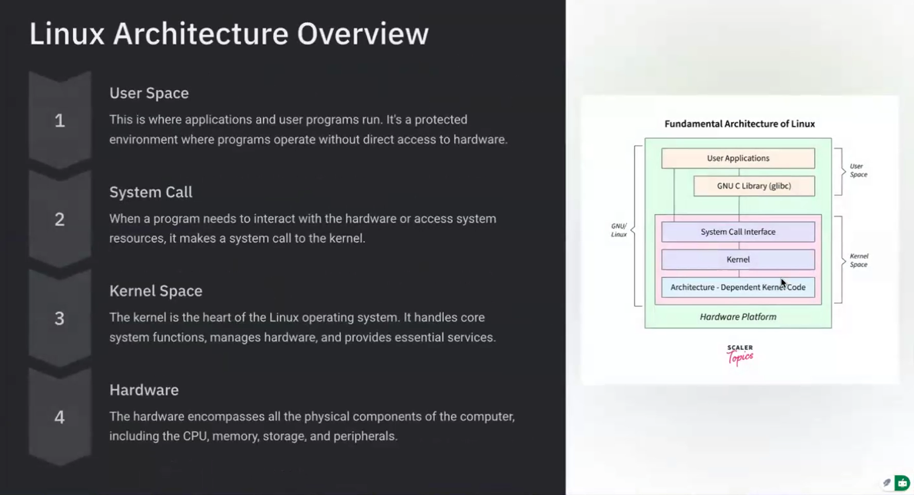
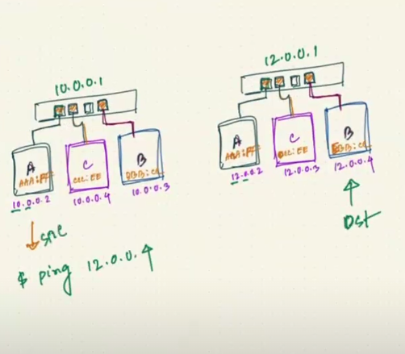
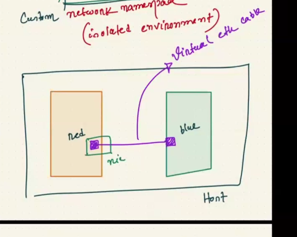

#image from the class 





# Notes 

# Networking and Container Networking Fundamentals

## 1. Host vs Network

### Question: What is the difference between a host and a network?

A **network** is a range of IP addresses that defines an address space.

A **host** is an individual device or network endpoint inside that network.

Think of:

* **Network** = neighborhood
* **Host** = individual house

Example:

```text
Network: 192.168.1.0/24

Host A: 192.168.1.10
Host B: 192.168.1.11
Host C: 192.168.1.12
```

The network defines the area. Each host gets an individual address within that area.

A container can also behave as a host because it can have its own network interface and IP address.

---

# 2. Who Decides a Host's IP Address?

### Question: Who decides the host IP address?

It depends on the network.

An IP address can be assigned by:

* A network administrator
* A DHCP server
* An AWS networking system
* Docker's IP address management system
* Manual/static configuration

For example, in a home network:

```text
Router
  │
  └── DHCP Server
          │
          ├── Laptop → 192.168.0.10
          ├── Phone  → 192.168.0.11
          └── PC     → 192.168.0.12
```

The network defines the available address space, while a system such as DHCP assigns individual addresses.

---

# 3. DHCP Server

### Question: What is a DHCP server?

**DHCP** stands for **Dynamic Host Configuration Protocol**.

A DHCP server automatically provides network configuration to devices.

It can provide:

* IP address
* Subnet mask
* Default gateway
* DNS server
* Lease information

For example:

```text
Network: 192.168.0.0/24

DHCP Server
     │
     ├── PC → 192.168.0.128
     ├── Phone → 192.168.0.129
     └── Laptop → 192.168.0.130
```

A home router commonly acts as the DHCP server.

### DHCP does not create the network

The network already exists.

For example:

```text
192.168.0.0/24
```

DHCP simply assigns addresses from that available range.

---

# 4. Finding Your Computer's IP Address

You used Windows `ipconfig` and had:

```text
IPv4 Address     : 192.168.0.128
Subnet Mask      : 255.255.255.0
Default Gateway  : 192.168.0.1
```

This means:

```text
Your computer:
192.168.0.128

Network:
192.168.0.0/24

Gateway/router:
192.168.0.1
```

`192.168.0.128` is a **private/local IP address**.

It is not your public Internet IP.

---

# 5. What Is a Subnet Mask?

### Question: What is a subnet mask?

A subnet mask tells a computer which portion of an IP address represents the **network** and which portion represents the **host**.

For:

```text
192.168.0.128/24
```

the `/24` means:

```text
Network bits: 24
Host bits:     8
```

The equivalent subnet mask is:

```text
255.255.255.0
```

Binary:

```text
11111111.11111111.11111111.00000000
```

So:

```text
192.168.0.128
^^^^^^^^^^^ ^^^
 network    host
```

More precisely, the first 24 bits identify the network and the last 8 bits identify hosts within that network.

---

# 6. Does `/24` Mean the First 24 Bits Are Fixed?

### Question: Does subnet mask mean the first 24 bits are fixed and the last 8 bits can change?

Yes, as a useful mental model.

For:

```text
192.168.0.0/24
```

the first 24 bits identify the network.

The remaining 8 bits identify individual addresses within that network.

There are:

```text
2^8 = 256
```

total addresses.

Traditionally:

```text
192.168.0.0   → network address
192.168.0.1   → host
192.168.0.2   → host
...
192.168.0.254 → host
192.168.0.255 → broadcast
```

So there are traditionally **254 usable host addresses**.

---

# 7. DHCP DORA Process

### Question: What is the DORA process?

DORA describes the four main steps of DHCP:

```text
D = Discover
O = Offer
R = Request
A = Acknowledgment
```

The process is:

```text
Client                         DHCP Server

   │
   │ DHCP DISCOVER
   │──────────────────────────>
   │
   │ DHCP OFFER
   │<──────────────────────────
   │
   │ DHCP REQUEST
   │──────────────────────────>
   │
   │ DHCP ACK
   │<──────────────────────────
```

### Analogy

Imagine renting a house.

```text
Discover:
"Is there a house available?"

Offer:
"House 128 is available."

Request:
"I want house 128."

Acknowledgment:
"House 128 is assigned to you."
```

The DHCP offer can contain:

```text
IP address
Subnet mask
Gateway
DNS server
Lease duration
```

---

# 8. Is `192.168.x.x` Provided by the ISP?

### Question: Is `192.168.*` from the Internet provider?

No.

`192.168.0.0/16` is a **private IPv4 address range**.

For example:

```text
192.168.0.128
```

is a private address.

Your home network might look like:

```text
Internet
   │
   │ Public IP
   ▼
Router
192.168.0.1
   │
   ├── PC → 192.168.0.128
   ├── Phone → 192.168.0.129
   └── Laptop → 192.168.0.130
```

Your ISP provides Internet connectivity and a public-facing address, while your router commonly uses private addresses internally.

Different isolated networks can use the same private address range without conflict.

---

# 9. What If Another Computer Has the Same IP?

Two devices should not normally have the same IP address within the **same local IP network**.

For example:

```text
PC A → 192.168.0.10
PC B → 192.168.0.10
```

inside the same network can cause an IP conflict.

However, the same private IP can exist in completely separate networks:

```text
Network A:
PC → 192.168.0.10

Network B:
PC → 192.168.0.10
```

This is fine because the networks are isolated.

This concept becomes important in containers because separate network environments can reuse private IP addresses.

---

# 10. Does DHCP Need a MAC Address?

On normal Ethernet/Wi-Fi networks, the client has a Layer 2 identity before it receives an IP address.

A DHCP client can initially communicate using:

```text
Source IP:      0.0.0.0
Destination IP: 255.255.255.255
```

while the Ethernet frame uses the client's MAC address as its source.

Conceptually:

```text
MAC → identifies the network interface at Layer 2

DHCP → obtains network configuration

IP → identifies the host at Layer 3
```

DHCP can also use client identifiers and other mechanisms, so saying that DHCP universally "requires a MAC address" would be too strong.

---

# 11. Layer 2 and Layer 3

### Question: What is Layer 3?

Layer 3 is the **Network Layer** in the OSI model.

The key protocol is **IP**.

Its major purpose is communication between different networks.

A simplified view:

```text
Layer 2:
MAC addresses
Ethernet
Switches
Local delivery

Layer 3:
IP addresses
Routing
Routers
Network-to-network delivery
```

Example:

```text
Network A                     Network B
10.0.0.0/24                   12.0.0.0/24

10.0.0.2                      12.0.0.4
   │                              │
 Switch                         Switch
   │                              │
   └────────── Router ────────────┘
```

The router uses the destination IP:

```text
12.0.0.4
```

to determine where to send the packet.

---

# 12. DHCP Table

### Question: What is a DHCP table?

A DHCP table is essentially a record of DHCP assignments or leases.

Example:

```text
Device     IP Address       MAC Address
-----------------------------------------
PC         192.168.0.128    AA:AA:AA:AA:AA:AA
Phone      192.168.0.129    BB:BB:BB:BB:BB:BB
Laptop     192.168.0.130    CC:CC:CC:CC:CC:CC
```

It helps the DHCP server keep track of which address has been assigned to which client.

Do not confuse this with a routing table or MAC address table.

---

# 13. MAC Address Table

### Question: What is a MAC address table?

A MAC address table is primarily maintained by a **Layer 2 switch**.

It maps:

```text
MAC address → switch port
```

Example:

```text
MAC Address       Port
------------------------
AA:AA:AA...       1
BB:BB:BB...       2
CC:CC:CC...       3
```

A switch learns this information by examining the source MAC address of incoming Ethernet frames.

### Comparison

```text
DHCP table:
Client/MAC → IP

MAC table:
MAC → Port

Routing table:
Destination network → Next hop/interface
```

Linux bridges also maintain a similar forwarding database called an **FDB**.

---

# 14. Where Does a MAC Address Exist?

A MAC address belongs to a **network interface**.

A computer can have multiple interfaces:

```text
Computer
   │
   ├── Ethernet NIC → MAC address
   ├── Wi-Fi NIC    → MAC address
   └── Virtual NIC  → MAC address
```

A physical network interface has a hardware-associated MAC address.

Virtual interfaces can also have MAC addresses.

Containers commonly use virtual interfaces with MAC addresses.

---

# 15. Different Networks Communicating

Consider:

```text
Network A: 10.0.0.0/24
Source:    10.0.0.2

Network B: 12.0.0.0/24
Destination: 12.0.0.4
```

The source and destination are on different networks.

A router is needed.

```text
10.0.0.0/24                    12.0.0.0/24

PC A                            PC B
10.0.0.2                        12.0.0.4
   │                               │
 Switch A                       Switch B
   │                               │
   └────────── Router ─────────────┘
              │       │
          10.0.0.1  12.0.0.1
```

The source sees:

```text
12.0.0.4
```

and determines that it is outside its local network.

Therefore it sends the packet toward its default gateway:

```text
10.0.0.1
```

The first Ethernet frame might look conceptually like:

```text
Source MAC      = PC A MAC
Destination MAC = Router's 10.0.0.1 MAC

Source IP       = 10.0.0.2
Destination IP  = 12.0.0.4
```

When the router forwards the packet into Network B, the Ethernet frame changes:

```text
Source MAC      = Router's Network-B MAC
Destination MAC = PC B MAC

Source IP       = 10.0.0.2
Destination IP  = 12.0.0.4
```

The important concept is:

> MAC addresses are used for local Layer 2 delivery, while IP addresses are used for Layer 3 routing.

---

# 16. What Is a Gateway?

### Question: What is a gateway?

A gateway is a network endpoint that provides a path to another network.

The easiest mental model:

> **Gateway = exit point from your current network.**

Example:

```text
Network: 10.0.0.0/24

PC
10.0.0.2
   │
   ▼
Gateway
10.0.0.1
   │
   ▼
Other network
```

If the destination is outside the local network, the host sends the traffic toward the gateway.

---

# 17. Is a Gateway the Same as a Router?

Not exactly.

A **router** is a device or networking function that forwards traffic between networks.

A **gateway** describes the role/address used as an exit point from a network.

A router can provide the default gateway.

Example:

```text
Router
├── 10.0.0.1 ← gateway for Network A
└── 12.0.0.1 ← gateway for Network B
```

So:

```text
Router = device/function

Gateway = role/address
```

In a typical home network, your router and default gateway are often the same physical device.

---

# 18. Is a Routing Table Part of a Router?

Yes.

A routing table is a fundamental part of the routing function.

It tells the router where different destination networks should be reached.

Example:

```text
Destination       Next Hop       Interface
------------------------------------------------
10.0.0.0/24       directly       eth0
12.0.0.0/24       directly       eth1
0.0.0.0/0         10.0.0.1       eth0
```

The router essentially asks:

> "The packet is going to this destination. Which path should I use?"

Linux computers also have routing tables.

You can inspect one with:

```bash
ip route
```

---

# 19. Network Namespace

### Question: What is a network namespace?

A **network namespace** is a Linux kernel feature that creates an isolated network environment.

A namespace can have its own:

* Network interfaces
* IP addresses
* Routing table
* ARP/neighbor information
* Network connections
* Loopback interface

For example:

```text
Host namespace

eth0 → 192.168.0.128
lo   → 127.0.0.1
```

A separate namespace could have:

```text
Namespace ns1

eth0 → 10.0.0.2
lo   → 127.0.0.1
```

The two environments have different network views.

Containers use network namespaces as one of their fundamental isolation mechanisms.

---

# 20. Ingress and Egress

### Question: What are ingress and egress?

These terms describe the direction of traffic.

### Ingress

**Ingress = incoming traffic.**

```text
Internet
   │
   ▼
Server
```

Traffic entering the server is ingress traffic.

### Egress

**Egress = outgoing traffic.**

```text
Server
   │
   ▼
Internet
```

Traffic leaving the server is egress traffic.

For a container:

```text
Client → Container
         ↑
       ingress

Container → Database
             ↑
           egress
```

A useful mental model:

```text
Ingress = coming in
Egress  = going out
```

---

# 21. Why Does a Network Namespace Have No Outside Connection Initially?

A new network namespace starts isolated.

For example:

```bash
sudo ip netns add ns1
```

The namespace does not automatically have a connection to:

```text
Host
Router
Internet
```

This is intentional.

You can connect it using Linux networking components such as:

* veth pairs
* Linux bridges
* Routing
* NAT
* Virtual interfaces

For example:

```text
Namespace
    │
   eth0
    │
  veth pair
    │
Linux bridge
    │
Host
    │
Physical NIC
    │
Router
    │
Internet
```

So:

> A network namespace starts isolated; connectivity must be deliberately provided.

---

# 22. NIC

### Question: What is a NIC?

**NIC** stands for **Network Interface Card**.

It is the hardware or virtual network interface that allows a system to send and receive network traffic.

Think of it as the computer's **door to the network**.

```text
Computer
   │
   ▼
 NIC
   │
   ▼
Network
```

A computer can have:

```text
Ethernet NIC
Wi-Fi NIC
Virtual NIC
```

A NIC is associated with a MAC address.

---

# 23. What Is the Purpose of a NIC?

A NIC connects the operating system's networking system to a network.

For a physical Ethernet connection:

```text
Linux
  │
Network stack
  │
NIC
  │
Ethernet cable
  │
Switch
```

The NIC handles the interface between the operating system and the physical network.

For a container, the interface may be virtual:

```text
Container
   │
Virtual NIC
   │
veth pair
   │
Linux bridge
   │
Physical NIC
```

---

# 24. `127.0.0.1`

### Question: What is `127.0.0.1`?

`127.0.0.1` is the IPv4 **loopback address**.

It means:

> "This machine/network namespace itself."

Example:

```bash
ping 127.0.0.1
```

This tests communication with the local networking stack.

Linux normally provides a loopback interface called:

```text
lo
```

So:

```text
127.0.0.1
     │
     ▼
    lo
     │
     ▼
This system itself
```

The IPv4 loopback range is:

```text
127.0.0.0/8
```

---

# 25. Loopback in Containers

Each network namespace has its own loopback interface.

Therefore:

```text
Container A
127.0.0.1
```

means:

> Container A itself.

And:

```text
Container B
127.0.0.1
```

means:

> Container B itself.

Container A cannot normally reach Container B by using:

```text
127.0.0.1
```

because loopback is local to the namespace.

---

# 26. How Can Two Network Namespaces Communicate?

Two network namespaces cannot communicate automatically.

They need a networking connection.

One common method is a **veth pair**.

```text
Namespace A                 Namespace B

   eth0                        eth0
    │                           │
    └──────── veth pair ────────┘
```

Assign addresses:

```text
Namespace A:
10.0.0.1/24

Namespace B:
10.0.0.2/24
```

Then they can communicate through the veth connection.

For multiple namespaces, a Linux bridge can connect them:

```text
             Linux Bridge
             /    |    \
            /     |     \
         veth    veth    veth
          │       │       │
         NS1     NS2     NS3
```

---

# 27. How Can Two Ends of a Virtual Cable Act Like NICs?

A veth pair is **not one NIC with two ends**.

It is two separate virtual network interfaces connected by Linux.

Physical analogy:

```text
Computer A
   │
  NIC
   │
Ethernet cable
   │
  NIC
   │
Computer B
```

Virtual analogy:

```text
Namespace A
   │
 veth-A
   ║
   ║ virtual Ethernet connection
   ║
 veth-B
   │
Namespace B
```

Each endpoint behaves like a network interface.

Each endpoint can have:

* Its own MAC address
* Its own IP configuration
* Its own interface state
* Its own packet queues

Linux treats them like connected Ethernet interfaces.

---

# 28. What Does "Communication With the Host" Mean?

The **host** is the Linux system on which the container or network namespace is running.

Suppose:

```text
Host namespace

veth-host
10.0.0.1
```

and:

```text
Namespace ns1

eth0
10.0.0.2
```

connected by a veth pair:

```text
Host namespace              Namespace ns1

veth-host 10.0.0.1
      │
      ║ veth pair
      │
                         eth0 10.0.0.2
```

If the namespace sends traffic to:

```text
10.0.0.1
```

it is communicating with the host.

For example:

```bash
sudo ip netns exec ns1 ping 10.0.0.1
```

This means:

```text
Namespace → Host
```

It does **not** automatically mean:

```text
Namespace → Internet
```

Internet connectivity requires additional routing and potentially NAT.

---

# 29. Host Network vs Network You Are Trying to Reach

### Question: Is the host network the network we are trying to communicate with?

Not necessarily.

The **host network** means the networking environment belonging to the computer running your container or namespace.

For example:

```text
              Host
┌─────────────────────────────┐
│ Host network namespace      │
│                             │
│ eth0                        │
│ 192.168.0.128               │
└──────────────┬──────────────┘
               │
             Router
               │
            Internet
```

A container may communicate with several different targets:

```text
Container → Host
Container → Another container
Container → Router
Container → Internet
Container → Database
```

Therefore, "host network" does not mean "the network we want to communicate with."

It specifically refers to the host's own networking environment.

---

# 30. Network Stack

### Question: What is a network stack?

A **network stack** is the collection of software and networking protocols that allow a computer to communicate over a network.

A simplified view:

```text
Application
     │
HTTP / DNS / SSH
     │
TCP / UDP
     │
IP
     │
Ethernet / Wi-Fi
     │
NIC
     │
Physical Network
```

For example, when you run:

```bash
curl https://example.com
```

multiple networking components work together.

Linux implements much of the core network stack inside the kernel.

Container network namespaces provide an isolated view of many networking components.

---

# 31. Route Table vs iptables

### Question: What is an iptables rule and a route table?

They perform different jobs.

### Route table

A routing table answers:

> **Where should this packet go?**

Example:

```text
Destination       Next Hop       Interface
------------------------------------------------
192.168.0.0/24    directly       eth0
10.0.0.0/24       192.168.0.1    eth0
0.0.0.0/0         192.168.0.1    eth0
```

### iptables

iptables provides rules for packet filtering and processing.

It can be used for things such as:

```text
Allow traffic
Drop traffic
Reject traffic
Forward traffic
NAT traffic
Modify packet handling
```

Conceptually:

```text
Route table:
"Where should this packet go?"

iptables:
"What should happen to this packet?"
```

Modern Linux systems commonly use **nftables** underneath, although the `iptables` commands and concepts remain widely encountered.

The exact order of routing and firewall processing depends on the packet path and netfilter hook, so the simple distinction above is a conceptual model rather than a universal packet-processing sequence.

---

# 32. What Is a Loopback Interface?

The **loopback interface** is a virtual network interface used for communication within the same system or network namespace.

Linux commonly names it:

```text
lo
```

with:

```text
127.0.0.1
```

Example:

```text
Application
    │
    ▼
127.0.0.1
    │
    ▼
   lo
    │
    ▼
Same namespace
```

It does not require a physical Ethernet or Wi-Fi NIC.

---

# 33. Custom Isolated Environment vs Host Environment

### Question: What is the difference between a custom isolated environment and the host environment?

The host has its own networking environment.

For example:

```text
Host network namespace

eth0 → 192.168.0.128
lo   → 127.0.0.1
routing table
network connections
```

A custom network namespace can have:

```text
Namespace ns1

eth0 → 10.0.0.2
lo   → 127.0.0.1
own routing table
own network connections
```

The two environments have separate network views.

The host itself normally has a network namespace too: the **initial/default network namespace**.

A container can use a separate network namespace.

---

# 34. What to Do After Creating a Network Namespace?

Suppose you create:

```bash
sudo ip netns add ns1
```

Initially, the namespace is isolated.

### Step 1: Inspect it

```bash
sudo ip netns exec ns1 ip addr
```

You will normally find the loopback interface.

### Step 2: Bring loopback up

```bash
sudo ip netns exec ns1 ip link set lo up
```

### Step 3: Create a veth pair

```bash
sudo ip link add veth-host type veth peer name veth-ns
```

You now have:

```text
veth-host <────────> veth-ns
```

### Step 4: Move one endpoint into the namespace

```bash
sudo ip link set veth-ns netns ns1
```

Now:

```text
Host:
veth-host

ns1:
veth-ns
```

### Step 5: Rename it to `eth0`

```bash
sudo ip netns exec ns1 ip link set veth-ns name eth0
```

### Step 6: Bring both interfaces up

Host:

```bash
sudo ip link set veth-host up
```

Namespace:

```bash
sudo ip netns exec ns1 ip link set eth0 up
```

### Step 7: Assign IP addresses

Host:

```bash
sudo ip addr add 10.0.0.1/24 dev veth-host
```

Namespace:

```bash
sudo ip netns exec ns1 ip addr add 10.0.0.2/24 dev eth0
```

You now have:

```text
Host                        Namespace

veth-host                   eth0
10.0.0.1                    10.0.0.2
     │
     ║ veth pair
     │
```

### Step 8: Test

```bash
sudo ip netns exec ns1 ping 10.0.0.1
```

The namespace should now be able to communicate with the host-side interface.

This still does not automatically provide Internet access.

---

# 35. What Is Network Virtualization?

### Question: What is network virtualization?

**Network virtualization** means creating logical or virtual networking components using software on top of physical networking infrastructure.

Instead of requiring a completely separate physical network for every environment, one physical infrastructure can support multiple logical networks.

Analogy:

```text
One physical building
        │
        ▼
One physical network
        │
 ┌──────┼──────┐
 │      │      │
 ▼      ▼      ▼
Net A  Net B  Net C
```

The networks can be logically separated even though they share physical infrastructure.

Virtual networking components include:

* Virtual network interfaces
* Virtual switches
* Virtual routers
* Network namespaces
* Linux bridges
* Veth pairs
* Virtual tunnels
* Virtual networks

Container networking is heavily based on network virtualization.

---

# 36. What Is `eth0`?

`eth0` is commonly the name of a Linux **network interface**.

For example:

```text
eth0
 │
 ├── MAC address
 ├── IP address
 └── Network connection
```

You can inspect it with:

```bash
ip addr show eth0
```

Historically, Linux commonly used names such as:

```text
eth0
eth1
eth2
```

Modern Linux distributions often use predictable names such as:

```text
ens33
enp0s3
eno1
```

So `eth0` is not a special universal piece of hardware. It is an interface name.

---

# 37. Is `eth0` the NIC?

Not exactly.

A **NIC** is the underlying network hardware or virtual network device.

`eth0` is the Linux interface through which the operating system accesses a network connection.

For a physical Ethernet connection:

```text
Physical NIC
      │
      ▼
    Linux
      │
     eth0
      │
      ▼
   Network
```

For a container:

```text
Container
    │
   eth0
    │
  veth pair
    │
Linux bridge
    │
Physical NIC
```

Here, the container's `eth0` is virtual.

Therefore:

> **NIC = network interface/device.**
>
> **`eth0` = a Linux interface name.**

---

# 38. `eth0` vs `veth`

### Question: What is the difference between `eth0` and `veth`?

The key distinction is:

> `eth0` is commonly an interface name, while `veth` identifies a specific type of virtual Ethernet interface.

### `eth0`

It is commonly used as the name of a network interface.

It can represent:

* A physical Ethernet interface
* A virtual interface
* A container interface

### `veth`

`veth` means **Virtual Ethernet**.

A veth pair consists of two connected virtual interfaces:

```text
veth-A  <══════════════>  veth-B
          virtual cable
```

Anything sent into one end is received by the other end.

Comparison:

| Feature         | `eth0`                     | `veth`                          |
| --------------- | -------------------------- | ------------------------------- |
| Meaning         | Common interface name      | Virtual Ethernet interface type |
| Physical?       | Can be physical or virtual | Virtual                         |
| Has MAC?        | Yes                        | Yes                             |
| Can have IP?    | Yes                        | Yes                             |
| Usually paired? | No                         | Yes                             |
| Common use      | General network interface  | Connecting network namespaces   |

---

# 39. What Is `veth0`?

`veth0` is usually just a name given to a virtual Ethernet interface.

The important part is:

```text
veth
```

which means **Virtual Ethernet**.

The `0` is simply an identifier.

For example:

```text
veth0
veth1
veth2
```

These names can identify different virtual interfaces.

You can create a veth pair:

```bash
sudo ip link add veth0 type veth peer name veth1
```

This creates:

```text
veth0  <══════════════>  veth1
          virtual cable
```

Each side is a separate network interface.

---

# 40. Why Does a Container Often Have `eth0` Even Though It Uses veth?

This is an important container-networking concept.

Suppose:

```text
Host namespace                 Container namespace

veth-host  ══════════════════  veth-container
```

Inside the container, Docker or another networking system can rename the container-side interface:

```text
Host namespace                 Container namespace

veth-host  ══════════════════  eth0
```

So the container's:

```text
eth0
```

can actually be a **veth endpoint**.

That means:

> `eth0` describes the interface's name, while `veth` describes its underlying interface type.

This distinction is very important.

---

# 41. Putting Everything Together

At this point, the major pieces can be connected into one picture.

```text
                         INTERNET
                            │
                            │
                         Router
                            │
                            │
                     Physical Network
                            │
                            ▼
                    ┌───────────────┐
                    │ Physical NIC  │
                    └───────┬───────┘
                            │
                            ▼
                    ┌───────────────┐
                    │ Linux Host    │
                    │               │
                    │ Host Network  │
                    │ Namespace     │
                    │               │
                    │ veth-host     │
                    └───────┬───────┘
                            │
                       veth pair
                            │
                            ▼
                    ┌───────────────┐
                    │ Container     │
                    │               │
                    │ Network       │
                    │ Namespace     │
                    │               │
                    │ eth0          │
                    │ 10.0.0.2      │
                    └───────────────┘
```

The flow is:

```text
Application
    ↓
Container network stack
    ↓
Container eth0
    ↓
veth pair
    ↓
Host network
    ↓
Bridge / routing / NAT
    ↓
Physical NIC
    ↓
Router
    ↓
Internet
```

---

# 42. The Core Mental Model

You can now think about Linux container networking using these layers:

```text
Application
     │
     ▼
Network Stack
     │
     ▼
Network Namespace
     │
     ▼
Network Interface
     │
     ▼
veth / bridge / physical NIC
     │
     ▼
Routing
     │
     ▼
Gateway / Router
     │
     ▼
Other Network
```

Each component has a different responsibility.

| Component              | Main idea                                   |
| ---------------------- | ------------------------------------------- |
| Network                | Address space                               |
| Host                   | Individual network endpoint/system          |
| IP address             | Layer 3 identity/address                    |
| MAC address            | Layer 2 interface identity                  |
| NIC                    | Network interface/device                    |
| `eth0`                 | Common Linux interface name                 |
| `veth`                 | Virtual Ethernet interface type             |
| veth pair              | Virtual Ethernet connection                 |
| `lo`                   | Loopback interface                          |
| `127.0.0.1`            | This namespace itself                       |
| Network namespace      | Isolated network environment                |
| Bridge                 | Virtual Layer 2 switch                      |
| Router                 | Connects networks                           |
| Gateway                | Exit point toward another network           |
| Route table            | Decides where traffic should go             |
| iptables/nftables      | Packet filtering/processing/NAT             |
| DHCP                   | Automatically assigns network configuration |
| MAC table/FDB          | MAC → interface/port                        |
| DHCP lease table       | Client → IP assignment                      |
| Ingress                | Incoming traffic                            |
| Egress                 | Outgoing traffic                            |
| Network stack          | Software/protocol machinery for networking  |
| Network virtualization | Software-created logical networking         |

---

# 43. The Most Important Relationships

### IP and MAC

```text
IP
 ↓
Layer 3
 ↓
Routing
```

```text
MAC
 ↓
Layer 2
 ↓
Local Ethernet delivery
```

---

### `eth0` and `veth`

```text
eth0
= commonly an interface name

veth
= virtual Ethernet interface type
```

Therefore:

```text
Container's eth0
       │
       └── may actually be a veth endpoint
```

---

### Namespace and veth

```text
Network namespace
= isolation

veth pair
= connectivity
```

Together:

```text
Namespace A
     │
    veth
     ║
    veth
     │
Namespace B
```

---

### Route table and iptables

```text
Route table
"What path should the packet take?"

iptables/nftables
"What should happen to the packet?"
```

---

### Loopback and NIC

```text
lo
= communicate with myself

eth0
= communicate through a network interface
```

For example:

```text
127.0.0.1
   ↓
lo
   ↓
same namespace
```

while:

```text
10.0.0.2
   ↓
eth0
   ↓
veth
   ↓
another network
```

---

# 44. Container Networking Mental Model

A container is not just a process with an IP address.

A useful simplified model is:

```text
Container
   │
   ├── Network namespace
   │
   ├── Virtual network interface
   │
   ├── IP address
   │
   ├── Routing table
   │
   └── Network connections
```

Then Linux connects that isolated environment to other networks using:

```text
veth
  ↓
bridge
  ↓
routing
  ↓
NAT
  ↓
physical NIC
```

This is the foundation behind many Docker and Kubernetes networking concepts.

---

# 45. Final Mental Picture

The entire concept can be reduced to this:

```text
                         OUTSIDE NETWORK
                               │
                               ▼
                            Router
                               │
                               ▼
                       Physical NIC
                               │
                         Linux Host
                               │
                 ┌─────────────┴─────────────┐
                 │                           │
          Host Network                Linux Bridge
          Namespace                       │
                                         │
                                  ┌──────┼──────┐
                                  │      │      │
                                veth   veth   veth
                                  │      │      │
                                 NS1    NS2    NS3
                                  │      │      │
                                 eth0   eth0   eth0
                                  │      │      │
                               Container Container Container
```

The most important idea is:

> **A network namespace creates isolation. A virtual interface provides a network connection. A veth pair connects network namespaces. A bridge connects multiple interfaces. A route table determines where packets go. A router connects different networks.**

Once these relationships are clear, Docker networking becomes much easier to understand.
