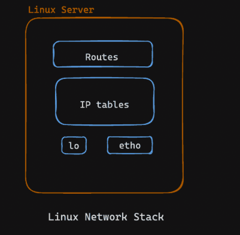

#Images from the lab




Below is the **Lab 1: Network Namespace** note based on the concepts you discussed. I kept the progression connected: Linux networking → interfaces → loopback → routing → namespace creation → entering the namespace → inspecting its network stack.

# Lab 1: Linux Network Namespace

## 1. Introduction

A **network namespace** gives a process its own isolated networking environment.

Before understanding container networking, you need to understand this idea:

```text
Linux Host
│
├── Host Network Namespace
│   ├── lo
│   ├── eth0
│   ├── docker0
│   ├── wt0
│   └── Routing Table
│
└── poridhi Network Namespace
    ├── lo
    └── Its own Routing Table
```

A network namespace can have its own:

* Network interfaces
* IP addresses
* Routing table
* Sockets
* Network-related configuration

This is one of the fundamental technologies behind **Linux containers**.

---

# 2. What Is a Network Namespace?

### Analogy

Imagine a large office building.

The building contains several separate rooms. Each room can have its own:

* Doors
* Internal phone system
* Addressing system
* Rules for where messages should go

Even though all rooms exist inside the same building, their internal communication environments are separated.

Linux works similarly.

```text
                    Linux
                      │
        ┌─────────────┴─────────────┐
        │                           │
 Host Network Namespace      poridhi Namespace
        │                           │
    ┌───┴────┐                  ┌───┴────┐
    │        │                  │        │
   eth0     lo                 eth0?     lo
    │                           │
 routing table               routing table
```

### Real definition

A **network namespace** is a Linux kernel feature that isolates a process's network stack from processes in other network namespaces.

This means two namespaces can have separate:

```text
Network interfaces
IP addresses
Routes
Sockets
Network configuration
```

A network namespace is **not a virtual machine**.

```text
Virtual Machine

Application
    ↓
Guest OS
    ↓
Virtual hardware
    ↓
Hypervisor
    ↓
Physical machine
```

A network namespace is much lighter:

```text
Process
   ↓
Network Namespace
   ↓
Same Linux Kernel
   ↓
Physical/virtual machine
```

---

# 3. Before Creating a Namespace: Understand `ip`

You have already seen commands such as:

```bash
ip link
ip addr
ip route
ip netns
```

Here, `ip` is not just an "IP address command."

It is a **Linux networking toolbox**.

```text
                  ip
                   │
        ┌──────────┼──────────┐
        │          │          │
      link        addr       route
        │          │          │
   interfaces     IPs      routing
                   │
                 netns
                   │
             namespaces
```

Examples:

```bash
ip link
```

Shows network interfaces.

```bash
ip addr
```

Shows IP addresses.

```bash
ip route
```

Shows the routing table.

```bash
ip netns
```

Manages named network namespaces.

---

# 4. Inspect the Existing Network Interfaces

Run:

```bash
ip link list
```

or:

```bash
ip link show
```

This shows the network interfaces available in the **current network namespace**.

You observed interfaces such as:

```text
lo
bond0
dummy0
eth0
docker0
wt0
```

The important concept is:

> `ip link` shows the network interfaces visible from the current network namespace.

---

## 4.1 `lo` — Loopback Interface

You saw:

```text
lo: <LOOPBACK,UP,LOWER_UP>
```

`lo` means **loopback**.

### Analogy

Think of `lo` as an internal hallway.

If you want to communicate with yourself, you do not need to leave the building.

```text
Computer
   │
   └── lo
       │
       └── Computer itself
```

### Real definition

The loopback interface provides local network communication within the current network namespace.

The common IPv4 loopback address is:

```text
127.0.0.1
```

The IPv6 loopback address is:

```text
::1
```

Therefore:

```text
127.0.0.1:8000
```

means:

```text
127.0.0.1
    │
    └── local loopback address

8000
    │
    └── network port
```

So:

> Connect to port `8000` on the local networking environment.

---

# 5. Important Namespace Concept: `127.0.0.1`

This becomes particularly important with namespaces.

Suppose the host has:

```text
Host namespace
127.0.0.1
```

and `poridhi` has:

```text
poridhi namespace
127.0.0.1
```

These are **not the same networking context**.

```text
┌───────────────────────────┐
│ Host namespace             │
│                            │
│ lo                         │
│ 127.0.0.1                  │
└───────────────────────────┘


┌───────────────────────────┐
│ poridhi namespace          │
│                            │
│ lo                         │
│ 127.0.0.1                  │
└───────────────────────────┘
```

Therefore:

> `127.0.0.1` means "this local network namespace," not automatically "the entire physical machine."

---

# 6. Inspect the Loopback Interface

Run:

```bash
ifconfig lo
```

You may see:

```text
lo: flags=73<UP,LOOPBACK,RUNNING>  mtu 65536
        inet 127.0.0.1  netmask 255.0.0.0
        inet6 ::1  prefixlen 128  scopeid 0x10<host>
        loop  txqueuelen 1000
        RX packets 975
        TX packets 975
```

Let's understand the important parts.

### `inet 127.0.0.1`

IPv4 loopback address:

```text
127.0.0.1
```

### `netmask 255.0.0.0`

This is:

```text
/8
```

So the IPv4 loopback range is:

```text
127.0.0.0/8
```

### `inet6 ::1`

IPv6 loopback address:

```text
::1
```

### `mtu 65536`

The loopback interface can use a much larger MTU than typical Ethernet interfaces.

For comparison, your `eth0` showed:

```text
MTU 1500
```

Do not interpret `65536` as the size of an Ethernet frame. Loopback is a virtual interface.

---

# 7. Understand Other Interfaces

Your `ip link` output also contained:

### `eth0`

```text
eth0: <BROADCAST,MULTICAST,UP,LOWER_UP>
```

This is an Ethernet-style network interface.

It can be used for communication outside the local namespace.

In your environment, `eth0` should not automatically be assumed to be a physical network card. In cloud and container environments, it can be virtual.

---

### `docker0`

```text
docker0
```

This is commonly Docker's default bridge interface.

Conceptually:

```text
                 docker0
              172.17.0.1
                   │
          ┌────────┴────────┐
          │                 │
      Container A       Container B
```

It provides connectivity for Docker's bridge network when that network is active.

---

### `bond0`

A Linux bonding interface can combine multiple network interfaces into one logical interface.

It is commonly used for things such as redundancy or increased availability.

---

### `dummy0`

A dummy interface is a virtual network interface.

It does not represent a physical Ethernet card.

---

### `wt0`

Your output showed:

```text
wt0: <POINTOPOINT,MULTICAST,NOARP,UP,LOWER_UP>
```

It is a point-to-point interface.

However, the output alone does not establish exactly which software created it or what service it represents.

---

# 8. What Is a Routing Table?

After understanding interfaces, the next question is:

> If a machine has several interfaces, how does Linux decide which interface should carry a packet?

The answer is the **routing table**.

Run:

```bash
ip route show
```

Think of the routing table as a **road map**.

```text
Packet
  │
  v
Routing Table
  │
  ├── Destination A → eth0
  ├── Destination B → wt0
  ├── Destination C → docker0
  └── Everything else → gateway
```

---

# 9. Your Routing Table

You observed:

```text
default via 10.62.0.1 dev eth0
10.62.0.0/16 dev eth0 proto kernel scope link src 10.62.31.86
100.80.0.0/16 dev wt0 proto kernel scope link src 100.80.222.48
172.17.0.0/16 dev docker0 proto kernel scope link src 172.17.0.1 linkdown
```

Let's understand the logic.

---

## 9.1 Default Route

```text
default via 10.62.0.1 dev eth0
```

Means:

> If Linux does not have a more specific route, send the packet through `eth0` to gateway `10.62.0.1`.

```text
Your machine
10.62.31.86
      │
     eth0
      │
      v
10.62.0.1
 Gateway
      │
      v
Other networks
```

For example, if you want to reach:

```text
8.8.8.8
```

Linux doesn't have a specific route for it.

Therefore:

```text
8.8.8.8
   ↓
default route
   ↓
10.62.0.1
   ↓
eth0
```

---

# 10. Directly Connected Network

You also had:

```text
10.62.0.0/16 dev eth0
```

Your machine's address is:

```text
10.62.31.86
```

which belongs to:

```text
10.62.0.0/16
```

Therefore, if the destination is:

```text
10.62.20.50
```

Linux recognizes that it is inside the directly connected network.

```text
10.62.0.0/16
       │
       ├── 10.62.0.1
       ├── 10.62.20.50
       ├── 10.62.31.86
       └── ...
```

Linux uses:

```text
eth0
```

rather than the default gateway route.

---

# 11. Create a Network Namespace

Now you can create your own isolated networking environment.

Run:

```bash
sudo ip netns add poridhi
```

Break it down:

```text
sudo
 │
 └── elevated privileges

ip
 │
 └── networking toolbox

netns
 │
 └── network namespace functionality

add
 │
 └── create

poridhi
 │
 └── namespace name
```

So:

> Create a network namespace called `poridhi`.

---

# 12. List the Namespace

Run:

```bash
sudo ip netns list
```

You should see:

```text
poridhi
```

This confirms that the named namespace exists.

Conceptually:

```text
Linux
 │
 ├── Host namespace
 │
 └── poridhi namespace
```

---

# 13. What Does the New Namespace Contain?

A newly created network namespace starts with its own isolated network stack.

One important interface is:

```text
lo
```

Conceptually:

```text
poridhi namespace
       │
       └── lo
           └── 127.0.0.1
```

At this point, the namespace does **not automatically have normal external network connectivity**.

This distinction is important.

Creating a namespace and connecting a namespace to a network are two separate steps.

Later, **veth pairs**, bridges, routes, and other networking mechanisms will provide connectivity.

---

# 14. Enter the Namespace Using `ip netns exec`

Run:

```bash
sudo ip netns exec poridhi bash
```

The command means:

> Execute `bash` inside the `poridhi` network namespace.

Breakdown:

```text
sudo
  ↓
ip
  ↓
netns
  ↓
exec
  ↓
poridhi
  ↓
bash
```

After entering:

```text
Your terminal
     │
     v
   bash
     │
     v
poridhi namespace
```

Now commands such as:

```bash
ip link
ip addr
ip route
```

operate in the `poridhi` networking context.

---

# 15. Enter the Namespace Using `nsenter`

You also learned:

```bash
sudo nsenter --net=/var/run/netns/poridhi bash
```

This does essentially the same thing for the network namespace:

> Start a Bash shell with the network namespace represented by `poridhi`.

Breakdown:

```text
sudo
  ↓
nsenter
  ↓
--net
  ↓
/var/run/netns/poridhi
  ↓
bash
```

### `nsenter`

`nsenter` means:

> Enter an existing Linux namespace and run a command there.

### `--net`

Specifies:

> Enter the network namespace.

### `/var/run/netns/poridhi`

Identifies the named network namespace.

### `bash`

Starts a Bash shell in that networking context.

---

# 16. `ip netns exec` vs `nsenter`

You can think about them like this:

```text
ip netns exec
      │
      └── Execute a command in a named
          network namespace


nsenter
      │
      └── Enter an existing namespace
          and execute a command
```

For this lab, both can be used to get a shell operating in `poridhi`.

---

# 17. Inspect the Namespace

After entering `poridhi`, run:

```bash
ip link show
```

Remember:

> `ip link` is scoped to the current network namespace.

Therefore, you are now asking:

> What network interfaces are available inside `poridhi`?

You should expect the namespace to have its own loopback interface.

Then:

```bash
ifconfig lo
```

or the modern equivalent:

```bash
ip addr show lo
```

This allows you to inspect its loopback interface.

---

# 18. The Most Important Mental Model

Everything you have learned can now be connected:

```text
                    Linux
                      │
            Network Namespace
                      │
          ┌───────────┴───────────┐
          │                       │
   Network Interface          Routing Table
          │                       │
     ┌────┼────┐              Decides where
     │    │    │              packets go
    lo   eth0 docker0
     │
     │
127.0.0.1
     │
     │
Local communication
```

Then you create another namespace:

```text
                     Linux
                       │
          ┌────────────┴────────────┐
          │                         │
     Host Namespace          poridhi Namespace
          │                         │
       eth0, lo                   lo
          │                         │
    routing table             routing table
```

Later, container networking will connect these isolated environments:

```text
Host Namespace
      │
   veth-host
      │
      │ Virtual Ethernet connection
      │
   veth-cont
      │
      v
Container / Namespace
```

This is where **network namespaces + veth pairs + bridges + routing** come together.

---

# 19. Lab Flow

The complete Lab 1 flow is:

```text
Understand Linux networking
          │
          v
   Network interfaces
          │
          v
        lo
          │
          v
    IP addresses
          │
          v
    Routing table
          │
          v
 Create network namespace
          │
          v
       poridhi
          │
          v
 Enter namespace
          │
     ┌────┴─────┐
     │          │
ip netns exec  nsenter
     │          │
     └────┬─────┘
          │
          v
     Bash shell
          │
          v
 Inspect namespace
          │
     ┌────┼────┐
     │    │    │
  ip link addr route
```

## 20. Commands Used in This Lab

```bash
# Inspect network interfaces
ip link show

# Inspect an interface
ifconfig lo

# Modern alternative
ip addr show lo

# Inspect routing table
ip route show

# Create a network namespace
sudo ip netns add poridhi

# List namespaces
sudo ip netns list

# Enter namespace using ip
sudo ip netns exec poridhi bash

# Enter namespace using nsenter
sudo nsenter --net=/var/run/netns/poridhi bash

# Inspect interfaces inside the namespace
ip link show

# Inspect loopback inside the namespace
ifconfig lo

# Inspect routes inside the namespace
ip route show
```

## Core principle

The key idea to carry into container networking is:

> **A network namespace creates an isolated network world. Interfaces provide connectivity inside that world, IP addresses identify endpoints, and the routing table determines where packets should go.**

The next logical step is **connecting two network namespaces with a veth pair**, which turns isolated network worlds into communicating environments.
--