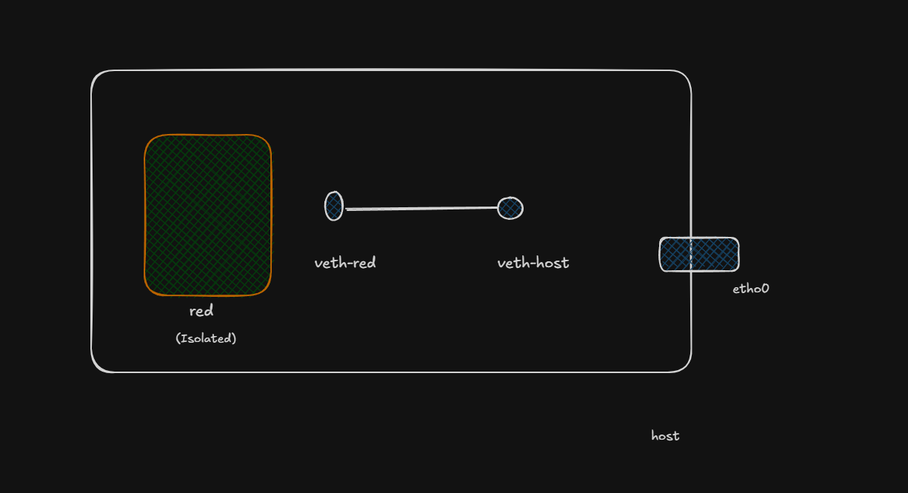
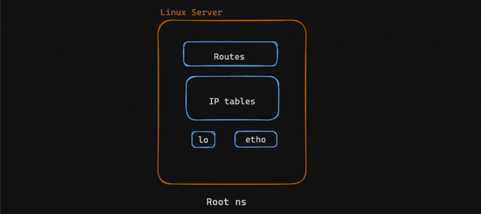
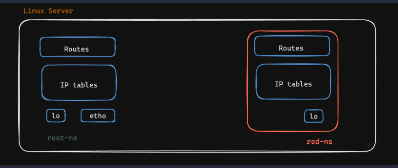
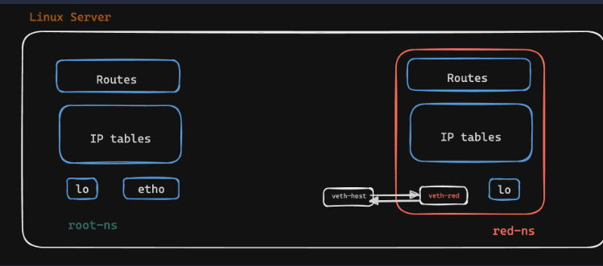

# Container Networking Lab 2: Connecting Network Namespaces with a veth Pair

## 1. Introduction

A Linux **network namespace** provides an isolated networking environment.

In this lab, you create a new network namespace called `red` and connect it to the host's default network namespace using a **veth pair**.

The main idea is:

```text
Root Network Namespace
        │
    veth-host
        │
        │  Virtual Ethernet Cable
        │
    veth-red
        │
Red Network Namespace
```

The two namespaces share the same Linux kernel, but their networking resources are isolated.

---

# 2. What You Will Build

You will build this:

```text
┌─────────────────────────────── Linux System ───────────────────────────────┐
│                                                                            │
│  Root / Default Network Namespace       Red Network Namespace             │
│                                                                            │
│  ┌───────────────────────┐               ┌───────────────────────┐         │
│  │ veth-host             │               │ veth-red              │         │
│  │ 192.168.1.2/24        │◄─────────────►│ 192.168.1.1/24        │         │
│  └───────────────────────┘   veth pair   └───────────────────────┘         │
│                                                                            │
└────────────────────────────────────────────────────────────────────────────┘
```

You will verify that:

```text
Root Namespace → Red Namespace
Red Namespace  → Root Namespace
```

can communicate.

---

# 3. Network Namespace

## 3.1 Analogy

Imagine one physical computer with two separate networking rooms.

Each room has its own:

* Network interfaces
* IP addresses
* Routing table
* Network connections

The rooms use the same building, but their networking environments are separated.

## 3.2 Technical Definition

A Linux network namespace isolates networking-related resources.

It can have its own:

* Network interfaces
* IP addresses
* Routing tables
* ARP/neighbour tables
* Sockets
* Firewall/networking state

It does **not** create another physical computer.

Both namespaces use the same Linux kernel.

---

# 4. Root Network Namespace

The **root network namespace** means the host's initial/default network namespace.

It is not the same thing as the `root` user.

For example:

```text
One Linux System
│
├── Root Network Namespace
│   ├── eth0
│   ├── docker0
│   ├── routing table
│   └── IP addresses
│
└── Red Network Namespace
    ├── veth-red
    ├── routing table
    └── IP addresses
```

When you create a new namespace, such as `red`, you create another isolated networking environment inside the same Linux system.

---

# 5. Step 1 — Create the Network Namespace

Run:

```bash
sudo ip netns add red
```

Check it:

```bash
sudo ip netns list
```

You should see:

```text
red
```

### Command breakdown

```text
sudo       → execute with administrative privileges
ip         → Linux networking command
netns      → work with network namespaces
add        → create
red        → namespace name
```

At this point:

```text
Root Namespace

       ┌───────────────┐
       │     root      │
       │               │
       └───────────────┘

       ┌───────────────┐
       │      red      │
       │               │
       └───────────────┘
```

The two namespaces exist, but they are not connected.

---

# 6. Step 2 — Create a veth Pair

Run:

```bash
sudo ip link add veth-red type veth peer name veth-host
```

A **veth pair** is like a virtual Ethernet cable with two ends.

```text
veth-red  ◄════════════════►  veth-host
             virtual cable
```

### Command breakdown

```text
ip link add
```

Create a network interface.

```text
veth-red
```

Name the first endpoint.

```text
type veth
```

Create a Virtual Ethernet device.

```text
peer
```

Create its connected partner.

```text
name veth-host
```

Name the second endpoint.

Initially, both endpoints exist in the root namespace.

---

# 7. Understanding `@` in `ip link`

After creating the pair, you may see:

```text
7: veth-host@veth-red
8: veth-red@veth-host
```

This means the two interfaces are peers.

```text
veth-host  ◄════════════►  veth-red
```

So:

```text
veth-host@veth-red
```

means:

> `veth-host` has `veth-red` as its peer.

Similarly:

```text
veth-red@veth-host
```

means:

> `veth-red` has `veth-host` as its peer.

They are two ends of the same virtual Ethernet connection.

---

# 8. Step 3 — Move One End into the Red Namespace

Run:

```bash
sudo ip link set veth-red netns red
```

This moves `veth-red` from the root namespace into the `red` namespace.

Before:

```text
ROOT NAMESPACE

veth-host
veth-red

Both endpoints are here.
```

After:

```text
ROOT NAMESPACE                 RED NAMESPACE

veth-host                     veth-red
     │                            │
     └──────── veth pair ─────────┘
```

This is the important step that connects the two namespaces.

### Why do we move one endpoint?

A veth pair has two endpoints.

If both endpoints remain in the root namespace:

```text
ROOT NS

veth-host ◄════════════► veth-red
```

the pair only connects interfaces inside the same namespace.

To connect two namespaces, put one endpoint in each:

```text
ROOT NS                         RED NS

veth-host ◄══════════════════► veth-red
```

Now the virtual Ethernet cable crosses the namespace boundary.

---

# 9. Step 4 — Give `veth-red` an IP Address

Run:

```bash
sudo ip netns exec red ip addr add 192.168.1.1/24 dev veth-red
```

This command executes the IP configuration inside the `red` namespace.

### Command breakdown

```text
ip netns exec red
```

Means:

> Execute the following command inside the `red` network namespace.

Then:

```text
ip addr add 192.168.1.1/24 dev veth-red
```

means:

> Assign `192.168.1.1/24` to the `veth-red` interface.

---

# 10. What Does `dev` Mean?

In:

```bash
ip addr add 192.168.1.1/24 dev veth-red
```

`dev` means **device/interface**.

It tells Linux which network interface the IP address belongs to.

For example:

```bash
ip addr show dev veth-red
```

means:

> Show the IP/network information of the `veth-red` interface.

`dev` does not create the device.

---

# 11. Step 5 — Bring `veth-red` Up

Run:

```bash
sudo ip netns exec red ip link set veth-red up
```

This enables the interface.

Remember:

```text
ip addr add
    ↓
Give the interface an IP address

ip link set ... up
    ↓
Enable the interface
```

You need both.

---

# 12. Understanding `veth-red@if7`

After moving the interface, you may see something like:

```text
8: veth-red@if7:
```

Here:

```text
8
```

is the interface index of `veth-red`.

And:

```text
@if7
```

indicates that its peer has interface index `7`.

Earlier you had:

```text
7: veth-host@veth-red
8: veth-red@veth-host
```

Therefore:

```text
veth-host → index 7
veth-red  → index 8
```

After moving `veth-red` into another namespace, Linux may display the peer relationship using the peer's interface index.

---

# 13. Understanding `UP` and `NO-CARRIER`

You may see:

```text
veth-red@if7: <NO-CARRIER,BROADCAST,MULTICAST,UP>
```

These values describe different things.

### `UP`

The interface has been administratively enabled.

You did this:

```bash
ip link set veth-red up
```

### `NO-CARRIER`

The interface currently does not detect an active carrier from the other side.

For a veth pair, this can happen when the peer interface is not active.

Therefore:

```text
UP ≠ connected/active carrier
```

More precisely:

```text
UP
↓
Interface is enabled

NO-CARRIER
↓
Underlying link currently has no active carrier
```

They can appear together.

---

# 14. Other Interface Information

You may see:

```text
mtu 1500
```

`MTU` means **Maximum Transmission Unit**.

It describes the maximum normal packet size that the interface can transmit at that layer without fragmentation.

You may also see:

```text
link/ether d6:c5:54:3c:3c:ee
```

This is the interface's Ethernet **MAC address**.

And:

```text
brd ff:ff:ff:ff:ff:ff
```

is the Ethernet broadcast MAC address.

You may also see:

```text
inet 192.168.1.1/24
```

This is the IPv4 address assigned to the interface.

---

# 15. Why Do We Need Two IP Addresses?

This is one of the key concepts of the lab.

You have two interfaces:

```text
Root Namespace                 Red Namespace

veth-host                     veth-red
192.168.1.2/24                192.168.1.1/24
```

Each interface needs its own IP address for Layer-3 communication.

Think about two computers connected by an Ethernet cable:

```text
Computer A                    Computer B

192.168.1.2  ═══════════════ 192.168.1.1
                  cable
```

The veth pair behaves similarly:

```text
Root NS                       Red NS

192.168.1.2                   192.168.1.1
     │                             │
veth-host ═══════════════════ veth-red
```

Both addresses belong to:

```text
192.168.1.0/24
```

Therefore, they can communicate directly.

---

# 16. Step 6 — Configure the Host-Side Interface

Run:

```bash
sudo ip addr add 192.168.1.2/24 dev veth-host
```

This gives the host-side interface:

```text
veth-host
192.168.1.2/24
```

Then enable it:

```bash
sudo ip link set veth-host up
```

Now the complete configuration is:

```text
ROOT NAMESPACE                 RED NAMESPACE

veth-host                      veth-red
192.168.1.2/24                 192.168.1.1/24
UP                             UP
     │                              │
     └════════ veth pair ═════════──┘
```

---

# 17. Why Are Both IPs in the Same `/24` Network?

The addresses are:

```text
192.168.1.1/24
192.168.1.2/24
```

The `/24` means:

```text
Network portion: 192.168.1
Host portion:    last octet
```

So the network is:

```text
192.168.1.0/24
```

Both addresses belong to that network:

```text
192.168.1.0/24
│
├── 192.168.1.1
└── 192.168.1.2
```

This allows the two interfaces to communicate directly without needing a router between them.

---

# 18. Step 7 — Add a Route

The lab may use:

```bash
sudo ip route add 192.168.1.1 dev veth-host
```

This tells the root namespace:

> To reach `192.168.1.1`, use `veth-host`.

However, there is an important Linux networking detail.

Because you already assigned:

```text
192.168.1.2/24
```

to `veth-host`, Linux normally creates a connected route automatically:

```text
192.168.1.0/24 dev veth-host proto kernel scope link src 192.168.1.2
```

Therefore, a separate route specifically for `192.168.1.1` is usually unnecessary.

The lab may include it to make the routing relationship explicit.

You can inspect routes with:

```bash
ip route
```

---

# 19. Step 8 — Test Connectivity with `ping`

Run from the root namespace:

```bash
ping 192.168.1.1 -c 3
```

This means:

> Send three ping requests to `192.168.1.1` and check whether it responds.

Breakdown:

```text
ping
    → test network connectivity

192.168.1.1
    → destination IP

-c 3
    → send 3 requests
```

---

# 20. What Does `ping` Actually Do?

`ping` uses **ICMP**, the Internet Control Message Protocol.

The root namespace sends an:

```text
ICMP Echo Request
```

to:

```text
192.168.1.1
```

The red namespace responds with:

```text
ICMP Echo Reply
```

The packet flow is:

```text
ROOT NS
192.168.1.2
    │
    │ ICMP Echo Request
    ↓
veth-host
    │
    │ virtual Ethernet
    ↓
veth-red
    │
    ↓
RED NS
192.168.1.1
    │
    │ ICMP Echo Reply
    ↓
veth-red
    │
    ↓
veth-host
    │
    ↓
ROOT NS
```

If the ping succeeds, you have verified communication between the two network namespaces.

---

# 21. Test in the Reverse Direction

You can also test from the `red` namespace:

```bash
sudo ip netns exec red ping 192.168.1.2 -c 3
```

This means:

> Enter the `red` namespace and ping the host-side interface.

The packet flow is now reversed:

```text
RED NS
192.168.1.1
    │
    ↓
veth-red
    │
    │ virtual Ethernet
    ↓
veth-host
    │
    ↓
ROOT NS
192.168.1.2
```

---

# 22. Complete Lab Architecture

```text
                         Linux System
┌──────────────────────────────────────────────────────────────────┐
│                                                                  │
│  Root Network Namespace             Red Network Namespace        │
│                                                                  │
│  ┌─────────────────────┐            ┌─────────────────────┐      │
│  │ veth-host           │            │ veth-red            │      │
│  │ 192.168.1.2/24      │            │ 192.168.1.1/24      │      │
│  │ UP                  │            │ UP                  │      │
│  └──────────┬──────────┘            └──────────┬──────────┘      │
│             │                                  │                 │
│             └══════════════════════════════════┘                 │
│                    Virtual Ethernet Pair                         │
│                                                                  │
└──────────────────────────────────────────────────────────────────┘
```

---

# 23. Important Commands

| Command                                   | Purpose                          |
| ----------------------------------------- | -------------------------------- |
| `sudo ip netns add red`                   | Create network namespace         |
| `sudo ip netns list`                      | List namespaces                  |
| `sudo ip link add ... type veth peer ...` | Create veth pair                 |
| `sudo ip link set veth-red netns red`     | Move interface into namespace    |
| `sudo ip netns exec red ...`              | Execute command inside namespace |
| `ip addr add ...`                         | Assign IP address                |
| `ip link set ... up`                      | Enable interface                 |
| `ip route`                                | View routing table               |
| `ping ...`                                | Test IP connectivity             |
| `ip link list`                            | View network interfaces          |
| `ip addr show`                            | View IP configuration            |

---

# 24. Key Concepts You Learned

### Network Namespace

An isolated networking environment inside Linux.

### Root Network Namespace

The host's initial/default network namespace.

### veth Pair

Two connected virtual Ethernet interfaces that behave like the two ends of a virtual cable.

### Interface

A network endpoint through which a system sends and receives network traffic.

### IP Address

A Layer-3 address assigned to a network interface.

### `/24`

A CIDR prefix indicating that the first 24 bits identify the network.

### Route

A rule telling Linux where and through which interface to send traffic.

### ICMP

A network protocol used by tools such as `ping` for connectivity testing.

### Ingress

Traffic entering a system, namespace, container, or interface.

### Egress

Traffic leaving a system, namespace, container, or interface.

---

# 25. The Complete Mental Model

Think about the veth pair as a **virtual Ethernet cable**.

```text
                Virtual Ethernet Cable

Root NS                                           Red NS
┌──────────────┐                              ┌──────────────┐
│ veth-host    │══════════════════════════════│ veth-red     │
│ 192.168.1.2  │                              │ 192.168.1.1  │
└──────────────┘                              └──────────────┘
       │                                             │
       │                                             │
       ▼                                             ▼
Host networking                              Red networking
```

The important sequence is:

```text
1. Create namespace
        ↓
2. Create veth pair
        ↓
3. Move one veth endpoint into the namespace
        ↓
4. Assign IP to red-side interface
        ↓
5. Bring red-side interface UP
        ↓
6. Assign IP to host-side interface
        ↓
7. Bring host-side interface UP
        ↓
8. Verify routing
        ↓
9. Ping between namespaces
```

The central idea is:

> **A network namespace provides isolation, while a veth pair provides a virtual connection between two network namespaces.**

This mechanism is fundamental to how container networking works. Containers commonly receive their own network namespace, and virtual interfaces are then used to connect that namespace to other networking components.
