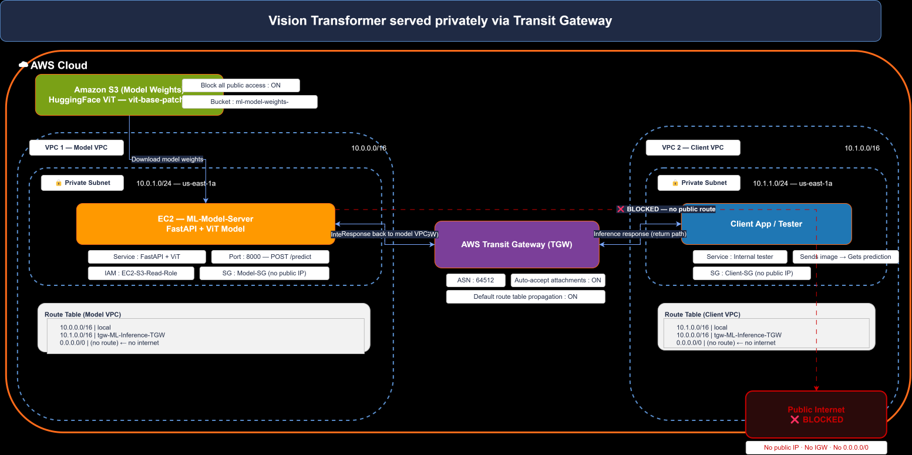
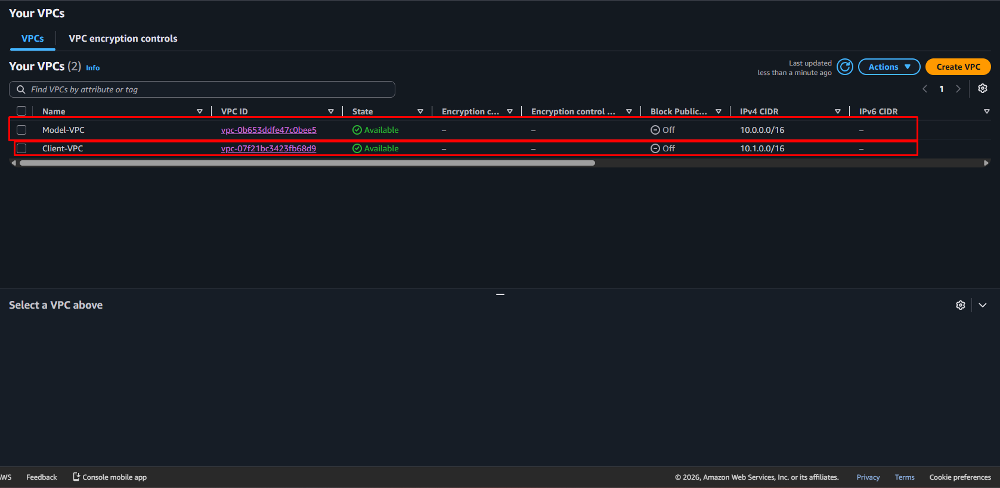
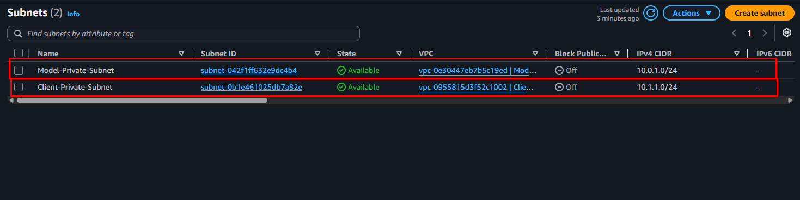
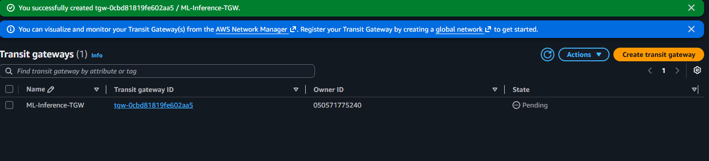
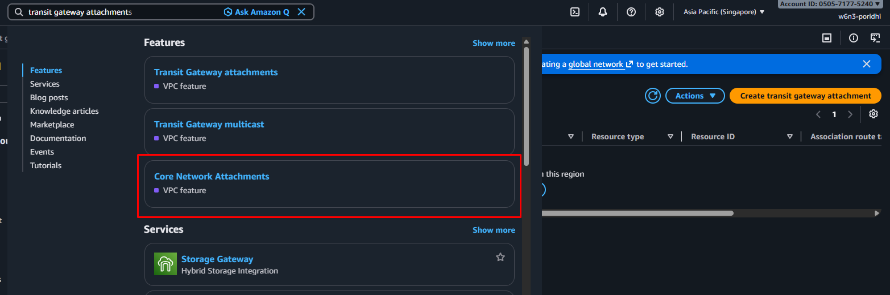
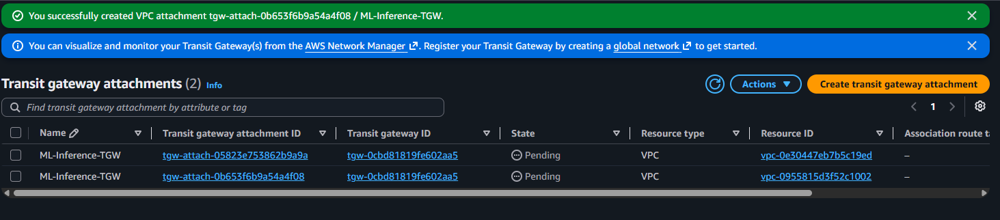
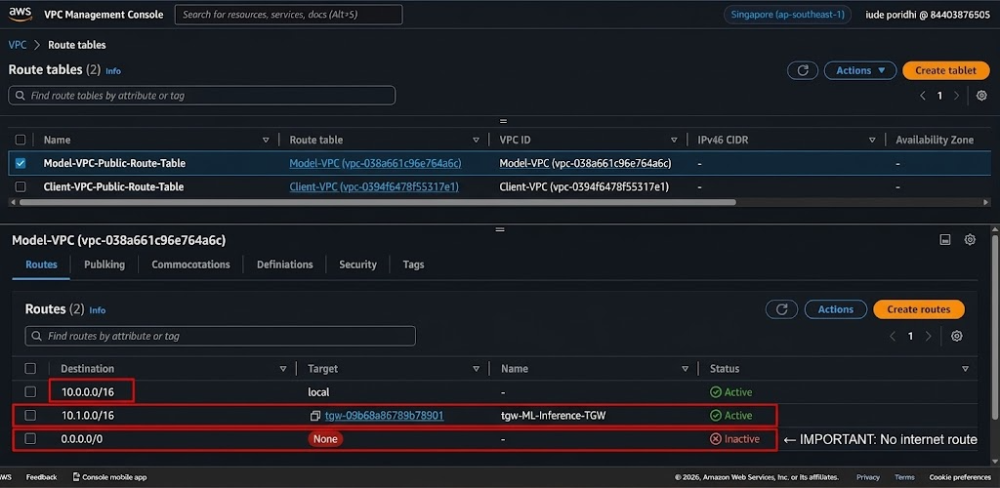

# Lab 1: VPC-Isolated ML Inference Endpoint

## Introduction

In production-grade ML systems, exposing a model publicly on the internet is a serious security risk. A Vision Transformer (ViT) or any other ML model placed in a public subnet can be discovered, probed, and abused : either for unauthorized inference (cost abuse) or for model exfiltration. This lab teaches you how to deploy an ML inference endpoint that lives entirely inside a private network, accessible **only** to authorized internal services through AWS Transit Gateway.

In this lab, you will build a two-VPC architecture: a **Model VPC** that hosts the FastAPI + ViT inference server inside a private subnet (no public IP), and a **Client VPC** that hosts an internal test client. The two VPCs are connected via an AWS Transit Gateway (TGW) using internal, private routing : completely isolated from the public internet. Model weights are stored in S3 and downloaded by the EC2 instance on launch.


## Architecture




*Figure 1: VPC-isolated ML inference architecture showing Model VPC and Client VPC connected via Transit Gateway.*

### Architecture Explanation

**Model VPC (VPC 1):** Contains a private subnet with an EC2 instance running FastAPI and a HuggingFace ViT model for image classification. This instance has **no public IP** and no route to the internet. Model weights are downloaded from S3 on startup. The route table explicitly has **no `0.0.0.0/0` route** : meaning even if someone tried, there's no path to the internet.

**Client VPC (VPC 2):** Contains a private subnet with a Client App / Tester that sends image files to the inference server and receives predictions. This client is also private : it has no public IP. It connects to the model through the same TGW.

**AWS Transit Gateway (TGW):** Acts as the central private bridge connecting the two VPCs. Traffic between the model and client flows VPC-to-VPC through the TGW using internal AWS networking. Neither VPC has an Internet Gateway, so the public internet cannot reach either endpoint.

**Key design points (from the diagram):**
- Model weights in S3 (HuggingFace ViT model) : block all public access ON.
- Model server in private subnet (no public IP).
- Two VPCs connected via Transit Gateway.
- Client VPC accesses model internally via TGW.
- No direct internet access to the model endpoint.

## Learning Objectives

By the end of this lab, you will be able to:

- Design a **multi-VPC architecture** using AWS Transit Gateway for private service-to-service communication.
- Deploy a **Vision Transformer (ViT) inference server** using FastAPI inside a private subnet.
- Configure **route tables** to direct inter-VPC traffic through TGW only.
- Use **S3 + IAM** to securely deliver model weights to a private EC2 instance.
- Validate that the model endpoint is **completely inaccessible from the public internet**.
- Build a **secure, production-ready ML inference architecture**.


## Prologue

You will build a VPC-isolated ML inference endpoint : a Vision Transformer model served via FastAPI inside a private subnet, reachable only by an authorized client in a separate VPC via AWS Transit Gateway. The public internet is completely locked out.

This is the production-grade pattern for serving internal ML models inside large organizations where models must be protected from unauthorized access but still be callable by trusted services.

## Step-by-Step Implementation

### Step 1 : Create Two VPCs

Create two VPCs using the VPC Dashboard:

**VPC 1 : Model VPC**

```text
Name tag: Model-VPC
IPv4 CIDR block: 10.0.0.0/16
Tenancy: Default
```

**VPC 2 : Client VPC**

```text
Name tag: Client-VPC
IPv4 CIDR block: 10.1.0.0/16
Tenancy: Default
```




### Step 2 : Create Private Subnets in Each VPC

**Model Private Subnet:**

```text
VPC ID: Model-VPC
Subnet name: Model-Private-Subnet
Availability Zone: ap-southeast-1a
IPv4 CIDR block: 10.0.1.0/24
Auto-assign public IPv4: Disabled
```

**Client Private Subnet:**

```text
VPC ID: Client-VPC
Subnet name: Client-Private-Subnet
Availability Zone: ap-southeast-1a
IPv4 CIDR block: 10.1.1.0/24
Auto-assign public IPv4: Disabled


```



### Step 3 : Create the Transit Gateway (TGW)

VPC Dashboard → Transit Gateways → Create Transit Gateway:

```text
Name tag: ML-Inference-TGW
Description: TGW for ML inference
Amazon side ASN: 64512
Auto accept shared attachments: Enable
Default route table association: Enable
Default route table propagation: Enable
DNS support: Enable
```

Wait until the TGW state becomes `available` before continuing.



**What just happened?**

The **AWS Transit Gateway (TGW)** acts as a central, highly available router that lets multiple VPCs talk to each other **privately** without ever touching the public internet. Think of it as a private switchboard inside AWS : once both VPCs are attached, traffic flows VPC-to-VPC over AWS's internal backbone.

Key points about this TGW:
- **Amazon side ASN (64512)** : A private BGP Autonomous System Number used internally for routing between attachments. You don't interact with BGP directly; AWS handles it.
- **Auto accept shared attachments** : If you later share this TGW with another AWS account, attachments are accepted automatically. For this single-account lab, this is harmless but convenient.
- **Default route table association + propagation** : Every attachment is automatically associated with (and propagates routes into) the TGW's default route table. This is why you don't need to manually create TGW route tables for this lab.
- **DNS support** : Allows DNS hostnames to resolve across VPCs through the TGW (useful if you later use private DNS names instead of raw IPs).

The TGW itself has **no internet gateway, no NAT, no public IP** : it's a pure Layer-3 routing construct. This is exactly why using a TGW keeps your model endpoint unreachable from the public internet.

After creation, you should see the TGW in the console with state transitioning from `pending` → `available` (usually 1–3 minutes). Do not proceed until the state reads `available`; otherwise attachments will fail.

### Step 4 : Attach Both VPCs to the Transit Gateway

Transit Gateways → Transit Gateway Attachments → Create attachment:





**Attachment 1 (Model VPC):**

```text
Attachment type: VPC
Transit Gateway: ML-Inference-TGW
VPC ID: Model-VPC
Subnet IDs: Model-Private-Subnet
```

**Attachment 2 (Client VPC):**

```text
Attachment type: VPC
Transit Gateway: ML-Inference-TGW
VPC ID: Client-VPC
Subnet IDs: Client-Private-Subnet
```



Wait until both attachments show `available`.

**What just happened?**

You just created **two Transit Gateway VPC attachments** : one elastic network interface per attachment that lives inside the chosen subnet of each VPC. This is the bridge that lets traffic flow from one VPC to the other through the TGW.

A few important details:
- **Why a single subnet per attachment?** A TGW attachment is made in **one subnet per AZ** for the VPC. AWS uses that subnet's ENI as the entry/exit point for traffic going to/from that VPC. If a VPC spans multiple AZs and you want redundancy, you would create one attachment per AZ. For this lab, a single attachment in a single AZ is enough.
- **No route is added yet.** Creating the attachment only wires the ENI; it does **not** automatically route traffic between VPCs. You still need explicit route table entries (Step 5) to actually send cross-VPC traffic through the TGW.
- **Status lifecycle:** the attachment will go `pending` → `available` (usually 30–90 seconds). If it stays `pending` for more than 3 minutes, double-check that the TGW itself is `available` and that the subnet IDs are correct.
- **What flows where:** once routing is configured in Step 5, any packet from `Client-VPC` (10.1.0.0/16) destined for `Model-VPC` (10.0.0.0/16) will be handed off to the TGW via the Client attachment's ENI, routed across AWS's private backbone, and delivered to the Model attachment's ENI. The packet never leaves AWS's network.

You should now have a fully wired (but not yet routed) TGW topology. The next step adds the actual route tables that direct traffic through it.

### Step 5 : Configure Route Tables

**Model VPC Route Table:**

```text
Destination     Target
10.0.0.0/16     local
10.1.0.0/16     tgw-ML-Inference-TGW
0.0.0.0/0       (no route)   ← IMPORTANT: no internet
```

**Client VPC Route Table:**

```text
Destination     Target
10.1.0.0/16     local
10.0.0.0/16     tgw-ML-Inference-TGW
0.0.0.0/0       (no route)   ← IMPORTANT: no internet
```



### Step 6 : Create Security Groups

**Model-SG (attached to Model EC2):**

| Type        | Protocol | Port Range | Source      | Description                 |
| ----------- | -------- | ---------- | ----------- | --------------------------- |
| Custom TCP  | TCP      | 8000       | 10.1.0.0/16 | FastAPI from Client VPC     |
| SSH         | TCP      | 22         | 10.1.0.0/16 | SSH from Client VPC (SSM)   |

VPC: Model-VPC

**Client-SG (attached to Client EC2):**

| Type | Protocol | Port Range | Source  | Description                  |
| ---- | -------- | ---------- | ------- | ---------------------------- |
| SSH  | TCP      | 22         | My IP   | SSH from your local machine  |

VPC: Client-VPC

### Step 7 : Create S3 Bucket for Model Weights

S3 → Create bucket:

```text
Bucket name: ml-model-weights-<unique-name>
Region: ap-southeast-1
Block all public access: ON (very important)
```

Upload your pre-downloaded HuggingFace ViT model to the bucket under a folder (e.g. `s3://ml-model-weights-<unique>/vit-model/`).

To download the model locally first:

```bash
pip install transformers torch
python -c "
from transformers import ViTForImageClassification
ViTForImageClassification.from_pretrained('google/vit-base-patch16-224').save_pretrained('./vit-model')
"
aws s3 cp ./vit-model s3://ml-model-weights-<unique>/vit-model/ --recursive
```

### Step 8 : Create IAM Role for EC2 → S3 Access

IAM → Roles → Create role:

```text
Trusted entity type: AWS service
Use case: EC2
Permissions policy: AmazonS3ReadOnlyAccess
Role name: EC2-S3-Read-Role
```

### Step 9 : Launch the Model EC2 (in Model Private Subnet)

EC2 → Launch instance:

```text
Name: ML-Model-Server
AMI: Ubuntu Server 22.04 LTS
Instance type: t3.medium  (or g4dn.xlarge for GPU)
Key pair: create/select existing
Network:
  VPC: Model-VPC
  Subnet: Model-Private-Subnet
  Auto-assign Public IP: Disabled
  Security group: Model-SG
  IAM instance profile: EC2-S3-Read-Role
```

**User data (advanced details):**

```bash
#!/bin/bash
apt update -y
apt install python3-pip -y
pip3 install fastapi uvicorn transformers torch boto3 pillow

mkdir -p /home/ubuntu/model
aws s3 cp s3://ml-model-weights-<unique>/vit-model/ /home/ubuntu/model/ --recursive

cat > /home/ubuntu/app.py << 'EOF'
from fastapi import FastAPI, File, UploadFile
from transformers import ViTImageProcessor, ViTForImageClassifier
from PIL import Image
import io

app = FastAPI()
processor = ViTImageProcessor.from_pretrained("./model")
model = ViTForImageClassifier.from_pretrained("./model")

@app.post("/predict")
async def predict(file: UploadFile = File(...)):
    image = Image.open(io.BytesIO(await file.read())).convert("RGB")
    inputs = processor(images=image, return_tensors="pt")
    outputs = model(**inputs)
    predicted_class = outputs.logits.argmax(-1).item()
    label = model.config.id2label[predicted_class]
    return {"class_id": predicted_class, "label": label}
EOF

cd /home/ubuntu
nohup uvicorn app:app --host 0.0.0.0 --port 8000 > server.log 2>&1 &
```

### Step 10 : Launch the Client EC2 (in Client Private Subnet)

EC2 → Launch instance:

```text
Name: Client-App-Tester
AMI: Ubuntu Server 22.04
Instance type: t3.micro
Network:
  VPC: Client-VPC
  Subnet: Client-Private-Subnet
  Auto-assign Public IP: Disabled
  Security group: Client-SG
  IAM instance profile: EC2-S3-Read-Role   (for SSM session manager later)
```

### Step 11 : Connect to Private EC2s Using Session Manager

Since both EC2s are in private subnets, SSH directly is not possible. Use AWS Systems Manager Session Manager:

**Step 11.1:** Create an additional IAM role `EC2-SSM-Role` with `AmazonSSMManagedInstanceCore` policy and attach to **both** EC2s.

**Step 11.2:** From the EC2 console, select each instance → Connect → Session Manager → Connect.

### Step 12 : Get the Model EC2 Private IP

From the EC2 console → Instances → ML-Model-Server → Details tab → note the **Private IPv4 address** (e.g. `10.0.1.50`).

### Step 13 : Test Connectivity from the Client

From the **Client EC2 Session Manager terminal**:

```bash
ping 10.0.1.50
```

Expected: successful pings.

### Step 14 : Test the Inference Endpoint

From the **Client EC2**:

```bash
# Upload any test image (here we download a sample cat image)
curl -o /tmp/test.jpg https://upload.wikimedia.org/wikipedia/commons/thumb/4/4d/Cat_November_2010-1a.jpg/1200px-Cat_November_2010-1a.jpg

# Send to the model
curl -X POST http://10.0.1.50:8000/predict -F "file=@/tmp/test.jpg"
```

Expected response:

```json
{"class_id":281,"label":"tabby, tabby cat"}
```

### Step 15 : Verify Public Internet is Blocked

From the **Model EC2 Session Manager terminal**:

```bash
curl http://google.com      # Should FAIL: Could not resolve host
ping 8.8.8.8                # Should FAIL: Network unreachable
```

Expected: both commands fail, confirming the model endpoint has no internet access.

## Verification

After completing the implementation, verify each piece:

```text
[ ] Model-VPC (10.0.0.0/16) and Client-VPC (10.1.0.0/16) exist.
[ ] Model-Private-Subnet and Client-Private-Subnet exist with public IP auto-assignment disabled.
[ ] ML-Inference-TGW is in `available` state.
[ ] Both VPCs are attached to the TGW and attachments are `available`.
[ ] Route tables route 10.1.0.0/16 and 10.0.0.0/16 to the TGW (no 0.0.0.0/0 route).
[ ] ML-Model-Server is running in Model-Private-Subnet with no public IP.
[ ] Client-App-Tester is running in Client-Private-Subnet with no public IP.
[ ] Model-SG only allows port 8000 from 10.1.0.0/16 (Client VPC CIDR).
[ ] S3 bucket has block all public access enabled.
[ ] Model EC2 can `ping` Client EC2 and vice versa via TGW.
[ ] `curl http://<model-private-ip>:8000/predict` from the Client EC2 returns a valid classification.
[ ] Model EC2 cannot reach google.com or 8.8.8.8.
```

## Testing

### Test 1 : Inter-VPC Connectivity via TGW

From Client EC2:

```bash
ping 10.0.1.50   # Model private IP
```

Expected: successful pings.

### Test 2 : Image Inference

From Client EC2:

```bash
curl -X POST http://10.0.1.50:8000/predict -F "file=@/tmp/test.jpg"
```

Expected: `{"class_id":281,"label":"tabby, tabby cat"}` (or another ImageNet label depending on the test image).

### Test 3 : Internet Isolation

From Model EC2:

```bash
curl http://google.com   # Should FAIL
ping 8.8.8.8            # Should FAIL
```

Expected: both fail : model is completely isolated from the internet.

### Test 4 : Security Group Behavior

From a machine **outside** the Client VPC (or from the Client EC2 trying to reach an unauthorized port):

```bash
curl http://10.0.1.50:22    # Should FAIL : port 22 only open from 10.1.0.0/16 in Model-SG
```

Expected: connection refused / timeout, proving least-privilege network access.

## Troubleshooting

| #  | Problem                                                                  | Likely Cause                                                              | Fix                                                                                                                                                                              |
| -- | ------------------------------------------------------------------------ | ------------------------------------------------------------------------- | -------------------------------------------------------------------------------------------------------------------------------------------------------------------------------- |
| 1  | TGW attachment stuck in `pending`                                        | TGW still provisioning                                                    | Wait 2–3 minutes for TGW to reach `available` state                                                                                                                              |
| 2  | `ping` to model IP fails from client                                     | Route table missing entry to other VPC                                    | Add route `10.0.0.0/16 → tgw-XXX` in Client VPC route table                                                                                                                      |
| 3  | `curl http://10.0.1.50:8000/predict` times out                           | Security group missing port 8000                                          | Add rule: Custom TCP, port 8000, source `10.1.0.0/16`                                                                                                                            |
| 4  | `curl http://10.0.1.50:8000/predict` connection refused                  | uvicorn not running on model EC2                                          | SSH via SSM, check `ps aux \| grep uvicorn`, restart if needed                                                                                                                   |
| 5  | `Connection refused` to S3 from model EC2                                | IAM role not attached or wrong policy                                     | Confirm `EC2-S3-Read-Role` is attached; policy has `s3:GetObject`                                                                                                                 |
| 6  | Session Manager "Instance not in list"                                   | SSM agent not running or IAM role missing                                 | Attach `AmazonSSMManagedInstanceCore` to the EC2, restart SSM agent                                                                                                              |
| 7  | `curl https://google.com` succeeds on model EC2                          | Internet Gateway accidentally attached                                    | Confirm there is no IGW attached to Model-VPC; remove if present                                                                                                                 |
| 8  | Model returns 500 / wrong predictions                                    | Model not fully downloaded                                                | Check `ls -la /home/ubuntu/model/` shows config + weights files; re-run `aws s3 cp`                                                                                              |
| 9  | Default route table propagation hides explicit routes                    | TGW uses default RT, associations were reset                              | In TGW → Route Tables, verify both VPC attachments are associated and propagated                                                                                                  |
| 10 | Inference server reachable from public internet (sanity check)           | SG accidentally allows `0.0.0.0/0` on port 8000                           | Tighten Model-SG source to `10.1.0.0/16` only                                                                                                                                    |

## Cleanup

To avoid unnecessary charges, delete resources in this exact order:

1. **Terminate EC2 instances** (`ML-Model-Server`, `Client-App-Tester`).
2. **Delete Transit Gateway attachments** (Model VPC, Client VPC).
3. **Delete Transit Gateway.**
4. **Delete S3 bucket** (objects first, then bucket).
5. **Delete VPCs** (`Model-VPC`, `Client-VPC`) : subnets, route tables, and SGs are removed automatically or manually as needed.
6. **Delete IAM role** `EC2-S3-Read-Role` (optional).

```bash
# AWS CLI teardown example
aws ec2 terminate-instances --instance-ids i-MODEL_ID i-CLIENT_ID
aws ec2 wait instance-terminated --instance-ids i-MODEL_ID i-CLIENT_ID

aws ec2 delete-transit-gateway-vpc-attachment --transit-gateway-attachment-id tgw-attach-MODEL
aws ec2 delete-transit-gateway-vpc-attachment --transit-gateway-attachment-id tgw-attach-CLIENT
aws ec2 delete-transit-gateway --transit-gateway-id tgw-XXXXX

aws s3 rm s3://ml-model-weights-<unique> --recursive
aws s3 rb s3://ml-model-weights-<unique>

aws ec2 delete-security-group --group-id sg-MODEL_SG
aws ec2 delete-security-group --group-id sg-CLIENT_SG
aws ec2 delete-subnet --subnet-id subnet-MODEL
aws ec2 delete-subnet --subnet-id subnet-CLIENT
aws ec2 delete-route-table --route-table-id rtb-MODEL
aws ec2 delete-route-table --route-table-id rtb-CLIENT
aws ec2 delete-vpc --vpc-id vpc-MODEL_ID
aws ec2 delete-vpc --vpc-id vpc-CLIENT_ID

aws iam remove-role-from-instance-profile --instance-profile-name EC2-S3-Read-Role --role-name EC2-S3-Read-Role
aws iam delete-instance-profile --instance-profile-name EC2-S3-Read-Role
aws iam delete-role --role-name EC2-S3-Read-Role
```

## Epilogue

You have successfully deployed a **fully VPC-isolated ML inference endpoint** using a Vision Transformer model. The model endpoint is reachable only by the authorized Client VPC through AWS Transit Gateway, and is completely inaccessible from the public internet. Model weights were securely delivered through S3 + IAM, and the EC2 instance never needed a public IP.

This is the canonical pattern for serving internal ML models securely inside an organization, where the model is a valuable asset that must be protected from external abuse.

## Principles

This lab demonstrates several core security and architecture principles:

- **Defense in depth** : multiple isolation layers (subnet, route table, SG, no IGW).
- **Least privilege networking** : SG only allows traffic from the Client VPC CIDR.
- **Zero public exposure** : model has no public IP and no IGW route.
- **Private service-to-service communication** : TGW provides internal-only routing.
- **Separation of model and clients** : different VPCs isolate blast radius.
- **IAM-based access** : S3 access via role, not access keys.
- **Cost awareness** : explicit cleanup order avoids orphan resources.

## What You Learned

- Designing a multi-VPC, isolated ML inference architecture.
- Configuring AWS Transit Gateway as a private VPC-to-VPC bridge.
- Deploying a HuggingFace ViT model with FastAPI on a private EC2.
- Downloading model weights securely via S3 + IAM.
- Configuring route tables and security groups for least-privilege traffic.
- Verifying that the model endpoint is fully isolated from the public internet.
- Cleaning up AWS resources to avoid unexpected billing.

## Next Steps

- Add **authentication** (API keys, mTLS, or IAM SigV4) to the inference API.
- Add **CloudWatch monitoring** and **alarms** for inference latency.
- Replace EC2 with **ECS Fargate** or **EKS** for horizontal scaling.
- Add an **Application Load Balancer** inside the Model VPC for multi-instance inference.
- Add **model versioning** with S3 prefixes and dynamic model selection.
- Extend with a **third VPC** (e.g. analytics VPC) connected via the same TGW.

## Conclusion

You have completed **Lab 1: VPC-Isolated ML Inference Endpoint** and built a production-grade, multi-VPC architecture that fully isolates a Vision Transformer inference server from the public internet while keeping it reachable to authorized internal services through AWS Transit Gateway. Across this lab you practiced the full lifecycle of a secure AWS network design: creating isolated VPCs, configuring private subnets with no public IP, attaching both VPCs to a Transit Gateway, writing route tables with no default internet route, locking down Security Groups to least-privilege CIDRs, delivering model weights through S3 with IAM roles (no static credentials), accessing private EC2 instances via SSM Session Manager, and verifying the model is reachable internally while the internet is provably blocked.


