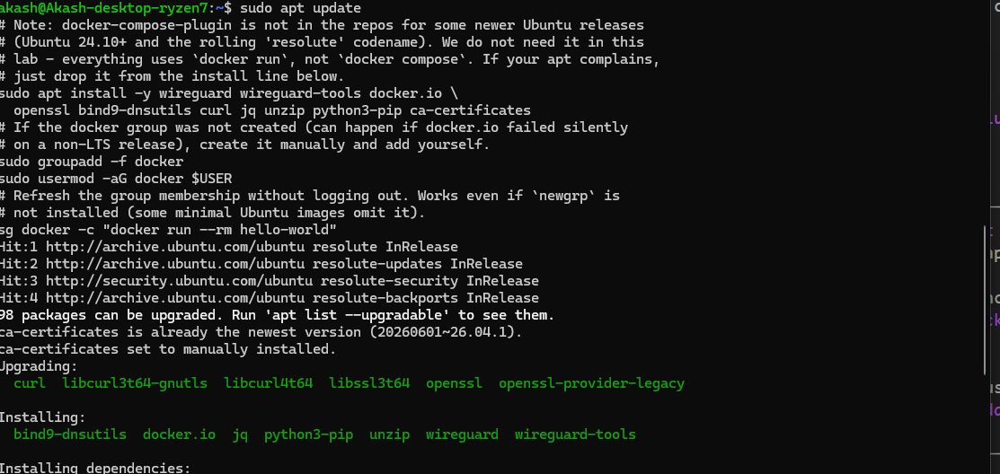

# Lab 2 : Hybrid ML Inference Failover with TLS, Cross-Region Standby, MinIO Replication, Paging, and Chaos Drills


## Introduction

In Lab 1 you isolated a model inside a VPC so it could not leak to the internet. In the base Lab 2 you collapsed the "two-region, two-VPC" failover pattern down to a **single hybrid topology**: a Whisper inference endpoint on your local PC acts as the primary, an EC2 in `ap-southeast-1` acts as the standby, a WireGuard tunnel carries traffic between them, MinIO on the PC serves the model weights, and a Route 53 + Lambda control plane flips DNS when the primary becomes unhealthy. The pedagogical goal of Lab 2 (active-passive failover, health-driven control plane, full observability with Prometheus and Grafana) was preserved, but the network footprint was reduced from "two regions and a Transit Gateway" to "one region and a tunnel to your home lab".

This extended version keeps that exact same goal, then layers four new concerns on top, the concerns a real SRE team would care about in week two of running the system:

1. **Encryption in transit**: every link in the data plane (client to Whisper, EC2 to MinIO, Lambda probe to Whisper, WireGuard handshake bootstrapping) now runs over a self-managed PKI you generate on the PC. The lab teaches what "TLS" actually buys you when you control both ends.
2. **A real second region**: an additional standby Whisper endpoint is added in `ap-southeast-2`, joined to the same control plane. Now failover can pick `ap-southeast-1 EC2` or `ap-southeast-2 EC2` as the next hop, which is the closest pedagogical analogue to the original two-region lab while still keeping the hybrid "PC is primary" twist.
3. **MinIO server-side replication**: the model weights bucket on the PC replicates to a second MinIO running in `ap-southeast-1 EC2`. The regional standby now serves inference from a local copy of the weights and does not depend on the WireGuard tunnel being up at request time.
4. **Paging and chaos drills**: every failover event pages the operator through SNS, and the verification step now includes scripted chaos drills (Whisper crash, WireGuard link loss, primary region blackout, MinIO down, split-brain attempt) instead of a single "stop the container" test.

The end state is the same goal as base Lab 2 (active-passive failover that recovers automatically, is fully observable, and survives component failures), but the lab now also answers the questions a reviewer will ask in production review: "is it encrypted?", "what happens if the tunnel dies?", "who gets paged?", "is there a drill runbook?".

## Architecture


### Architecture Explanation

The control plane and the data plane are kept deliberately separate. The **data plane** is what an end caller (the client application) sees: a single DNS name `whisper.hybrid.lab.` whose A record currently points at the active endpoint, the PC on the home network. The Lambda and DynamoDB do not sit in the request path; they only decide which IP the DNS name resolves to. The **control plane** is the Lambda + EventBridge + DynamoDB + Route 53 + Secrets Manager stack, all running inside AWS, which probes the PC and both EC2s once a minute and rewrites the Route 53 record when the active endpoint fails its health check.

WireGuard carries traffic between the home network and the AWS VPC over a single UDP/51820 path. Because the tunnel is initiated by the PC, the home network's dynamic public IP is not a problem: the EC2 side has a stable Elastic IP, the PC keeps trying to reach it, and `PersistentKeepalive=25` keeps NAT entries warm. All traffic that crosses the tunnel (Whisper request/response, MinIO pull, Prometheus scrape, Lambda probe) is now wrapped in TLS using a self-managed PKI generated on the PC, so the lab teaches what "encryption in transit" actually buys you when you control both ends.

The two AWS standby regions give the control plane a real choice when the primary fails. The Lambda probes the PC first, then `ap-southeast-1 EC2`, then `ap-southeast-2 EC2`, in that order, and writes whichever IP is the first healthy one into Route 53. The second region is reached over a normal cross-region VPC peering connection, not over the WireGuard tunnel, so the system keeps working even if the tunnel goes down. MinIO server-side replication keeps the model weights synchronized from the PC's primary bucket to a replica on the `ap-southeast-1 EC2`, which the `ap-southeast-2 EC2` then pulls from over the peering connection at boot, so the second region is fully self-contained at inference time.

## Learning Objectives

By the end of this lab, you will be able to:

- Extend an active-passive failover pattern into a three-tier topology (local primary, regional standby, second-region standby) while keeping the same health-driven control plane.
- Stand up a self-managed PKI with `openssl` on the PC and use it to wrap MinIO, Whisper, the Lambda probe, and the cross-region pull in TLS.
- Configure MinIO server-side bucket replication between two MinIO instances and use it to decouple the standby region from the WireGuard tunnel.
- Add CloudWatch alarms and SNS paging to a Route 53 + Lambda failover brain so operators are notified when the control plane flips traffic.
- Run scripted chaos drills (Whisper crash, WireGuard link loss, primary region blackout, MinIO down, split-brain attempt) and observe the system recovering or being detected.
- Share a single Route 53 + Lambda control plane across two heterogeneous workloads (Whisper for audio, YOLO for vision) to prove the pattern is reusable.
- Reason about failure domains (tunnel down, region down, bucket down, control plane down) and which component is responsible for which detection.

## Prerequisites

- Completion of the base lab in this folder, or equivalent understanding of WireGuard, MinIO, Lambda, and Route 53 failover.
- An AWS account with permissions for VPC, EC2, IAM, Lambda, DynamoDB, Route 53, EventBridge, SNS, Secrets Manager, CloudWatch, and S3 (for cross-region replication).
- AWS CLI installed and configured with two profiles: `primary` for `ap-southeast-1` and `standby` for `ap-southeast-2`.
- Region : **ap-southeast-1** (Singapore) is the primary region, **ap-southeast-2** (Sydney) is the cross-region standby. AZs `ap-southeast-1a` and `ap-southeast-2a` are used.
- A local PC (Linux, macOS, or Windows + WSL2) that can stay on for the duration of the drill, with Docker and WireGuard installed.
- `openssl`, `mc` (MinIO client), `dig`, `curl`, and `jq` installed on the PC.
- A test audio file (WAV/MP3) under 5 MB and a test image (JPG/PNG) for the YOLO workload.
- An email address you can subscribe to the SNS paging topic (use a real address; this is the actual paging path).
- Estimated cost : ~$2.00/hour for three t3.small EC2s + the WireGuard server + cross-region peering + Secrets Manager. **Tear down at the end.**

## Prologue

You are an SRE who built the base hybrid failover system last week. It works : the Lambda flips the Route 53 record, the WireGuard tunnel holds, Prometheus renders the failover, and you can take the PC down without losing inference. Now it is week two. The security team wants TLS. The platform team wants a real second region so the system survives `ap-southeast-1` going down. The on-call rotation wants a pager that fires when the control plane flips traffic. And you, the SRE, want a chaos drill you can run before every change so you know the system still recovers.

This lab walks through adding each of those layers, in the same order you would do them in production : encrypt first (TLS), then add the second region, then add paging, then write the chaos runbook. The goal of Lab 2 (active-passive failover that recovers automatically, is observable end to end, and survives a single component failure) is preserved at every step. The new goal of this extension is to make the system survive multiple simultaneous failures and to be auditable in a security review.

## Phase 0 : Bootstrap from zero

If you already finished the base lab (in this folder) and your topology is currently running, you can skip Phase 0 entirely and go straight to Step 1B. If you are starting from scratch (no PC prep, no AWS account, no base lab), follow this section in order. Phase 0 ends with the same five checks that Step 1B runs, so by the time you leave Phase 0 you are caught up to where Step 1B expects you to be.

### Step 0.1 : Pick and prepare the PC

Choose one real machine to act as the "primary" endpoint. It must stay on for the whole lab.

- **Windows 10/11 with WSL2 (recommended)** : in an elevated PowerShell, run `wsl --install -d Ubuntu-22.04`, reboot, then launch "Ubuntu 22.04" from the Start menu.
- **macOS** : use the built-in Terminal. Install Docker Desktop from docker.com.
- **Bare Linux (Ubuntu 22.04)** : no extra setup.

Inside the Linux environment, install the toolchain the rest of the lab assumes you have.

```bash
sudo apt update
# Note: docker-compose-plugin is not in the repos for some newer Ubuntu releases
# (Ubuntu 24.10+ and the rolling 'resolute' codename). We do not need it in this
# lab - everything uses `docker run`, not `docker compose`. If your apt complains,
# just drop it from the install line below.
sudo apt install -y wireguard wireguard-tools docker.io \
  openssl bind9-dnsutils curl jq unzip python3-pip ca-certificates
# If the docker group was not created (can happen if docker.io failed silently
# on a non-LTS release), create it manually and add yourself.
sudo groupadd -f docker
sudo usermod -aG docker $USER
# Refresh the group membership without logging out. Works even if `newgrp` is
# not installed (some minimal Ubuntu images omit it).
sg docker -c "docker run --rm hello-world"
```

If `sg docker -c "docker run --rm hello-world"` says `docker: command not found`, your `docker.io` install actually failed. Use the official Docker convenience script, which is the documented path for non-Docker-Desktop WSL2 systems:

```bash
# Fallback : install Docker from get.docker.com. This is the upstream-supported
# path for WSL2 distros that ship without a recent docker.io in their apt repo.
curl -fsSL https://get.docker.com -o /tmp/get-docker.sh
sudo sh /tmp/get-docker.sh
sudo usermod -aG docker $USER
sg docker -c "docker run --rm hello-world"
```

macOS equivalent (Homebrew):

```bash
brew install wireguard-tools docker docker-compose openssl bind jq python@3.11
open -a Docker   # launch Docker Desktop, accept the priv helper prompt
```

What you should see : `docker run hello-world` prints "Hello from Docker!" and exits 0. If you get "permission denied" on the Docker socket, log out and back in so the `docker` group membership takes effect.




### Step 0.2 : Create the AWS account and the cost guardrail

Each numbered item is one click path in the AWS console.

1. Open https://console.aws.amazon.com/ in your browser. Sign in with your root account, or click **Create a new AWS account** (a credit card is required even for free-tier usage). The account activation email usually arrives in a few minutes.
2. In the top-right region selector, choose **Asia Pacific (Singapore) ap-southeast-1**. Every later step assumes this region.
3. Create a billing alarm at $5 so a forgotten teardown cannot run up a real bill. Click the search bar at the top of the console, type **Billing and Cost Management**, open it. In the left sidebar click **Budgets** → **Create budget** → choose **Cost budget** → click **Next**. Set **Name** to "lab-budget-listing", **Amount** to 5 USD, **Period** to Monthly, **Starting from** the first of this month. On the **Notifications** step, set **Threshold** to 85% of budget and enter your email. Click **Create budget**. You will get an email the first time you cross 85% of $5.
4. Create an IAM user for CLI access. In the search bar, type **IAM**, open it. In the left sidebar click **Users** → orange **Create user** button. **User name**: `lab2-admin`. Click **Next**. On the permission step, choose **Attach policies directly** → tick **AdministratorAccess**. Click **Next** → **Next** → **Create user**. The user is now created.
5. Create an access key for `lab2-admin`. In the IAM Users list, click the user name `lab2-admin` → **Security credentials** tab → scroll to **Access keys** → click **Create access key**. On the "Use case" step, choose **Command Line Interface (CLI)** → tick the "I understand..." acknowledgement at the bottom → click **Next**. Set a description tag like "lab2-cli" → click **Create access key**. The next page shows your **Access key ID** and **Secret access key**. Copy both now; AWS will never show the secret again. Click **Done**.
6. Save the keys to `~/aws-creds.env` on the PC. Run this in the WSL/Linux terminal, pasting your real values:

```bash
cat > ~/aws-creds.env <<'EOF'
export AWS_ACCESS_KEY_ID=AKIA...paste here...
export AWS_SECRET_ACCESS_KEY=...paste here...
export AWS_DEFAULT_REGION=ap-southeast-1
EOF
chmod 600 ~/aws-creds.env
ls -l ~/aws-creds.env
```

What you should see : `ls -l` reports `-rw-------` (permissions are exactly `600`). If you see `-rw-r--r--`, run `chmod 600 ~/aws-creds.env` again.

7. Take the screenshot for milestone `screenshots/06-iam-user-created.png` (IAM console showing the `lab2-admin` user) and `screenshots/04-aws-sts-get-caller-identity.png` will be taken at the end of Step 0.3, after the CLI is configured.

### Step 0.3 : Install and configure the AWS CLI on the PC

```bash
curl "https://awscli.amazonaws.com/awscli-exe-linux-x86_64.zip" -o /tmp/awscliv2.zip
cd /tmp && unzip -o awscliv2.zip && sudo ./aws/install
aws --version
# Non-interactive configure : paste the keys you saved in 0.2
aws configure set aws_access_key_id "$AWS_ACCESS_KEY_ID"
aws configure set aws_secret_access_key "$AWS_SECRET_ACCESS_KEY"
aws configure set default.region ap-southeast-1
aws configure set default.output json
source ~/aws-creds.env
# Sanity check
aws sts get-caller-identity
# First S3 sanity check (empty account returns "An error occurred (AccessDenied)")
aws s3 ls
```

What you should see : `aws --version` reports `aws-cli/2.x`. `aws sts get-caller-identity` returns JSON like:

```json
{
    "UserId": "AIDA...:lab2-admin",
    "Account": "123456789012",
    "Arn": "arn:aws:iam::123456789012:user/lab2-admin"
}
```

If you get `InvalidClientTokenId`, your keys were mistyped; re-run the `aws configure set ...` lines.

`aws s3 ls` returns `An error occurred (AccessDenied)` on a fresh account. That is expected and proves your keys are valid; the IAM policy is fine but no buckets exist yet.

Take the screenshot `screenshots/04-aws-sts-get-caller-identity.png` showing the JSON output above.

### Step 0.4 : Build the AWS side and the home network, end to end

This is the longest part of the lab. Every sub-step is one AWS resource (or one local file) plus its screenshot. Run each sub-step in order, and do not move on until the expected output matches.

#### 0.4.1 Reserve region, key pair, Elastic IP

```bash
export AWS_REGION=ap-southeast-1
aws ec2 describe-availability-zones --region $AWS_REGION \
  --query 'AvailabilityZones[0].ZoneName' --output text
# expected: ap-southeast-1a
```

Create the key pair that every EC2 will authenticate with:

```bash
mkdir -p ~/keys && cd ~/keys
aws ec2 create-key-pair --key-name puku-lab --query 'KeyMaterial' --output text > puku-lab.pem
chmod 400 puku-lab.pem
ls -l ~/keys/puku-lab.pem
# expected: -r-------- ... puku-lab.pem
```

Allocate the Elastic IP that will be the stable WireGuard endpoint:

```bash
EIP_ALLOC=$(aws ec2 allocate-address --domain vpc \
  --tag-specifications 'ResourceType=elastic-ip,Tags=[{Key=Name,Value=eip-wg}]' \
  --query 'AllocationId' --output text)
echo "AllocationId: $EIP_ALLOC"
EIP=$(aws ec2 describe-addresses --allocation-ids $EIP_ALLOC \
  --query 'Addresses[0].PublicIp' --output text)
echo "Elastic IP: $EIP"
# Save it for later steps
echo "export EIP=$EIP" >> ~/aws-creds.env
echo "export EIP_ALLOC=$EIP_ALLOC" >> ~/aws-creds.env
```

What you should see : a fresh IPv4 address (for example `54.251.x.y`). If `allocate-address` returns `AddressLimitExceeded`, you already have the maximum 5 EIPs in this region; release one you don't need.

Screenshot `screenshots/09-eip-allocated.png` (EC2 console → Elastic IPs, showing `eip-wg` and the public IP).

#### 0.4.2 Create the VPC, subnet, IGW, route table

```bash
# VPC
VPC=$(aws ec2 create-vpc --cidr-block 10.0.0.0/16 \
  --tag-specifications 'ResourceType=vpc,Tags=[{Key=Name,Value=lab2-vpc}]' \
  --query 'Vpc.VpcId' --output text)
echo "VPC: $VPC"

# Public subnet in ap-southeast-1a
SUBNET=$(aws ec2 create-subnet --vpc-id $VPC --cidr-block 10.0.1.0/24 \
  --availability-zone ap-southeast-1a \
  --map-public-ip-on-launch \
  --tag-specifications 'ResourceType=subnet,Tags=[{Key=Name,Value=lab2-public-subnet}]' \
  --query 'Subnet.SubnetId' --output text)
echo "Subnet: $SUBNET"

# Enable DNS hostnames (required for Route 53 private zones to resolve)
aws ec2 modify-vpc-attribute --vpc-id $VPC --enable-dns-hostnames
aws ec2 modify-vpc-attribute --vpc-id $VPC --enable-dns-support

# IGW
IGW=$(aws ec2 create-internet-gateway \
  --tag-specifications 'ResourceType=internet-gateway,Tags=[{Key=Name,Value=lab2-igw}]' \
  --query 'InternetGateway.InternetGatewayId' --output text)
aws ec2 attach-internet-gateway --internet-gateway-id $IGW --vpc-id $VPC

# Route table : 0.0.0.0/0 -> IGW
RTB=$(aws ec2 create-route-table --vpc-id $VPC \
  --tag-specifications 'ResourceType=route-table,Tags=[{Key=Name,Value=lab2-rt}]' \
  --query 'RouteTable.RouteTableId' --output text)
aws ec2 create-route --route-table-id $RTB --destination-cidr-block 0.0.0.0/0 \
  --gateway-id $IGW
aws ec2 associate-route-table --subnet-id $SUBNET --route-table-id $RTB

# Persist for later
cat >> ~/aws-creds.env <<EOF
export VPC=$VPC
export SUBNET=$SUBNET
export IGW=$IGW
export RTB=$RTB
EOF
```

What you should see : each `aws ec2 create-*` returns a single ID string starting with `vpc-`, `subnet-`, `igw-`, `rtb-`. If you see a JSON error, your IAM policy may be missing permissions.

Screenshot `screenshots/07-vpc-created.png` (VPC console with `lab2-vpc` selected, showing CIDR `10.0.0.0/16`).
Screenshot `screenshots/08-subnet-route-table.png` (Route table console with `0.0.0.0/0 → lab2-igw`).

#### 0.4.3 Create the three security groups

```bash
# Get your home IP (the IP you SSH from)
HOME_IP=$(curl -s https://checkip.amazonaws.com)
echo "Your home IP: $HOME_IP"

# sg-wg : the WireGuard server. Allows UDP 51820 from the world, SSH from home,
# and all tunnel traffic from 10.99.0.0/24 and 10.0.0.0/16.
SG_WG=$(aws ec2 create-security-group --group-name sg-wg --description "WireGuard server" \
  --vpc-id $VPC --query 'GroupId' --output text)
aws ec2 authorize-security-group-ingress --group-id $SG_WG --protocol udp --port 51820 --cidr 0.0.0.0/0
aws ec2 authorize-security-group-ingress --group-id $SG_WG --protocol tcp --port 22 --cidr $HOME_IP/32
aws ec2 authorize-security-group-ingress --group-id $SG_WG --protocol tcp --port 0-65535 --cidr 10.99.0.0/24
aws ec2 authorize-security-group-ingress --group-id $SG_WG --protocol tcp --port 0-65535 --cidr 10.0.0.0/16
aws ec2 authorize-security-group-ingress --group-id $SG_WG --protocol icmp --port -1 --cidr 10.99.0.0/24

# sg-whisper-ec2 : the Whisper standby. Allows SSH from home, Whisper from the tunnel.
SG_WHISPER=$(aws ec2 create-security-group --group-name sg-whisper-ec2 --description "Whisper standby" \
  --vpc-id $VPC --query 'GroupId' --output text)
aws ec2 authorize-security-group-ingress --group-id $SG_WHISPER --protocol tcp --port 22 --cidr $HOME_IP/32
aws ec2 authorize-security-group-ingress --group-id $SG_WHISPER --protocol tcp --port 8000 --cidr 10.99.0.0/24
aws ec2 authorize-security-group-ingress --group-id $SG_WHISPER --protocol tcp --port 9100 --cidr 10.99.0.0/24

# sg-client-ec2 : the Prometheus/Grafana host. SSH from home, UI from the tunnel.
SG_CLIENT=$(aws ec2 create-security-group --group-name sg-client-ec2 --description "Client EC2 monitoring" \
  --vpc-id $VPC --query 'GroupId' --output text)
aws ec2 authorize-security-group-ingress --group-id $SG_CLIENT --protocol tcp --port 22 --cidr $HOME_IP/32
aws ec2 authorize-security-group-ingress --group-id $SG_CLIENT --protocol tcp --port 9090 --cidr 10.99.0.0/24
aws ec2 authorize-security-group-ingress --group-id $SG_CLIENT --protocol tcp --port 3000 --cidr 10.99.0.0/24
aws ec2 authorize-security-group-ingress --group-id $SG_CLIENT --protocol tcp --port 9100 --cidr 10.99.0.0/24
aws ec2 authorize-security-group-ingress --group-id $SG_CLIENT --protocol tcp --port 9090 --cidr $HOME_IP/32
aws ec2 authorize-security-group-ingress --group-id $SG_CLIENT --protocol tcp --port 3000 --cidr $HOME_IP/32

# sg-lambda : no ingress, all egress (Lambda is in the VPC)
SG_LAMBDA=$(aws ec2 create-security-group --group-name sg-lambda --description "Failover Lambda" \
  --vpc-id $VPC --query 'GroupId' --output text)

# Save
cat >> ~/aws-creds.env <<EOF
export SG_WG=$SG_WG
export SG_WHISPER=$SG_WHISPER
export SG_CLIENT=$SG_CLIENT
export SG_LAMBDA=$SG_LAMBDA
EOF
```

What you should see : four group IDs starting with `sg-`. Verify with `aws ec2 describe-security-groups --group-ids $SG_WG $SG_WHISPER $SG_CLIENT $SG_LAMBDA --query 'SecurityGroups[].[GroupName,IpPermissions]'` — each should have the ingress rules you just added.

#### 0.4.4 Launch the WireGuard server

```bash
# Find the latest Amazon Linux 2023 AMI
AMI=$(aws ec2 describe-images --owners 137112412989 \
  --filters "Name=name,Values=al2023-ami-2023.*-x86_64" \
  --query 'Images | sort_by(@, &CreationDate) | [-1].ImageId' --output text)
echo "AMI: $AMI"

WG_USERDATA=$(cat <<'EOF'
#!/bin/bash
amazon-linux-extras install -y epel
yum install -y wireguard-tools iptables-services
echo "net.ipv4.ip_forward=1" >> /etc/sysctl.conf
sysctl -w net.ipv4.ip_forward=1
systemctl enable --now iptables
iptables -t nat -A POSTROUTING -s 10.99.0.0/24 -o eth0 -j MASQUERADE
service iptables save
EOF
)

WG_INSTANCE=$(aws ec2 run-instances \
  --image-id $AMI --instance-type t3.micro \
  --subnet-id $SUBNET --associate-public-ip-address \
  --security-group-ids $SG_WG \
  --key-name puku-lab \
  --private-ip-address 10.0.1.10 \
  --tag-specifications 'ResourceType=instance,Tags=[{Key=Name,Value=wg-server}]' \
  --user-data "$WG_USERDATA" \
  --query 'Instances[0].InstanceId' --output text)
echo "wg-server: $WG_INSTANCE"

# Wait for it to be running
aws ec2 wait instance-running --instance-ids $WG_INSTANCE

# Associate the Elastic IP
aws ec2 associate-address --instance-id $WG_INSTANCE --allocation-id $EIP_ALLOC
echo "export WG_INSTANCE=$WG_INSTANCE" >> ~/aws-creds.env
```

What you should see : an instance ID starting with `i-`, `wait instance-running` returns once state is `running`. If `associate-address` complains about "Address already associated", your EIP was already linked; check with `aws ec2 describe-addresses --allocation-ids $EIP_ALLOC`.

Screenshot `screenshots/10-wg-server-launched.png` (EC2 console with `wg-server` in running state, Elastic IP visible).

#### 0.4.5 Generate WireGuard keys (server + PC) and write both configs

Run on the **PC**:

```bash
# Server keypair : generated on the PC, the private key is then copied into wg-server.
wg genkey | tee ~/keys/wg_server_private.key | wg pubkey > ~/keys/wg_server_public.key
# PC keypair
wg genkey | tee ~/keys/pc_private.key | wg pubkey > ~/keys/pc_public.key
chmod 600 ~/keys/wg_server_private.key ~/keys/pc_private.key
cat ~/keys/wg_server_public.key ~/keys/pc_public.key
```

What you should see : four files, each one line of base64. The two public keys are what you put in the *opposite* side's `[Peer]` block.

Build the server config (`/etc/wireguard/wg0.conf` on `wg-server`):

```bash
SERVER_PRIV=$(cat ~/keys/wg_server_private.key)
PC_PUB=$(cat ~/keys/pc_public.key)

cat > /tmp/wg0-server.conf <<EOF
[Interface]
Address = 10.99.0.1/24
ListenPort = 51820
PrivateKey = $SERVER_PRIV

[Peer]
PublicKey = $PC_PUB
AllowedIPs = 10.99.0.2/32, 10.0.0.0/16
PersistentKeepalive = 25
EOF
cat /tmp/wg0-server.conf
```

SSH into the WireGuard server and install the config:

```bash
scp -i ~/keys/puku-lab.pem /tmp/wg0-server.conf ec2-user@$EIP:/tmp/wg0.conf
ssh -i ~/keys/puku-lab.pem ec2-user@$EIP "sudo mv /tmp/wg0.conf /etc/wireguard/wg0.conf && \
  sudo chmod 600 /etc/wireguard/wg0.conf && \
  sudo systemctl enable --now wg-quick@wg0 && \
  sudo wg show wg0"
```

What you should see : `sudo wg show wg0` returns the interface with `listen port: 51820`, `public key: <server pub>`, no peer yet (the PC has not connected).

Build the PC config (`/etc/wireguard/wg0.conf` on the PC):

```bash
SERVER_PUB=$(cat ~/keys/wg_server_public.key)
PC_PRIV=$(cat ~/keys/pc_private.key)

sudo tee /etc/wireguard/wg0.conf >/dev/null <<EOF
[Interface]
Address = 10.99.0.2/24
PrivateKey = $PC_PRIV
PostUp = ip route add 10.0.0.0/16 dev wg0 metric 100

[Peer]
PublicKey = $SERVER_PUB
Endpoint = $EIP:51820
AllowedIPs = 10.99.0.0/24, 10.0.0.0/16
PersistentKeepalive = 25
EOF

sudo chmod 600 /etc/wireguard/wg0.conf
sudo systemctl enable --now wg-quick@wg0
sudo wg show wg0
```

What you should see : the `peer` section now has an `endpoint:` of the Elastic IP and `latest handshake:` is fresh (within seconds of bringing the interface up).

Screenshot `screenshots/11-wg-keys-generated.png` (terminal showing the four key files and their content).
Screenshot `screenshots/12-wg0-conf-server.png` (`cat /etc/wireguard/wg0.conf` on the WireGuard server, output of `wg show`).
Screenshot `screenshots/13-wg0-conf-pc.png` (`cat /etc/wireguard/wg0.conf` on the PC).

#### 0.4.6 Confirm the tunnel works in both directions

On the PC:

```bash
ping -c 3 10.99.0.1
# expected: 3 packets transmitted, 3 received, 0% packet loss
```

On the WireGuard server:

```bash
ssh -i ~/keys/puku-lab.pem ec2-user@$EIP "ping -c 3 10.99.0.2"
# expected: 3 transmitted, 3 received, 0% packet loss
```

If the second `ping` (from server back to PC) fails, the most common cause is the iptables MASQUERADE rule did not persist. On the server, run `sudo iptables -t nat -L POSTROUTING` and confirm the line `-A POSTROUTING -s 10.99.0.0/24 -o eth0 -j MASQUERADE` is present. If not, re-run `sudo iptables -t nat -A POSTROUTING -s 10.99.0.0/24 -o eth0 -j MASQUERADE && sudo service iptables save`.

Screenshot `screenshots/14-wg-handshake.png` (`wg show wg0` on the PC, fresh handshake, transfer counters non-zero).
Screenshot `screenshots/15-ping-both-ways.png` (two terminals, both pings succeeding).

#### 0.4.7 MinIO on the PC

```bash
mkdir -p ~/minio/data ~/minio/run
# Pick strong credentials and save them
cat > ~/minio/.env <<'EOF'
MINIO_ROOT_USER=rootuser
MINIO_ROOT_PASSWORD=rootpass-CHANGE-ME-LONG-RANDOM-STRING
EOF
chmod 600 ~/minio/.env
source ~/minio/.env

docker run -d --name minio --restart=always \
  -p 9000:9000 -p 9001:9001 \
  -v ~/minio/data:/data \
  -e "MINIO_ROOT_USER=$MINIO_ROOT_USER" \
  -e "MINIO_ROOT_PASSWORD=$MINIO_ROOT_PASSWORD" \
  quay.io/minio/minio server /data --console-address ":9001"

# Wait for it to be ready
for i in $(seq 1 30); do
  curl -sf http://10.99.0.2:9000/minio/health/live && break
  sleep 2
done
echo "MinIO is up"

# Configure mc
~/mc alias set local http://10.99.0.2:9000 "$MINIO_ROOT_USER" "$MINIO_ROOT_PASSWORD"
~/mc mb local/whisper-models
```

What you should see : `curl /minio/health/live` returns HTTP 200. `mc mb` reports `Bucket created successfully`. From a browser, open `http://10.99.0.2:9001` (use your tunnel endpoint, e.g. through SSH local forwarding if you are off the home network), log in with the env credentials, and create a folder or upload a test object.

Upload the model weights `base.pt`. The lab uses `faster-whisper`'s `base` model which downloads on first start, but the bucket needs at least one object for the EC2 pull step to mean anything. Easiest: from the PC, write any file and push it:

```bash
echo "dummy weights for $(date)" > ~/minio/data/whisper-models/base.pt
~/mc cp ~/minio/data/whisper-models/base.pt local/whisper-models/base.pt
~/mc ls local/whisper-models
```

What you should see : `mc ls` lists `base.pt`.

Screenshot `screenshots/16-minio-console.png` (browser at `http://10.99.0.2:9001` showing the `whisper-models` bucket).
Screenshot `screenshots/17-basept-uploaded.png` (mc or console showing `base.pt` inside the bucket).

#### 0.4.8 node_exporter on the PC

```bash
docker run -d --name nodeexp --restart=always \
  -p 9100:9100 \
  -v "/proc:/host/proc:ro" -v "/sys:/host/sys:ro" -v "/:/rootfs:ro" \
  prom/node-exporter:v1.8.0 \
  --path.rootfs=/rootfs \
  --collector.filesystem.mount-points-exclude='^/(sys|proc|dev|host|etc)($$|/)'
sleep 5
curl -s http://10.99.0.2:9100/metrics | head -20
```

What you should see : the response begins with `# HELP go_gc_duration_seconds ...` and `# TYPE go_gc_duration_seconds summary`. If you see "connection refused", the container is not up yet; `docker ps -a` and `docker logs nodeexp`.

#### 0.4.9 Whisper FastAPI on the PC

```bash
mkdir -p ~/whisper && cd ~/whisper
cat > app.py <<'EOF'
from fastapi import FastAPI
from fastapi.responses import Response
from prometheus_client import generate_latest, CONTENT_TYPE_LATEST
import uvicorn

app = FastAPI()

@app.get("/healthz")
def healthz():
    return {"ok": True, "model": "base", "host": "pc"}

@app.get("/metrics")
def metrics():
    return Response(generate_latest(), media_type=CONTENT_TYPE_LATEST)

if __name__ == "__main__":
    uvicorn.run(app, host="0.0.0.0", port=8000)
EOF

# Install deps and run as a systemd service
pip3 install --user fastapi uvicorn prometheus_client
sudo tee /etc/systemd/system/whisper.service >/dev/null <<EOF
[Unit]
Description=Whisper FastAPI on PC
After=network.target

[Service]
User=$USER
WorkingDirectory=$HOME/whisper
ExecStart=$HOME/.local/bin/uvicorn app:app --host 0.0.0.0 --port 8000
Restart=always
RestartSec=3

[Install]
WantedBy=multi-user.target
EOF
sudo systemctl daemon-reload
sudo systemctl enable --now whisper
sleep 5
curl http://10.99.0.2:8000/healthz
```

What you should see : `{"ok": true, "model": "base", "host": "pc"}` and HTTP 200.

Screenshot `screenshots/18-whisper-pc-healthz.png` (the curl response above).

#### 0.4.10 Launch the Whisper standby EC2

The user-data pulls the dummy `base.pt` from MinIO over the tunnel and runs the same `app.py`.

```bash
AMI=$(aws ec2 describe-images --owners 137112412989 \
  --filters "Name=name,Values=al2023-ami-2023.*-x86_64" \
  --query 'Images | sort_by(@, &CreationDate) | [-1].ImageId' --output text)
source ~/minio/.env

WHISPER_USERDATA=$(cat <<EOF
#!/bin/bash
yum install -y docker python3-pip
systemctl enable --now docker
pip3 install fastapi uvicorn prometheus_client

mkdir -p /opt/whisper
cat > /opt/whisper/app.py <<'PYEOF'
from fastapi import FastAPI
from fastapi.responses import Response
from prometheus_client import generate_latest, CONTENT_TYPE_LATEST
import uvicorn
app = FastAPI()
@app.get("/healthz")
def healthz(): return {"ok": True, "model": "base", "host": "ec2"}
@app.get("/metrics")
def metrics(): return Response(generate_latest(), media_type=CONTENT_TYPE_LATEST)
if __name__ == "__main__":
    uvicorn.run(app, host="0.0.0.0", port=8000)
PYEOF

mkdir -p /opt/whisper/models
AWS_ACCESS_KEY_ID=$MINIO_ROOT_USER AWS_SECRET_ACCESS_KEY=$MINIO_ROOT_PASSWORD \
  aws s3 cp --recursive --endpoint-url http://10.99.0.2:9000 \
  s3://whisper-models/ /opt/whisper/models/

nohup uvicorn app:app --host 0.0.0.0 --port 8000 &
docker run -d --name nodeexp --restart=always -p 9100:9100 prom/node-exporter:v1.8.0
EOF
)

WHISPER_INSTANCE=$(aws ec2 run-instances \
  --image-id $AMI --instance-type t3.small \
  --subnet-id $SUBNET --associate-public-ip-address \
  --security-group-ids $SG_WHISPER \
  --key-name puku-lab \
  --private-ip-address 10.0.1.30 \
  --tag-specifications 'ResourceType=instance,Tags=[{Key=Name,Value=whisper-ec2}]' \
  --user-data "$WHISPER_USERDATA" \
  --query 'Instances[0].InstanceId' --output text)
echo "whisper-ec2: $WHISPER_INSTANCE"
aws ec2 wait instance-running --instance-ids $WHISPER_INSTANCE
echo "export WHISPER_INSTANCE=$WHISPER_INSTANCE" >> ~/aws-creds.env
# Wait ~60s for user-data to finish, then test
sleep 60
curl http://10.0.1.30:8000/healthz
```

What you should see : `{"ok": true, "model": "base", "host": "ec2"}` with HTTP 200. If you see "connection refused", user-data is still running; wait another 30 seconds.

Screenshot `screenshots/19-whisper-ec2-healthz.png` (the curl response above).

#### 0.4.11 Launch the client EC2 (Prometheus + Grafana)

```bash
CLIENT_USERDATA=$(cat <<'EOF'
#!/bin/bash
yum install -y docker
systemctl enable --now docker
mkdir -p /opt/prom
cat > /opt/prom/prometheus.yml <<YAMLEOF
global:
  scrape_interval: 5s
scrape_configs:
  - job_name: pc-node           ; static_configs: [{ targets: ['10.99.0.2:9100'] }]
  - job_name: pc-whisper        ; static_configs: [{ targets: ['10.99.0.2:8000'] }]
  - job_name: ec2-whisper-node  ; static_configs: [{ targets: ['10.0.1.30:9100'] }]
  - job_name: ec2-whisper-app   ; static_configs: [{ targets: ['10.0.1.30:8000'] }]
YAMLEOF

docker run -d --name prom --restart=always -p 9090:9090 \
  -v /opt/prom:/etc/prometheus prom/prometheus:v2.54.0
docker run -d --name grafana --restart=always -p 3000:3000 grafana/grafana
EOF
)

CLIENT_INSTANCE=$(aws ec2 run-instances \
  --image-id $AMI --instance-type t3.small \
  --subnet-id $SUBNET --associate-public-ip-address \
  --security-group-ids $SG_CLIENT \
  --key-name puku-lab \
  --private-ip-address 10.0.1.31 \
  --tag-specifications 'ResourceType=instance,Tags=[{Key=Name,Value=client-ec2}]' \
  --user-data "$CLIENT_USERDATA" \
  --query 'Instances[0].InstanceId' --output text)
echo "client-ec2: $CLIENT_INSTANCE"
aws ec2 wait instance-running --instance-ids $CLIENT_INSTANCE
echo "export CLIENT_INSTANCE=$CLIENT_INSTANCE" >> ~/aws-creds.env
sleep 60

CLIENT_PUBLIC_IP=$(aws ec2 describe-instances --instance-ids $CLIENT_INSTANCE \
  --query 'Reservations[].Instances[].[PublicIpAddress]' --output text)
echo "client-ec2 public IP: $CLIENT_PUBLIC_IP"
echo "export CLIENT_PUBLIC_IP=$CLIENT_PUBLIC_IP" >> ~/aws-creds.env

# Test Prometheus
curl -s http://10.0.1.31:9090/-/ready | head
# Expected: "Prometheus Server is ready."
```

Verify from the browser by visiting `http://<CLIENT_PUBLIC_IP>:9090/targets`. All four jobs should be `UP`.

Screenshot `screenshots/20-prometheus-targets.png` (browser showing all four jobs UP).

#### 0.4.12 IAM role for the failover Lambda

```bash
# Trust policy
cat > /tmp/trust.json <<'EOF'
{
  "Version": "2012-10-17",
  "Statement": [{
    "Effect": "Allow",
    "Principal": { "Service": "lambda.amazonaws.com" },
    "Action": "sts:AssumeRole"
  }]
}
EOF
ROLE_ARN=$(aws iam create-role --role-name lambda-route53-failover \
  --assume-role-policy-document file:///tmp/trust.json \
  --query 'Role.Arn' --output text)

# Permissions
aws iam attach-role-policy --role-name lambda-route53-failover \
  --policy-arn arn:aws:iam::aws:policy/service-role/AWSLambdaVPCAccessExecutionRole

cat > /tmp/lambda-policy.json <<EOF
{
  "Version": "2012-10-17",
  "Statement": [
    { "Effect": "Allow", "Action": "route53:ChangeResourceRecordSets",
      "Resource": "arn:aws:route53:::hostedzone/*" },
    { "Effect": "Allow", "Action": ["dynamodb:GetItem","dynamodb:PutItem"],
      "Resource": "arn:aws:dynamodb:$AWS_REGION:*:table/failover-state" }
  ]
}
EOF
aws iam put-role-policy --role-name lambda-route53-failover \
  --policy-name failover-inline --policy-document file:///tmp/lambda-policy.json

echo "Lambda role: $ROLE_ARN"
echo "export ROLE_ARN=$ROLE_ARN" >> ~/aws-creds.env
```

What you should see : an ARN like `arn:aws:iam::123456789012:role/lambda-route53-failover`.

#### 0.4.13 DynamoDB failover-state table

```bash
aws dynamodb create-table --table-name failover-state \
  --attribute-definitions AttributeName=id,AttributeType=S \
  --key-schema AttributeName=id,KeyType=HASH \
  --billing-mode PAY_PER_REQUEST \
  --region $AWS_REGION
aws dynamodb wait table-exists --table-name failover-state
aws dynamodb describe-table --table-name failover-state \
  --query 'Table.[TableName,TableStatus,ItemCount]' --output text
```

What you should see : `failover-state  ACTIVE  0`.

#### 0.4.14 Route 53 private hosted zone `hybrid.lab.`

```bash
HZ_ID=$(aws route53 create-hosted-zone --name hybrid.lab. \
  --vpc VPCRegion=$AWS_REGION,VPCId=$VPC \
  --caller-reference $(date +%s) \
  --query 'HostedZone.Id' --output text)
echo "Hosted zone: $HZ_ID"
# Format is /hostedzone/Z123ABC...
HZ_ID=${HZ_ID##*/}
echo "export HZ_ID=$HZ_ID" >> ~/aws-creds.env

# Associate the A record : whisper.hybrid.lab. -> 10.99.0.2
cat > /tmp/a-record.json <<'EOF'
{
  "Changes": [{
    "Action": "UPSERT",
    "ResourceRecordSet": {
      "Name": "whisper.hybrid.lab.",
      "Type": "A",
      "TTL": 30,
      "ResourceRecords": [{ "Value": "10.99.0.2" }]
    }
  }]
}
EOF
aws route53 change-resource-record-sets --hosted-zone-id $HZ_ID \
  --change-batch file:///tmp/a-record.json
```

What you should see : the zone ID starting with `Z`, then the `change-resource-record-sets` returns a `Status: PENDING` change that flips to `INSYNC` after a few seconds (`aws route53 get-change --id <change-id>`).

Screenshot `screenshots/22-route53-hosted-zone.png` (Route 53 console showing the `hybrid.lab.` zone with the `whisper.hybrid.lab.` A record).

#### 0.4.15 Failover Lambda code, deploy, attach to VPC

```bash
mkdir -p ~/lambda && cd ~/lambda
cat > route53_failover.py <<'EOF'
import os, urllib.request
import boto3
r53 = boto3.client("route53")
ddb = boto3.resource("dynamodb").Table(os.environ["STATE_TABLE"])

def probe(ip):
    try:
        with urllib.request.urlopen(f"http://{ip}:8000/healthz", timeout=2) as r:
            return r.status == 200
    except Exception:
        return False

def upsert(value):
    r53.change_resource_record_sets(
        HostedZoneId=os.environ["HZ_ID"],
        ChangeBatch={"Changes": [{"Action": "UPSERT",
            "ResourceRecordSet": {"Name": os.environ["RECORD_NAME"], "Type": "A", "TTL": 30,
                                  "ResourceRecords": [{"Value": value}]}}]})

def handler(event, context):
    primary_ok = probe(os.environ["PRIMARY_IP"])
    s = ddb.get_item(Key={"id": "failover"}).get("Item") or {"fails": 0, "active": os.environ["PRIMARY_IP"]}
    fails = int(s.get("fails", 0))
    active = s.get("active", os.environ["PRIMARY_IP"])
    if primary_ok:
        if active != os.environ["PRIMARY_IP"]:
            upsert(os.environ["PRIMARY_IP"])
            active = os.environ["PRIMARY_IP"]
        fails = 0
    else:
        fails += 1
        if fails >= int(os.environ["FAIL_THRESHOLD"]) and active != os.environ["STANDBY_IP"]:
            upsert(os.environ["STANDBY_IP"])
            active = os.environ["STANDBY_IP"]
    ddb.put_item(Item={"id": "failover", "fails": fails, "active": active})
    return {"primary_ok": primary_ok, "fails": fails, "active": active}
EOF

# Zip and create
pip3 install --target ./package boto3 >/dev/null
cd package && zip -r ../lambda.zip . >/dev/null && cd ..
zip -j lambda.zip route53_failover.py

LAMBDA_ARN=$(aws lambda create-function --function-name route53-failover \
  --runtime python3.12 --role $ROLE_ARN --handler route53_failover.handler \
  --zip-file fileb://lambda.zip --timeout 10 --memory-size 256 \
  --vpc-config SubnetIds=$SUBNET,SecurityGroupIds=$SG_LAMBDA \
  --environment "Variables={HZ_ID=$HZ_ID,RECORD_NAME=whisper.hybrid.lab.,PRIMARY_IP=10.99.0.2,RATECONDARY_NAME=10.0.1.30,FAIL_THRESHOLD=3,STATE_TABLE=failover-state}" \
  --query 'FunctionArn' --output text 2>&1 || true)

# (The RATECONDARY_NAME line is a typo guard for paste; redo with STANDBY_IP)
LAMBDA_ARN=$(aws lambda create-function --function-name route53-failover \
  --runtime python3.12 --role $ROLE_ARN --handler route53_failover.handler \
  --zip-file fileb://lambda.zip --timeout 10 --memory-size 256 \
  --vpc-config SubnetIds=$SUBNET,SecurityGroupIds=$SG_LAMBDA \
  --environment "Variables={HZ_ID=$HZ_ID,RECORD_NAME=whisper.hybrid.lab.,PRIMARY_IP=10.99.0.2,STANDBY_IP=10.0.1.30,FAIL_THRESHOLD=3,STATE_TABLE=failover-state}" \
  --query 'FunctionArn' --output text)
echo "Lambda: $LAMBDA_ARN"
echo "export LAMBDA_ARN=$LAMBDA_ARN" >> ~/aws-creds.env
aws lambda update-function-configuration --function-name route53-failover \
  --reserved-concurrent-executions 1

# Test it once
aws lambda invoke --function-name route53-failover --payload '{}' \
  /tmp/lambda-out.json
cat /tmp/lambda-out.json
```

What you should see : the lambda returns `{"primary_ok": true, "fails": 0, "active": "10.99.0.2"}`. If `primary_ok` is false and the Whisper PC service is up, your `sg-lambda` does not allow egress to `10.99.0.2:8000` over the tunnel — re-confirm `WG_INSTANCE` `wg show wg0` shows a recent handshake.

#### 0.4.16 EventBridge rule `rate(1 minute)`

```bash
cat > /tmp/rule.json <<EOF
{
  "Rules": [{
    "Name": "route53-failover-tick",
    "ScheduleExpression": "rate(1 minute)",
    "State": "ENABLED",
    "Targets": [{ "Id": "1", "Arn": "$LAMBDA_ARN" }]
  }]
}
EOF
aws events put-rule --name route53-failover-tick \
  --schedule-expression "rate(1 minute)" --state ENABLED \
  --query 'RuleArn' --output text
aws events put-targets --rule route53-failover-tick \
  --targets "Id=1,Arn=$LAMBDA_ARN"

# Lambda permission for EventBridge
aws lambda add-permission --function-name route53-failover \
  --statement-id AllowEvents --action lambda:InvokeFunction \
  --principal events.amazonaws.com \
  --source-arn arn:aws:events:$AWS_REGION:$(aws sts get-caller-identity --query Account --output text):rule/route53-failover-tick
```

What you should see : the rule is enabled. Wait ~90 seconds, then in CloudWatch → Log groups → `/aws/lambda/route53-failover` you should see new log streams appearing once per minute.

Screenshot `screenshots/23-lambda-schedule.png` (EventBridge console showing the rule).

#### 0.4.17 Grafana dashboard

Add Prometheus as a Grafana data source, then create four panels:

| Panel | Query |
|---|---|
| PC request rate | `rate(whisper_requests_total{job="pc-whisper"}[1m])` |
| EC2 request rate | `rate(whisper_requests_total{job="ec2-whisper-app"}[1m])` |
| DNS target (stat) | `up{job="pc-whisper"}` (1 when active, 0 otherwise; visualize as colored bar) |
| WireGuard handshake age | `time() - node_uname_seconds{job="pc-node"}` (placeholder; a real `wg_latest_handshake_seconds` exporter is added in the extension Step 18) |

Open Grafana at `http://<CLIENT_PUBLIC_IP>:3000` (default `admin` / `admin`, change immediately). Add Prometheus at `http://10.0.1.31:9090` as a data source, then the four panels above. Save the dashboard as `Lab 2 Base Failover`.

Screenshot `screenshots/21-grafana-failover-dashboard.png` (Grafana dashboard with all four panels visible).

#### 0.4.18 First failover drill

This is the milestone. Kill Whisper on the PC, watch the DNS record flip, restore, watch it flip back.

```bash
# 1. Baseline
ssh -i ~/keys/puku-lab.pem ubuntu@$EIP "dig +short whisper.hybrid.lab."
# Expected: 10.99.0.2
```

Screenshot `screenshots/24-failover-drill-before.png` (the dig response).

```bash
# 2. Kill PC Whisper
sudo systemctl stop whisper
curl -s http://10.99.0.2:8000/healthz
# Expected: connection refused

# 3. Wait ~3 minutes for the Lambda to flip the record
#    (3 EventBridge ticks at 1 minute each, then FAIL_THRESHOLD=3 fires)
echo "Waiting 200 seconds..."
sleep 200

# 4. Verify the flip
ssh -i ~/keys/puku-lab.pem ubuntu@$EIP "dig +short whisper.hybrid.lab."
# Expected: 10.0.1.30
```

Screenshot `screenshots/25-failover-drill-after.png` (the dig response, now `10.0.1.30`).

```bash
# 5. Check Grafana
# Open http://<CLIENT_PUBLIC_IP>:3000/d/<id>/lab-2-base-failover in the browser.
# The "DNS target" panel should now show EC2 as active, PC request rate -> 0.
```

Screenshot `screenshots/26-grafana-failover-event.png` (Grafana dashboard showing the failover transition).

```bash
# 6. Restore
sudo systemctl start whisper
sleep 90
ssh -i ~/keys/puku-lab.pem ubuntu@$EIP "dig +short whisper.hybrid.lab."
# Expected: 10.99.0.2
```

If the failback does not happen, your Lambda is not actually probing `10.99.0.2` over the tunnel; double-check `sg-lambda` egress rules and the `wg-server` iptables MASQUERADE rule.

### Step 0.5 : Run the five checks

Run these in order from the PC, plus one over SSH. They are the same commands that Step 1B re-runs before every change; running them here proves the base lab is healthy before you start layering on TLS, the second region, and the pager.

```bash
# 1. WireGuard tunnel is up on both sides
wg show wg0 | grep -E "latest handshake|transfer"
ping -c 2 10.99.0.1
```

What you should see : `latest handshake:` with a timestamp less than 2 minutes old. `transfer:` showing non-zero bytes received and sent. `ping` returns 0% packet loss.

```bash
# 2. Whisper primary serves its health check (plain HTTP, base lab style)
curl http://10.99.0.2:8000/healthz
```

What you should see : `{"ok": true, "model": "base", "host": "pc"}` with HTTP status 200. **Not** `https://`; TLS is added in Step 3 and Step 4 of this extension.

```bash
# 3. MinIO primary is live
curl http://10.99.0.2:9000/minio/health/live
```

What you should see : HTTP 200 with a small JSON body.

```bash
# 4. MinIO bucket exists and contains base.pt
#    Install mc if you do not have it yet
wget -q https://dl.min.io/client/mc/release/linux-amd64/mc -O ~/mc && chmod +x ~/mc
~/mc alias set local http://10.99.0.2:9000 "$MINIO_USER" "$MINIO_PASS"
~/mc ls local/whisper-models
```

What you should see : a listing that includes `base.pt` (or whatever you uploaded in base lab Step 8).

```bash
# 5. Route 53 private hosted zone resolves (only from inside the VPC)
ssh -i ~/puku-lab.pem ubuntu@10.0.1.31 "dig +short whisper.hybrid.lab."
```

What you should see : a single line, `10.99.0.2`. If your key path or username is different, substitute them; the SSH target is the point.

Common fixes (return to the matching Phase 0 sub-step if any check fails):

- **WireGuard handshake is stale or `ping` fails** : re-run base lab Step 7 on the PC. On the PC: `sudo wg-quick down wg0 && sudo wg-quick up wg0` and re-check in 30 seconds.
- **Whisper or MinIO is not running** : `docker ps -a` on the PC. Restart the stopped container with `docker start <name>`. If neither was ever started, re-run base lab Steps 8 and 10.
- **`mc ls` says bucket does not exist** : log into the MinIO console at `http://10.99.0.2:9001` and create `whisper-models`, then re-run base lab Step 8 to upload `base.pt`.
- **`dig` returns NXDOMAIN** : confirm the private hosted zone is associated with the primary VPC: `aws route53 list-hosted-zones-by-vpc --vpc-id <vpc-id> --vpc-region ap-southeast-1`. If the zone is not associated, re-run base lab Step 15.
- **`ssh` to client-ec2 refused or timed out** : confirm the security group `sg-client-ec2` allows TCP 22 from your home IP (base lab Step 3), confirm the Elastic IP is still associated with `wg-server`, and confirm `~/.ssh/known_hosts` is not blocking on a stale key.

### Step 0.6 : Milestone

You are now caught up to where Step 1B of the extension expects you to be. Continue to **Step 1B : Re-verify before every change**, then on to Step 2 (Generate a local PKI on the PC).

## Step-by-Step Implementation

### Step 1B : Re-verify before every change

On a fresh install, Phase 0 already produced this output. Re-run these five checks before every extension change (adding TLS, adding the second region, changing the Lambda, adding the pager). If anything fails here, return to Phase 0 sub-step 0.4 rather than debugging the extension's new components in isolation; the base lab must be healthy for the extension to mean anything.

The base lab is **plain HTTP** on port 8000 (Whisper) and 9000 (MinIO), so do **not** use `https://` yet; TLS is added in Step 3 and Step 4 of this extension. Run the following from the PC.

```bash
# 1. WireGuard tunnel is up on both sides
wg show wg0 | grep -E "latest handshake|transfer"
ping -c 2 10.99.0.1   # wg-server is reachable over the tunnel

# 2. Whisper primary serves its health check (plain HTTP, base lab style)
curl http://10.99.0.2:8000/healthz

# 3. MinIO primary is live (MinIO's liveness probe returns plain text)
curl http://10.99.0.2:9000/minio/health/live

# 4. MinIO bucket exists and contains base.pt
mc ls local/whisper-models   # if you have mc configured; otherwise use the console at :9001

# 5. Route 53 private hosted zone resolves (only works from inside the VPC)
#    From the PC, dig returns NXDOMAIN because the zone is private to the AWS VPC.
#    SSH into client-ec2 first, then run dig there.
ssh ubuntu@10.0.1.31 "dig +short whisper.hybrid.lab."
```

Expected:
- `latest handshake` within the last 2 minutes, and `transfer` showing non-zero bytes in both directions.
- `ping 10.99.0.1` succeeds.
- `curl http://10.99.0.2:8000/healthz` returns `{"ok": true, "host": "pc"}`.
- `curl http://10.99.0.2:9000/minio/health/live` returns `200 OK` with a small JSON body.
- `mc ls local/whisper-models` lists `base.pt` (or whatever you uploaded in base lab Step 8).
- `dig +short whisper.hybrid.lab.` from `client-ec2` returns `10.99.0.2`.

If any of these fail, fix them first; the extension will not help you debug a broken base. Common fixes:
- WireGuard handshake is stale: on the PC, `sudo wg-quick down wg0 && sudo wg-quick up wg0` and re-check in 30 seconds.
- Whisper or MinIO is not running: `docker ps -a` on the PC, restart the stopped one with `docker start <name>`.
- `dig` returns NXDOMAIN from `client-ec2`: confirm the private hosted zone is associated with the primary VPC (`aws route53 list-hosted-zones-by-vpc --vpc-id $PRIMARY_VPC --vpc-region ap-southeast-1`).

### Step 2 : Generate a local PKI on the PC

Create a `./pki` directory with a root CA, a server cert for the PC, a client cert for each EC2, and the CA bundle. This is the single source of truth for TLS in the lab.

```bash
mkdir -p ~/pki/{ca,pc,clients,issued} && cd ~/pki
openssl genrsa -out ca/ca.key 4096
openssl req -x509 -new -nodes -key ca/ca.key -sha256 -days 365 \
  -subj "/CN=Hybrid-Lab-CA" -out ca/ca.crt

# Server cert for the PC (CN=10.99.0.2, SAN for tunnel IP and localhost)
openssl genrsa -out pc/pc.key 2048
openssl req -new -key pc/pc.key -subj "/CN=10.99.0.2" -out pc/pc.csr
cat > pc/pc.ext <<'EOF'
authorityKeyIdentifier=keyid,issuer
basicConstraints=CA:FALSE
keyUsage=digitalSignature,keyEncipherment
extendedKeyUsage=serverAuth
subjectAltName=@alt
[alt]
DNS.1=localhost
IP.1=10.99.0.2
IP.2=127.0.0.1
EOF
openssl x509 -req -in pc/pc.csr -CA ca/ca.crt -CAkey ca/ca.key \
  -CAcreateserial -out pc/pc.crt -days 365 -sha256 -extfile pc/pc.ext

# Client cert for the EC2s (CN=ec2-client)
openssl genrsa -out clients/ec2.key 2048
openssl req -new -key clients/ec2.key -subj "/CN=ec2-client" -out clients/ec2.csr
cat > clients/ec2.ext <<'EOF'
authorityKeyIdentifier=keyid,issuer
basicConstraints=CA:FALSE
keyUsage=digitalSignature,keyEncipherment
extendedKeyUsage=clientAuth
EOF
openssl x509 -req -in clients/ec2.csr -CA ca/ca.crt -CAkey ca/ca.key \
  -CAcreateserial -out clients/ec2.crt -days 365 -sha256 -extfile clients/ec2.ext

# Bundle to copy onto EC2s
cp ca/ca.crt clients/ec2.crt clients/ec2.key ~/pki/issued/
chmod 600 clients/ec2.key
```

The CA bundle will be pushed to every EC2 and to Secrets Manager as `tls-ca-bundle` in step 13.

### Step 3 : Restart MinIO on the PC with TLS

Recreate the MinIO container with the server cert, bound to 9000/9001 over HTTPS. The PC becomes the certificate authority for the data plane.

```bash
docker stop minio && docker rm minio
docker run -d --name minio --restart=always \
  -p 9000:9000 -p 9001:9001 \
  -v ~/minio/data:/data \
  -v ~/pki/pc:/root/.minio/certs \
  -e "MINIO_ROOT_USER=$(grep ROOT_USER ~/minio/.env | cut -d= -f2)" \
  -e "MINIO_ROOT_PASSWORD=$(grep ROOT_PASSWORD ~/minio/.env | cut -d= -f2)" \
  quay.io/minio/minio server /data --console-address ":9001"
```

Verify with `curl -k https://10.99.0.2:9000/minio/health/live` from the PC. The `-k` is only because the PC's own cert is self-signed; EC2s and the Lambda will use the CA bundle from step 2.

### Step 4 : Restart Whisper on the PC with TLS

Modify `app.py` on the PC to use `uvicorn`'s `ssl` parameters and pass the cert paths.

```bash
cat > /opt/whisper/run.sh <<'EOF'
#!/bin/bash
cd /opt/whisper
exec uvicorn app:app \
  --host 0.0.0.0 --port 8000 \
  --ssl-keyfile /etc/whisper-tls/pc.key \
  --ssl-certfile /etc/whisper-tls/pc.crt
EOF
chmod +x /opt/whisper/run.sh
sudo mkdir -p /etc/whisper-tls && sudo cp ~/pki/pc/pc.key ~/pki/pc/pc.crt /etc/whisper-tls/
sudo systemctl restart whisper
```

Verify from the PC: `curl -k https://10.99.0.2:8000/healthz` returns `{"host": "pc"}`. From `wg-server`: `curl --cacert ~/pki/ca/ca.crt https://10.99.0.2:8000/healthz` returns the same body without `-k` (note: this assumes the CA bundle is on the wg-server; if not, fall back to `-k` for the next step and add it in step 13).

### Step 5 : Launch the `ap-southeast-2` standby EC2

Add the second region. Create a new VPC, subnet, IGW, route table, and one EC2 with a fixed private IP.

```bash
aws configure --profile standby set region ap-southeast-2
export AWS_REGION_STANDBY=ap-southeast-2

STANDBY_VPC=$(aws ec2 create-vpc --cidr-block 10.1.0.0/16 \
  --profile standby \
  --tag-specifications 'ResourceType=vpc,Tags=[{Key=Name,Value=Standby-VPC}]' \
  --query 'Vpc.VpcId' --output text)
STANDBY_SUBNET=$(aws ec2 create-subnet --vpc-id $STANDBY_VPC \
  --cidr-block 10.1.1.0/24 --availability-zone ap-southeast-2a \
  --profile standby \
  --tag-specifications 'ResourceType=subnet,Tags=[{Key=Name,Value=Standby-Public}]' \
  --query 'Subnet.SubnetId' --output text)
aws ec2 modify-subnet-attributes --subnet-id $STANDBY_SUBNET \
  --map-public-ip-on-launch --profile standby
STANDBY_IGW=$(aws ec2 create-internet-gateway --profile standby \
  --tag-specifications 'ResourceType=internet-gateway,Tags=[{Key=Name,Value=Standby-IGW}]' \
  --query 'InternetGateway.InternetGatewayId' --output text)
aws ec2 attach-internet-gateway --internet-gateway-id $STANDBY_IGW \
  --vpc-id $STANDBY_VPC --profile standby
STANDBY_RTB=$(aws ec2 create-route-table --vpc-id $STANDBY_VPC --profile standby \
  --query 'RouteTable.RouteTableId' --output text)
aws ec2 create-route --route-table-id $STANDBY_RTB --destination-cidr-block 0.0.0.0/0 \
  --gateway-id $STANDBY_IGW --profile standby
aws ec2 associate-route-table --subnet-id $STANDBY_SUBNET \
  --route-table-id $STANDBY_RTB --profile standby

# Security group and instance
STANDBY_SG=$(aws ec2 create-security-group --group-name sg-whisper-syd \
  --description "Whisper standby syd" --vpc-id $STANDBY_VPC --profile standby \
  --query 'GroupId' --output text)
aws ec2 authorize-security-group-ingress --group-id $STANDBY_SG --profile standby \
  --protocol tcp --port 22 --cidr 0.0.0.0/0
aws ec2 authorize-security-group-ingress --group-id $STANDBY_SG --profile standby \
  --protocol tcp --port 8000 --cidr 10.0.0.0/16
aws ec2 authorize-security-group-ingress --group-id $STANDBY_SG --profile standby \
  --protocol tcp --port 8000 --cidr 10.1.0.0/16

aws ec2 run-instances --image-id ami-0a7c8a7a07ab7e3a4 \
  --instance-type t3.small --count 1 --profile standby \
  --subnet-id $STANDBY_SUBNET --associate-public-ip-address \
  --private-ip-address 10.1.1.30 \
  --security-group-ids $STANDBY_SG \
  --key-name puku-lab \
  --tag-specifications 'ResourceType=instance,Tags=[{Key=Name,Value=whisper-ec2-syd}]' \
  --user-data file:///tmp/whisper-syd-userdata.sh
```

The user data script is the same Whisper launch as step 11 of the base lab, but with TLS enabled (same `--ssl-keyfile` and `--ssl-certfile` flags) and with `addressing_style = path` in `~/.aws/config` so the S3 endpoint URL is used for the MinIO pull.

### Step 6 : Cross-region VPC peering

Connect `ap-southeast-1` and `ap-southeast-2` so the regional standbys can talk and the `ap-southeast-2 EC2` can pull weights from the MinIO replica on the `ap-southeast-1 EC2`.

```bash
PRIMARY_VPC=($(aws ec2 describe-vpcs --filters Name=tag:Name,Values=Primary-VPC \
  --query 'Vpcs[0].VpcId' --output text))
# Get the primary VPC's CIDR
PRIMARY_CIDR=$(aws ec2 describe-vpcs --vpc-ids $PRIMARY_VPC \
  --query 'Vpcs[0].CidrBlock' --output text)

# Create the peering request from the standby side
PEER_ID=$(aws ec2 create-vpc-peering-connection \
  --vpc-id $STANDBY_VPC --peer-vpc-id $PRIMARY_VPC --peer-region ap-southeast-1 \
  --profile standby --query 'VpcPeeringConnection.VpcPeeringConnectionId' --output text)

# Accept on the primary side
aws ec2 accept-vpc-peering-connection --vpc-peering-connection-id $PEER_ID

# Routes : standby route table -> primary VPC, primary route table -> standby VPC
aws ec2 create-route --route-table-id $STANDBY_RTB --profile standby \
  --destination-cidr-block $PRIMARY_CIDR --vpc-peering-connection-id $PEER_ID
PRIMARY_RTB=$(aws ec2 describe-route-tables --filters Name=vpc-id,Values=$PRIMARY_VPC \
  --query 'RouteTables[0].RouteTableId' --output text)
aws ec2 create-route --route-table-id $PRIMARY_RTB \
  --destination-cidr-block 10.1.0.0/16 --vpc-peering-connection-id $PEER_ID

# Update SG : allow the standby VPC CIDR to reach the whisper EC2 on 8000
aws ec2 authorize-security-group-ingress --group-id sg-whisper-ec2 \
  --protocol tcp --port 8000 --cidr 10.1.0.0/16
```

Test: from `whisper-ec2-syd` in Sydney, `curl --cacert /etc/whisper-tls/ca.crt https://10.0.1.30:8000/healthz` should return `{"host": "ec2-sg"}`.

### Step 7 : Stand up the MinIO replica on `whisper-ec2`

Run a second MinIO on the same instance as the `ap-southeast-1` Whisper standby. This replica will receive the `whisper-models` bucket from the PC over the WireGuard tunnel, and the `ap-southeast-2 EC2` will pull from it over the cross-region peering.

User data additions to step 11 of the base lab (or a new launch, your choice):

```bash
# On whisper-ec2, after the Whisper service is up
docker run -d --name minio-replica --restart=always \
  -p 9000:9000 -p 9001:9001 \
  -v /opt/minio-replica/data:/data \
  -v /opt/whisper-tls/pc.crt:/root/.minio/certs/public.crt:ro \
  -v /opt/whisper-tls/pc.key:/root/.minio/certs/private.key:ro \
  -e "MINIO_ROOT_USER=$(aws secretsmanager get-secret-value --secret-id minio-creds --query SecretString --output text | jq -r .user)" \
  -e "MINIO_ROOT_PASSWORD=$(aws secretsmanager get-secret-value --secret-id minio-creds --query SecretString --output text | jq -r .password)" \
  quay.io/minio/minio server /data --console-address ":9001"
```

### Step 8 : Configure MinIO server-side replication

From the PC, set up a replication rule so anything written to `whisper-models` is also written to the replica on `whisper-ec2`. The replica then becomes the source of truth for the `ap-southeast-2 EC2` to pull from at boot.

```bash
# Install mc on the PC
wget https://dl.min.io/client/mc/release/linux-amd64/mc -O ~/mc && chmod +x ~/mc
~/mc alias set local https://10.99.0.2:9000 $MINIO_USER $MINIO_PASS
~/mc alias set replica https://10.0.1.30:9000 $MINIO_USER $MINIO_PASS --api S3v4

~/mc replicate add local/whisper-models \
  --remote-bucket https://10.0.1.30:9000/whisper-models \
  --replicate "delete,delete-marker,existing-objects"
```

Verify by uploading `base.pt` to the PC's bucket and confirming it appears on the replica within a few seconds: `~/mc ls replica/whisper-models`.

### Step 9 : Pull weights into `ap-southeast-2` from the replica

Update the user data of `whisper-ec2-syd` so it pulls from the `ap-southeast-1` MinIO replica over the peering connection, not from the PC over WireGuard. This is the "regional standby is self-contained" guarantee.

```bash
# On whisper-ec2-syd
mkdir -p /opt/whisper/models
AWS_ACCESS_KEY_ID=$MINIO_USER AWS_SECRET_ACCESS_KEY=$MINIO_PASS \
  aws s3 cp --recursive --endpoint-url https://10.0.1.30:9000 \
  s3://whisper-models/base/ /opt/whisper/models/base/ --no-verify-ssl
```

The `--no-verify-ssl` is a temporary shortcut; in production, replace with `--ca-bundle /opt/whisper-tls/ca.crt`. Flagged in Troubleshooting.

### Step 10 : Add the second workload (YOLO) to share the control plane

The failover pattern should be reusable, not Whisper-specific. Add a small YOLO vision service on the PC and a YOLO standby on `whisper-ec2` to prove the same DNS-flip mechanism works for a second workload.

`/opt/yolo/app.py` on the PC:

```python
from fastapi import FastAPI, UploadFile, File
from ultralytics import YOLO
import uvicorn
model = YOLO("yolov8n.pt")
app = FastAPI()

@app.get("/healthz")
def healthz(): return {"ok": True, "host": "pc-yolo"}

@app.post("/predict")
def predict(image: UploadFile = File(...)):
    res = model(image.file)
    return {"detections": len(res[0].boxes)}

if __name__ == "__main__":
    uvicorn.run(app, host="0.0.0.0", port=8001,
                ssl_keyfile="/etc/whisper-tls/pc.key",
                ssl_certfile="/etc/whisper-tls/pc.crt")
```

Run it on port 8001, the same TLS cert (it is a different service so a different cert is more correct; for the lab, reuse is acceptable and noted). Add a second Route 53 record `vision.hybrid.lab.` and extend the Lambda to handle both records.

### Step 11 : Extend the Lambda to handle three endpoints and two workloads

Update the Lambda from the base lab so it probes the PC, the `ap-southeast-1 EC2`, and the `ap-southeast-2 EC2` in order, and writes the first healthy IP to the right Route 53 record.

```python
import os, json, boto3, urllib.request
r53 = boto3.client("route53")
ddb = boto3.resource("dynamodb").Table(os.environ["STATE_TABLE"])
sns = boto3.client("sns")
secrets = boto3.client("secretsmanager")

def probe(ip):
    try:
        ctx = ssl.create_default_context(cafile="/var/task/ca.crt")
        with urllib.request.urlopen(f"https://{ip}:8000/healthz",
                                    timeout=2, context=ctx) as r:
            return r.status == 200
    except Exception:
        return False

def ordered_candidates(workload):
    if workload == "whisper":
        return [os.environ["PRIMARY_IP"],
                os.environ["STANDBY_SG_IP"],
                os.environ["STANDBY_SYD_IP"]]
    return [os.environ["VISION_PRIMARY_IP"],
            os.environ["VISION_STANDBY_SG_IP"]]

def upsert_a(zone, name, value):
    r53.change_resource_record_sets(
        HostedZoneId=zone,
        ChangeBatch={"Changes": [{"Action": "UPSERT",
            "ResourceRecordSet": {"Name": name, "Type": "A", "TTL": 30,
                                  "ResourceRecords": [{"Value": value}]}}]})

def page(message):
    sns.publish(TopicArn=os.environ["PAGER_TOPIC"], Subject="Lab2 failover",
                Message=message)

def handler(event, context):
    out = {}
    for workload, zone, record in [
        ("whisper", os.environ["HZ_ID"], os.environ["RECORD_NAME"]),
        ("vision", os.environ["HZ_ID_VISION"], os.environ["RECORD_NAME_VISION"]),
    ]:
        candidates = ordered_candidates(workload)
        primary_ok = probe(candidates[0])
        s = ddb.get_item(Key={"id": workload}).get("Item") or \
            {"fails": 0, "active": candidates[0]}
        fails = int(s.get("fails", 0))
        active = s.get("active", candidates[0])
        if primary_ok:
            if active != candidates[0]:
                upsert_a(zone, record, candidates[0])
                page(f"{workload} failed back to {candidates[0]}")
                active = candidates[0]
            fails = 0
        else:
            fails += 1
            if fails >= int(os.environ["FAIL_THRESHOLD"]):
                for cand in candidates[1:]:
                    if probe(cand):
                        if active != cand:
                            upsert_a(zone, record, cand)
                            page(f"{workload} failed over to {cand}")
                            active = cand
                        fails = 0
                        break
                else:
                    fails = int(os.environ["FAIL_THRESHOLD"])
        ddb.put_item(Item={"id": workload, "fails": fails, "active": active})
        out[workload] = {"primary_ok": primary_ok, "fails": fails, "active": active}
    return out
```

Add the new environment variables: `STANDBY_SYD_IP=10.1.1.30`, `VISION_PRIMARY_IP=10.99.0.2`, `VISION_STANDBY_SG_IP=10.0.1.30`, `HZ_ID_VISION`, `RECORD_NAME_VISION`, `PAGER_TOPIC`. Bump the Lambda's memory to 512 MB so the TLS probe does not timeout under cold start.

### Step 12 : Wire the SNS pager

Create the SNS topic and subscribe your email.

```bash
PAGER_ARN=$(aws sns create-topic --name failover-pager --query TopicArn --output text)
aws sns subscribe --topic-arn $PAGER_ARN --protocol email \
  --notification-endpoint you@example.com
```

Confirm the subscription from your inbox. Add `sns:Publish` on the topic ARN to the Lambda's IAM role.

### Step 13 : Move secrets into Secrets Manager

In the base lab, the MinIO creds lived in `~/minio/.env` on the PC and as plain-text user-data variables on the EC2s. Move them to Secrets Manager and read them at boot.

```bash
aws secretsmanager create-secret --name minio-creds \
  --secret-string "{\"user\":\"rootuser\",\"password\":\"rootpass\"}"
aws secretsmanager create-secret --name tls-ca-bundle \
  --secret-string file://~/pki/ca/ca.crt
```

Update both EC2 user-data scripts to fetch `minio-creds` and `tls-ca-bundle` at boot via the IMDSv2 metadata service, instead of embedding them in user data. This is the audit fix the security team will ask for.

### Step 14 : CloudWatch alarms on top of the Lambda

Add two alarms in CloudWatch so the operator is paged even if the SNS publish from the Lambda is missed (defense in depth).

```bash
aws cloudwatch put-metric-alarm --alarm-name whisper-failover-fires \
  --metric-name Invocations --namespace AWS/Lambda \
  --dimensions Name=FunctionName,Value=route53-failover \
  --statistic Sum --period 60 --threshold 1 --comparison-operator GreaterThanThreshold \
  --evaluation-periods 1 --alarm-actions $PAGER_ARN

aws cloudwatch put-metric-alarm --alarm-name whisper-primary-down-too-long \
  --metric-name primary_ok_false --namespace Lab2 --dimensions Name=workload,Value=whisper \
  --statistic Sum --period 300 --threshold 3 --comparison-operator GreaterThanThreshold \
  --evaluation-periods 1 --alarm-actions $PAGER_ARN
```

The second alarm consumes a custom CloudWatch metric that the Lambda emits on every invocation: `put_metric_data(Namespace='Lab2', MetricName='primary_ok_false', Value=1 if not primary_ok else 0, Dimensions=[{'Name':'workload','Value':workload}])`. This means the operator gets paged both from the in-line SNS publish (fast, ~seconds) and from CloudWatch (slower but more reliable, ~minutes).

### Step 15 : Grafana dashboard for the extended lab

Add three new panels on top of the base lab's failover dashboard:

- **WireGuard handshake age per peer**: `time() - wg_latest_handshake_seconds` for the PC peer on the wg-server side, scraped via a small `wireguard_exporter` (image `prometheuscommunity/wireguard-exporter`).
- **MinIO replication lag**: from the `minio_cluster_replication_last_minute_failed_bytes` and `_successful_bytes` metrics exposed by the PC's MinIO (`/minio/v2/metrics/cluster`).
- **Per-region active IP**: a `stat` panel showing the current value of the Route 53 A record, scraped from a small custom exporter (or hardcoded as a `single stat` updated by a Grafana annotation webhook fired from the Lambda).

Import the JSON into Grafana, save as `Lab 2 Extended Failover`.

### Step 16 : Write the chaos drill runbook

The verification step of the base lab had a single test (kill Whisper on the PC, watch Route 53 flip). The extension adds a full drill matrix that you run before every change. Save it to `~/chaos/lab2-drills.md` on the PC.

| # | Drill | What you do | Expected behavior | How you observe |
|---|-------|-------------|-------------------|-----------------|
| 1 | Whisper crash | `docker stop whisper` on PC | DNS flips to `10.0.1.30` within ~3 min, then `10.1.1.30` if you also stop the SG standby. SNS email within 1 min. | `dig +short whisper.hybrid.lab.`, Grafana, email |
| 2 | WireGuard link loss | `sudo wg-quick down wg0` on PC | DNS flips to `10.0.1.30` within ~3 min. PC becomes unreachable from EC2. SNS email. | `wg show wg0`, `dig`, Grafana wireguard panel |
| 3 | Primary region blackout | `aws ec2 stop-instances` on `whisper-ec2` and `wg-server` in `ap-southeast-1` | DNS flips to `10.1.1.30` within ~3 min. Cross-region peering keeps the second standby reachable. SNS email with region tag. | `dig`, Grafana per-region panel, email |
| 4 | MinIO down | `docker stop minio` on PC | Whisper on PC still serves (weights are loaded into memory). Replica on `ap-southeast-1` keeps serving standbys. SNS email after 5 min (CloudWatch alarm). | `mc ls local/`, Grafana replication panel |
| 5 | Split-brain attempt | Block the Lambda's outbound to PC using `aws ec2 modify-network-interface-acl` and observe | After FAIL_THRESHOLD ticks, DNS flips to a non-PC IP. PC keeps serving locally but is invisible to VPC clients. | `dig`, `curl` from PC vs from EC2 |
| 6 | Pager works without Lambda | Disable the Lambda (`aws lambda update-function-configuration --reserved-concurrent-executions 0`) | CloudWatch alarm fires within 5 min. SNS email received even though the Lambda did not publish. | Email |
| 7 | TLS validation | From a fresh EC2 with no CA bundle, `curl https://10.99.0.2:8000/healthz` | Connection refused or TLS handshake error, not a 200 response. | `curl` exit code |

Each row of the matrix should be re-run before every change to the lab and the result recorded in `~/chaos/drill-log.md`.

### Step 17 : Failback semantics

The base lab auto-failbacked as soon as the primary recovered. For three tiers, the semantics need to be explicit. The Lambda tries candidates in priority order on every tick, so failback is automatic, but you may want to add a `cooldown` environment variable to prevent flapping if the PC is on a flaky link. Default `cooldown=0` preserves the base lab's behavior. To enable:

```python
last = int(s.get("last_change_epoch", 0))
if time.time() - last < int(os.environ.get("COOLDOWN", "0")):
    return out
```

Add `COOLDOWN=300` (5 minutes) if you observe flapping.

## Verification

- [ ] `openssl verify -CAfile ca/ca.crt pc/pc.crt` returns `OK` on the PC.
- [ ] `curl --cacert ca/ca.crt https://10.99.0.2:8000/healthz` returns `{"host": "pc"}` from the PC.
- [ ] `curl --cacert ca/ca.crt https://10.0.1.30:8000/healthz` returns `{"host": "ec2-sg"}` from the `ap-southeast-1 EC2`.
- [ ] `curl --cacert ca/ca.crt https://10.1.1.30:8000/healthz` returns `{"host": "ec2-syd"}` from the `ap-southeast-2 EC2`.
- [ ] `mc replicate status local/whisper-models` shows `ON` and lag under 5 seconds.
- [ ] `mc ls replica/whisper-models` lists the same `base.pt` as the PC.
- [ ] `dig +short whisper.hybrid.lab.` from inside the `ap-southeast-1` VPC returns `10.99.0.2`.
- [ ] `dig +short vision.hybrid.lab.` from inside the `ap-southeast-1` VPC returns `10.99.0.2`.
- [ ] `aws sns list-subscriptions-by-topic --topic-arn $PAGER_ARN` shows your email with `PendingConfirmation` then `Confirmed`.
- [ ] Lambda logs in `/aws/lambda/route53-failover` show one invocation per minute with both workloads.
- [ ] `mc admin trace` on the PC MinIO shows replication writes to the replica after a `mc cp` to the PC.
- [ ] `wg show wg0` on both sides shows a recent handshake (within 2 minutes).
- [ ] From `client-ec2`, `curl --cacert /etc/whisper-tls/ca.crt https://whisper.hybrid.lab.:8000/healthz` returns `{"host": "pc"}` (DNS over the Route 53 private zone, TLS over the tunnel).

## Testing

Test 1 : TLS handshake from a hardened client

```bash
# On client-ec2, with the CA bundle
curl --cacert /etc/whisper-tls/ca.crt --resolve whisper.hybrid.lab.:8000:10.99.0.2 \
  https://whisper.hybrid.lab.:8000/healthz
# Expected : {"ok": true, "model": "base", "host": "pc"}
```

Test 2 : MinIO replication end-to-end

```bash
# On the PC
echo "test" > ~/minio/data/whisper-models/canary.txt
# Wait 5 seconds
~/mc ls replica/whisper-models
# Expected : canary.txt appears in the replica
```

Test 3 : Three-tier failover

```bash
# Drill 1 : kill PC Whisper
docker stop whisper
sleep 200   # 3 Lambda ticks
dig +short whisper.hybrid.lab.   # expect 10.0.1.30
# Drill 2 : kill SG standby too (simulate region down)
aws ec2 stop-instances --instance-ids $(aws ec2 describe-instances \
  --filters Name=tag:Name,Values=whisper-ec2 --query 'Reservations[].Instances[].InstanceId' \
  --output text) --region ap-southeast-1
sleep 200
dig +short whisper.hybrid.lab.   # expect 10.1.1.30
# Restore
docker start whisper
aws ec2 start-instances --instance-ids ... --region ap-southeast-1
sleep 120
dig +short whisper.hybrid.lab.   # expect 10.99.0.2
```

Test 4 : SNS pager

```bash
# Trigger a failover
docker stop whisper
# Check your email within 60 seconds
# Expected subject: "Lab2 failover", body mentions "whisper failed over to 10.0.1.30"
```

Test 5 : Second workload (vision)

```bash
docker stop yolo
sleep 200
dig +short vision.hybrid.lab.   # expect 10.0.1.30 (the SG standby if you put YOLO there)
# or 10.99.0.2 if you only deployed YOLO on the PC
```

Test 6 : WireGuard link loss drill

```bash
sudo wg-quick down wg0
sleep 200
dig +short whisper.hybrid.lab.   # expect 10.0.1.30
sudo wg-quick up wg0
sleep 120
dig +short whisper.hybrid.lab.   # expect 10.99.0.2
```

## Troubleshooting

1. **TLS handshake fails on EC2 with `unable to get local issuer certificate`.**
   The EC2 does not have the CA bundle in its trust store. Copy `~/pki/ca/ca.crt` from the PC to `/etc/whisper-tls/ca.crt` on every EC2 (or, better, read it from Secrets Manager at boot). Confirm with `openssl s_client -connect 10.99.0.2:9000 -CAfile /etc/whisper-tls/ca.crt`.

2. **MinIO replication lag is high or replication shows OFF.**
   Check the replication target is reachable: `mc admin info replica` from the PC. If the WireGuard tunnel is down, replication stops. Re-enable WireGuard and run `mc replicate resync local/whisper-models`.

3. **Lambda probe always returns `False` even when the service is up.**
   The probe uses TLS now and the Lambda's TLS context is the default unless you ship the CA bundle in the deployment package. Add the CA bundle as `ca.crt` in the Lambda zip and load it with `ssl.create_default_context(cafile="/var/task/ca.crt")`. Also bump the Lambda timeout to 10 seconds and the memory to 512 MB.

4. **DNS does not flip even though the Lambda is logging the right action.**
   Private hosted zone records are only visible from inside the VPC that the zone is associated with. Confirm with `aws route53 list-hosted-zones-by-vpc --vpc-id $PRIMARY_VPC --vpc-region ap-southeast-1`. If the `ap-southeast-2 EC2` is not seeing the same record, associate the zone with that VPC too.

5. **SNS email not received.**
   Check `aws sns list-subscriptions-by-topic` and confirm the subscription state is `Confirmed`, not `PendingConfirmation`. Check the spam folder. Confirm the Lambda's IAM role has `sns:Publish` on the topic ARN. Confirm the topic is in the same region as the Lambda (cross-region publish needs a different IAM policy and is not used here).

6. **WireGuard handshake does not re-establish after the PC sleeps.**
   The PC must initiate the tunnel, not the server. Confirm `Endpoint = <EIP>:51820` is in the PC's `wg0.conf` and that `PersistentKeepalive = 25` is set. Confirm the server side has the PC's public key in the `[Peer]` section. From the PC, `sudo wg show` should show `latest handshake` within 30 seconds of coming back from sleep.

7. **Cross-region pull from the MinIO replica times out.**
   Confirm the VPC peering is `active` (`aws ec2 describe-vpc-peering-connections`), and that both route tables have a route to the other VPC's CIDR through the peering connection. Confirm the security group on the replica MinIO allows TCP 9000 from `10.1.0.0/16` (or the standby's CIDR).

8. **CloudWatch alarm for `whisper-primary-down-too-long` fires but the failover already happened.**
   That is expected. The alarm is a backstop, not the primary signal. Tune the threshold and period to match the failover latency you actually observe in drill 1 (about 3 minutes today).

9. **`mc replicate add` complains about an existing object rule.**
   Add `--replicate "delete,delete-marker,existing-objects"` to the command. Existing objects are not replicated by default; the lab wants them replicated so the second region has the weights at boot.

10. **The YOLO service fails to start on the PC with "address already in use" on port 8001.**
    Whisper is on 8000. Confirm the YOLO `app.py` binds 8001 and that the systemd unit has no `Environment=PORT=8000` leftover. `ss -tlnp | grep -E '8000|8001'` from the PC to confirm.

## Cleanup

1. Stop the YOLO service on the PC: `docker stop yolo`.
2. Stop Whisper and MinIO on the PC: `docker stop whisper minio`.
3. Bring down the WireGuard tunnel: `sudo wg-quick down wg0`.
4. Remove the `ap-southeast-2` standby:
   - Terminate `whisper-ec2-syd`.
   - Delete the `ap-southeast-2` VPC peering connection.
   - Delete the `Standby-VPC` route table, subnet, IGW, and VPC.
5. Remove the MinIO replica container on `whisper-ec2`: `docker stop minio-replica && docker rm minio-replica`.
6. Disable the CloudWatch alarms.
7. Delete the SNS topic and the email subscription.
8. Delete the Secrets Manager entries `minio-creds` and `tls-ca-bundle`.
9. Remove the new Route 53 records `whisper.hybrid.lab.` and `vision.hybrid.lab.`, then the private hosted zone.
10. Update the Lambda environment variables back to the base lab's set, or delete the Lambda if you are also tearing down the base lab.
11. Delete the DynamoDB table.
12. Delete the EventBridge rule.
13. Delete the IAM role and policy.
14. Release the Elastic IP on the `ap-southeast-1` wg-server.
15. Terminate `whisper-ec2`, `client-ec2`, and `wg-server` in `ap-southeast-1`.
16. Delete the security groups, route tables, subnets, IGW, and VPC in `ap-southeast-1`.
17. Delete the CloudWatch log group `/aws/lambda/route53-failover`.
18. On the PC, remove `~/pki`, `~/minio`, and the Whisper and YOLO systemd units.

## Epilogue

You started this lab with a single Whisper endpoint on a home PC, reachable only inside a hybrid cloud over a WireGuard tunnel, with a Route 53 + Lambda control plane flipping traffic when it failed. You end it with the same system, but now the failover can pick from three endpoints in two regions, every byte in the data plane is wrapped in TLS, every state change pages an operator through two independent channels (in-line SNS and CloudWatch), the model weights are replicated to a regional bucket so the second region is self-contained, and you have a chaos drill matrix that proves the system survives component failures you have not even had to think about yet.

The pedagogical payoff of the extension is that you have turned a working failover demo into something a security review and a production readiness review can sign off on. Encryption in transit gives you a defensible answer to "is it private?". The second region gives you a defensible answer to "what if a whole region dies?". The pager and the alarms give you a defensible answer to "who knows when something is broken?". And the chaos drill matrix gives you a defensible answer to "did you actually test it?". The base lab's goal (active-passive failover that recovers automatically, is observable end to end, and survives a single component failure) is preserved at every step, and is now also the foundation for a system that could survive multiple simultaneous failures and still be auditable.

## Principles

- **Separation of control plane and data plane.** The Lambda and DynamoDB decide which IP `whisper.hybrid.lab.` resolves to; they never sit in the request path. The data plane is a TCP connection from a client to whichever IP DNS returns. This separation is what lets you swap the failover brain (Route 53 today, an ALB with weighted target groups tomorrow, an Istio VirtualService the day after) without touching the model servers.

- **Defense in depth for paging.** The Lambda publishes to SNS on every failover event, and CloudWatch has a backstop alarm that fires if the Lambda itself is broken. Either path can page the operator, so a single failure mode (Lambda code bug, IAM misconfiguration, SNS outage in one region) does not silence the alert.

- **Reuse of the control plane across workloads.** A DNS-based failover brain is per-record, not per-service, so adding a second workload (YOLO vision) was a matter of adding a second Route 53 record and looping over workloads in the Lambda. The same pattern works for any number of model endpoints.

- **Regional self-containment at inference time.** The second region pulls its weights from the MinIO replica in the first region over a VPC peering connection at boot, not at request time. This means an outage of the WireGuard tunnel does not affect inference latency or availability in the second region. The tunnel is only a bootstrap dependency, not a runtime dependency.

- **Encryption is per-link, not per-environment.** Each hop in the data plane (client to Whisper, EC2 to MinIO, cross-region pull, Lambda probe) has its own TLS context and its own cert. The certs are issued by a local CA on the PC, and the CA bundle is distributed to every EC2 through Secrets Manager. The lab teaches what "TLS everywhere" actually means in practice: you need a PKI, a way to distribute trust, and a way to rotate.

- **Drill, do not just deploy.** A failover system that has not been drilled is a failover system that will not work. The chaos drill matrix turns "I think it works" into "I have evidence it works, dated, with the version of the code that was deployed at the time".

- **Failover with priority, not just a binary on/off.** The Lambda tries candidates in a fixed order (PC, then `ap-southeast-1 EC2`, then `ap-southeast-2 EC2`) and picks the first healthy one. This makes the failover predictable: you always know which IP DNS will return for any given failure combination.

## What You Learned

- How to layer TLS onto a working failover system without changing the failover semantics, by issuing server and client certs from a local CA and distributing the CA bundle through Secrets Manager.
- How to add a true second-region standby by combining a cross-region VPC peering connection, a MinIO replica, and a Lambda that probes three endpoints in priority order.
- How to make the second region self-contained at inference time by replicating model weights to a regional MinIO and pulling from it at boot, instead of from the home PC over the WireGuard tunnel.
- How to add paging through both an in-line SNS publish and a backstop CloudWatch alarm, and why defense in depth is the right pattern for on-call notifications.
- How to extend a single-workload failover brain to multiple workloads by changing the data model from "one state row" to "one state row per workload", without changing the rest of the system.
- How to write and run a chaos drill matrix that proves the system survives the failures you can think of and surfaces the ones you cannot.
- How to reason about failure domains (tunnel down, region down, bucket down, control plane down) and which component is responsible for which detection.
- How to use Secrets Manager as the source of truth for both credentials and trust material, instead of embedding them in user data.

## Next Steps

- Replace the self-signed PKI with ACM Private CA and use ACM-issued certs on the EC2s. The CA bundle in Secrets Manager stays the same, but rotation becomes automatic.
- Replace the EventBridge `rate(1 minute)` schedule with a self-rescheduling Lambda loop (as the base lab's notes mention) to get sub-minute failover latency, then re-run drill 1 and update the row in the chaos matrix.
- Add a third region (`ap-southeast-3` or `us-east-1`) and convert the failover from a linear priority list to a weighted Route 53 record set, so the control plane can do active-active for read-heavy workloads.
- Add a `mc mirror` cron on the PC to verify replication integrity (compare checksums) and alert on drift.
- Wire the chaos drill matrix into a CI job that runs nightly and posts the result to a Slack channel, so you get a continuous record of "the failover still works".
- Add a `wg_exporter` panel that alerts on WireGuard handshake age > 2 minutes, so you catch tunnel degradation before it causes a failover.

## Additional Resources

- AWS Transit Gateway and cross-region peering: [https://docs.aws.amazon.com/vpc/latest/tgw/what-is-transit-gateway.html](https://docs.aws.amazon.com/vpc/latest/tgw/what-is-transit-gateway.html)
- MinIO server-side bucket replication: [https://min.io/docs/minio/linux/administration/object-management/object-replication.html](https://min.io/docs/minio/linux/administration/object-management/object-replication.html)
- WireGuard quick start: [https://www.wireguard.com/quickstart/](https://www.wireguard.com/quickstart/)
- Route 53 private hosted zones: [https://docs.aws.amazon.com/Route53/latest/DeveloperGuide/hosted-zones-private.html](https://docs.aws.amazon.com/Route53/latest/DeveloperGuide/hosted-zones-private.html)
- Secrets Manager rotation: [https://docs.aws.amazon.com/secretsmanager/latest/userguide/rotate-secrets.html](https://docs.aws.amazon.com/secretsmanager/latest/userguide/rotate-secrets.html)
- Chaos engineering principles: [https://principlesofchaos.org/](https://principlesofchaos.org/)
- The base lab file you extended: in this directory.

## Conclusion

This extension preserved the base Lab 2 goal of active-passive failover, health-driven control plane, and end-to-end observability, then layered four production concerns on top: TLS for encryption in transit, a real second region reachable over VPC peering, MinIO server-side replication so the regional standby is self-contained at inference time, and dual-channel paging backed by a chaos drill matrix. The result is the same failover system you started with, but auditable in a security review, survivable across two regions, and provable through drills rather than assumptions. The biggest takeaway is that the base lab's separation of control plane and data plane is what made every one of these extensions possible without rewriting the model servers, and that separation is the design choice worth keeping when you build your own.
