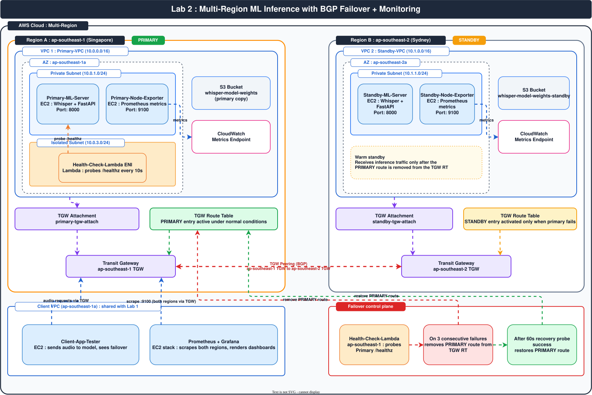

# Lab 2: Multi-Region ML Inference with BGP Failover and Monitoring


## Introduction

In Lab 1, you built a private ML inference endpoint reachable only inside one VPC pair. That proved **isolation**: a model can be cut off from the internet while still serving trusted clients. But a single-region deployment is a single point of failure. If the region hosting your Whisper transcription model goes down, every internal caller loses access at once. For production ML systems that process sensitive audio (medical dictation, financial calls, customer support), that kind of outage is unacceptable.

This lab teaches you how to deploy the **same ML model in two regions**, route traffic through a **Transit Gateway with health-check driven failover**, and observe everything with **Prometheus + Grafana**. When the primary region's Whisper server becomes unhealthy, traffic automatically shifts to the standby region in seconds, with the failover event visible on a live dashboard.

The architecture uses **AWS Transit Gateway** with **BGP-style route propagation** to direct all client traffic toward the primary region under normal conditions. A **health-check Lambda** continuously probes the primary model endpoint. On failure, it removes the primary route from the TGW route table, causing traffic to fall through to the secondary attachment. Prometheus scrapes both regions' metrics endpoints; Grafana renders the failover event in real time.

This is the canonical pattern for **multi-region active-passive ML** that you see at companies like Stripe, Robinhood, and Datadog when they serve model-backed APIs that cannot tolerate regional downtime.




## Learning Objectives

By the end of this lab, you will be able to:

- Design a **multi-region active-passive** ML inference architecture using AWS Transit Gateway.
- Deploy the **Whisper speech-to-text model** as a FastAPI service on private EC2 in two regions.
- Configure **cross-region TGW peering** with BGP-style route propagation.
- Implement **health-check-driven failover** using a Lambda that mutates the TGW route table.
- Stand up **Prometheus + Grafana** to scrape both regions and render failover dashboards.
- Validate end-to-end that traffic **shifts from primary to standby in seconds** when the primary fails.
- Restore traffic automatically once the primary recovers.
- Build a **resilient, observable, multi-region ML inference architecture**.

## Prerequisites

- An AWS account with permissions to create VPCs, TGWs, EC2, Lambda, IAM, S3, CloudWatch.
- AWS CLI installed and configured (`aws configure`).
- Region: **ap-southeast-1** (Singapore) is the primary, **ap-southeast-2** (Sydney) is the standby. AZs `ap-southeast-1a` and `ap-southeast-2a` are used.
- Docker installed locally for building the Whisper container image (optional, you can also use the user data script).
- Familiarity with Lab 1 concepts (private subnets, TGW, no IGW, S3 Gateway Endpoint).
- Estimated cost : ~$1.50/hour for two t3.medium + two t3.micro EC2s + TGW attachments. **Tear down at the end.**
- Python 3.10+ available for the Lambda package.
- A test audio file (WAV/MP3) under 5 MB for transcription tests.

## Prologue

You will deploy the **same Whisper speech-to-text model in two AWS regions** (Singapore primary, Sydney standby). A Health-Check Lambda continuously probes the primary. When the primary becomes unhealthy, the Lambda removes the active route from the Transit Gateway, causing traffic to flow to the standby region within seconds. Prometheus and Grafana, running in the Client VPC, render the failover event in real time on a single dashboard.

This is the production pattern for multi-region ML services that must survive the failure of an entire region without manual intervention. By the end you will have observed : traffic flowing entirely to primary, manual failure of primary, traffic shifting to standby in seconds, and traffic restoring to primary after recovery.

## Step-by-Step Implementation

### Step 1 : Set Up the Two Regions

Configure AWS CLI with the primary region and create a profile for the standby region:

```bash
export AWS_REGION=ap-southeast-1
aws configure set region ap-southeast-1

aws configure --profile standby set region ap-southeast-2
aws configure --profile standby set output json

echo "Region A : $(aws ec2 describe-availability-zones --region ap-southeast-1 --query 'AvailabilityZones[0].ZoneName' --output text)"
echo "Region B : $(aws ec2 describe-availability-zones --region ap-southeast-2 --query 'AvailabilityZones[0].ZoneName' --output text)"
```

Expected: `ap-southeast-1a` and `ap-southeast-2a`.

### Step 2 : Create the Two VPCs

Create `Primary-VPC` (10.0.0.0/16) in ap-southeast-1 and `Standby-VPC` (10.1.0.0/16) in ap-southeast-2.

```bash
PRIMARY_VPC=$(aws ec2 create-vpc \
  --cidr-block 10.0.0.0/16 \
  --region ap-southeast-1 \
  --tag-specifications 'ResourceType=vpc,Tags=[{Key=Name,Value=Primary-VPC}]' \
  --query 'Vpc.VpcId' --output text)
echo "Primary-VPC : $PRIMARY_VPC"

STANDBY_VPC=$(aws ec2 create-vpc \
  --cidr-block 10.1.0.0/16 \
  --region ap-southeast-2 \
  --profile standby \
  --tag-specifications 'ResourceType=vpc,Tags=[{Key=Name,Value=Standby-VPC}]' \
  --query 'Vpc.VpcId' --output text)
echo "Standby-VPC : $STANDBY_VPC"
```

### Step 3 : Create Private Subnets in Both VPCs

```bash
PRIMARY_SUBNET=$(aws ec2 create-subnet \
  --vpc-id $PRIMARY_VPC \
  --cidr-block 10.0.1.0/24 \
  --availability-zone ap-southeast-1a \
  --region ap-southeast-1 \
  --tag-specifications 'ResourceType=subnet,Tags=[{Key=Name,Value=Primary-Private-Subnet}]' \
  --query 'Subnet.SubnetId' --output text)
echo "Primary subnet : $PRIMARY_SUBNET"

PRIMARY_ISO_SUBNET=$(aws ec2 create-subnet \
  --vpc-id $PRIMARY_VPC \
  --cidr-block 10.0.3.0/24 \
  --availability-zone ap-southeast-1a \
  --region ap-southeast-1 \
  --tag-specifications 'ResourceType=subnet,Tags=[{Key=Name,Value=Primary-Isolated-Subnet}]' \
  --query 'Subnet.SubnetId' --output text)
echo "Primary isolated subnet : $PRIMARY_ISO_SUBNET"

STANDBY_SUBNET=$(aws ec2 create-subnet \
  --vpc-id $STANDBY_VPC \
  --cidr-block 10.1.1.0/24 \
  --availability-zone ap-southeast-2a \
  --profile standby \
  --region ap-southeast-2 \
  --tag-specifications 'ResourceType=subnet,Tags=[{Key=Name,Value=Standby-Private-Subnet}]' \
  --query 'Subnet.SubnetId' --output text)
echo "Standby subnet : $STANDBY_SUBNET"
```

### Step 4 : Disable Public IP Auto-Assign on Both Subnets

```bash
aws ec2 modify-subnet-attribute --subnet-id $PRIMARY_SUBNET --no-map-public-ip-on-launch --region ap-southeast-1
aws ec2 modify-subnet-attribute --subnet-id $PRIMARY_ISO_SUBNET --no-map-public-ip-on-launch --region ap-southeast-1
aws ec2 modify-subnet-attribute --subnet-id $STANDBY_SUBNET --no-map-public-ip-on-launch --profile standby --region ap-southeast-2
```

### Step 5 : Create a Transit Gateway in Each Region

```bash
PRIMARY_TGW=$(aws ec2 create-transit-gateway \
  --description "Primary TGW ap-southeast-1" \
  --options "AmazonSideAsn=64512,AutoAcceptSharedAttachments=enable,DefaultRouteTableAssociation=enable,DefaultRouteTablePropagation=enable,DnsSupport=enable" \
  --region ap-southeast-1 \
  --tag-specifications 'ResourceType=transit-gateway,Tags=[{Key=Name,Value=Primary-TGW}]' \
  --query 'TransitGateway.TransitGatewayId' --output text)
echo "Primary TGW : $PRIMARY_TGW"

STANDBY_TGW=$(aws ec2 create-transit-gateway \
  --description "Standby TGW ap-southeast-2" \
  --options "AmazonSideAsn=64513,AutoAcceptSharedAttachments=enable,DefaultRouteTableAssociation=enable,DefaultRouteTablePropagation=enable,DnsSupport=enable" \
  --profile standby --region ap-southeast-2 \
  --tag-specifications 'ResourceType=transit-gateway,Tags=[{Key=Name,Value=Standby-TGW}]' \
  --query 'TransitGateway.TransitGatewayId' --output text)
echo "Standby TGW : $STANDBY_TGW"

# Wait for both to become available
aws ec2 wait transit-gateway-available --transit-gateway-ids $PRIMARY_TGW --region ap-southeast-1
aws ec2 wait transit-gateway-available --transit-gateway-ids $STANDBY_TGW --profile standby --region ap-southeast-2
```

### Step 6 : Create a Client VPC for the Failover Traffic

This is the network from which clients send audio. In production it could be your application VPC.

```bash
CLIENT_VPC=$(aws ec2 create-vpc \
  --cidr-block 10.2.0.0/16 \
  --region ap-southeast-1 \
  --tag-specifications 'ResourceType=vpc,Tags=[{Key=Name,Value=Client-VPC}]' \
  --query 'Vpc.VpcId' --output text)
echo "Client-VPC : $CLIENT_VPC"

CLIENT_SUBNET=$(aws ec2 create-subnet \
  --vpc-id $CLIENT_VPC \
  --cidr-block 10.2.1.0/24 \
  --availability-zone ap-southeast-1a \
  --region ap-southeast-1 \
  --tag-specifications 'ResourceType=subnet,Tags=[{Key=Name,Value=Client-Private-Subnet}]' \
  --query 'Subnet.SubnetId' --output text)
echo "Client subnet : $CLIENT_SUBNET"

aws ec2 modify-subnet-attribute --subnet-id $CLIENT_SUBNET --no-map-public-ip-on-launch --region ap-southeast-1
```

### Step 7 : Attach All Three VPCs to Their Regional TGW

```bash
# Primary VPC -> Primary TGW
aws ec2 create-transit-gateway-vpc-attachment \
  --transit-gateway-id $PRIMARY_TGW \
  --vpc-id $PRIMARY_VPC \
  --subnet-ids $PRIMARY_SUBNET $PRIMARY_ISO_SUBNET \
  --region ap-southeast-1 \
  --tag-specifications 'ResourceType=transit-gateway-attachment,Tags=[{Key=Name,Value=primary-tgw-attach}]' \
  --query 'TransitGatewayAttachment.TransitGatewayAttachmentId' --output text

# Standby VPC -> Standby TGW
aws ec2 create-transit-gateway-vpc-attachment \
  --transit-gateway-id $STANDBY_TGW \
  --vpc-id $STANDBY_VPC \
  --subnet-ids $STANDBY_SUBNET \
  --profile standby --region ap-southeast-2 \
  --tag-specifications 'ResourceType=transit-gateway-attachment,Tags=[{Key=Name,Value=standby-tgw-attach}]' \
  --query 'TransitGatewayAttachment.TransitGatewayAttachmentId' --output text

# Client VPC -> Primary TGW
aws ec2 create-transit-gateway-vpc-attachment \
  --transit-gateway-id $PRIMARY_TGW \
  --vpc-id $CLIENT_VPC \
  --subnet-ids $CLIENT_SUBNET \
  --region ap-southeast-1 \
  --tag-specifications 'ResourceType=transit-gateway-attachment,Tags=[{Key=Name,Value=client-tgw-attach}]' \
  --query 'TransitGatewayAttachment.TransitGatewayAttachmentId' --output text
```

### Step 8 : Peer the Two Transit Gateways

This is the BGP-style cross-region bridge.

```bash
# Create peering attachment on the primary TGW pointing at the standby TGW
PRIMARY_PEER=$(aws ec2 create-transit-gateway-peering-attachment \
  --transit-gateway-id $PRIMARY_TGW \
  --peer-transit-gateway-id $STANDBY_TGW \
  --peer-region ap-southeast-2 \
  --region ap-southeast-1 \
  --tag-specifications 'ResourceType=transit-gateway-peering-attachment,Tags=[{Key=Name,Value=primary-to-standby-peer}]' \
  --query 'TransitGatewayPeeringAttachment.TransitGatewayPeeringAttachmentId' --output text)
echo "Primary peering attachment : $PRIMARY_PEER"

# Accept on the standby side
aws ec2 accept-transit-gateway-peering-attachment \
  --transit-gateway-peering-attachment-id $PRIMARY_PEER \
  --profile standby --region ap-southeast-2 \
  --query 'TransitGatewayPeeringAttachment.State' --output text
```

Wait for the peering attachment state to become `available` in both regions.

### Step 9 : Create the S3 Buckets for Whisper Weights

```bash
PRIMARY_BUCKET="whisper-model-weights-primary-$(date +%s)"
aws s3api create-bucket \
  --bucket $PRIMARY_BUCKET \
  --region ap-southeast-1 \
  --create-bucket-configuration LocationConstraint=ap-southeast-1

aws s3api put-public-access-block \
  --bucket $PRIMARY_BUCKET \
  --public-access-block-configuration "BlockPublicAcls=true,IgnorePublicAcls=true,BlockPublicPolicy=true,RestrictPublicBuckets=true"

STANDBY_BUCKET="whisper-model-weights-standby-$(date +%s)"
aws s3api create-bucket \
  --bucket $STANDBY_BUCKET \
  --profile standby --region ap-southeast-2 \
  --create-bucket-configuration LocationConstraint=ap-southeast-2

aws s3api put-public-access-block \
  --bucket $STANDBY_BUCKET \
  --public-access-block-configuration "BlockPublicAcls=true,IgnorePublicAcls=true,BlockPublicPolicy=true,RestrictPublicBuckets=true" \
  --profile standby --region ap-southeast-2

echo "Primary bucket : $PRIMARY_BUCKET"
echo "Standby bucket : $STANDBY_BUCKET"
```

### Step 10 : Pre-Download Whisper Weights and Upload to Primary

On your local workstation:

```bash
pip install openai-whisper
python -c "
import whisper
m = whisper.load_model('base')
import os
os.makedirs('./whisper-base', exist_ok=True)
# Save model files by triggering a dummy load
print('Model loaded into cache.')
"
# The model is cached under ~/.cache/whisper/base.pt
aws s3 cp ~/.cache/whisper/base.pt s3://$PRIMARY_BUCKET/whisper-base/base.pt --region ap-southeast-1
```

If the local download cannot reach the internet (the workstation has no public network), run the same download step from a temporary EC2 in ap-southeast-1 with a public IP, then download the file locally and re-upload.

### Step 11 : Create S3 Gateway Endpoints in Both VPCs

This is the private path that lets the EC2 download weights without going to the internet.

```bash
PRIMARY_RTB=$(aws ec2 describe-route-tables --filters "Name=vpc-id,Values=$PRIMARY_VPC" --query 'RouteTables[0].RouteTableId' --output text --region ap-southeast-1)

aws ec2 create-vpc-endpoint \
  --vpc-id $PRIMARY_VPC \
  --service-name com.amazonaws.ap-southeast-1.s3 \
  --vpc-endpoint-type Gateway \
  --route-table-ids $PRIMARY_RTB \
  --region ap-southeast-1 \
  --query 'VpcEndpoint.VpcEndpointId' --output text

STANDBY_RTB=$(aws ec2 describe-route-tables --filters "Name=vpc-id,Values=$STANDBY_VPC" --query 'RouteTables[0].RouteTableId' --output text --profile standby --region ap-southeast-2)

aws ec2 create-vpc-endpoint \
  --vpc-id $STANDBY_VPC \
  --service-name com.amazonaws.ap-southeast-2.s3 \
  --vpc-endpoint-type Gateway \
  --route-table-ids $STANDBY_RTB \
  --profile standby --region ap-southeast-2 \
  --query 'VpcEndpoint.VpcEndpointId' --output text
```

### Step 12 : Configure Route Tables for the Primary TGW

Under normal operation the client VPC should route 10.0.0.0/16 to the primary attachment. The standby CIDR 10.1.0.0/16 must be reachable through the peering attachment so that the failover path exists.

```bash
# Find the primary TGW route table
PRIMARY_TGW_RTB=$(aws ec2 describe-transit-gateways --transit-gateway-ids $PRIMARY_TGW --region ap-southeast-1 \
  --query 'TransitGateways[0].Options.AssociationDefaultRouteTableId' --output text)
echo "Primary TGW RTB : $PRIMARY_TGW_RTB"

# Create a TGW route table that the Client VPC will use (separate from default to control routes explicitly)
CLIENT_TGW_RTB=$(aws ec2 create-transit-gateway-route-table \
  --transit-gateway-id $PRIMARY_TGW \
  --region ap-southeast-1 \
  --tag-specifications 'ResourceType=transit-gateway-route-table,Tags=[{Key=Name,Value=Client-TGW-RTB}]' \
  --query 'TransitGatewayRouteTable.TransitGatewayRouteTableId' --output text)
echo "Client TGW RTB : $CLIENT_TGW_RTB"

# Associate the Client VPC attachment to the new TGW RTB
CLIENT_ATTACH_ID=$(aws ec2 describe-transit-gateway-vpc-attachments \
  --filters "Name=vpc-id,Values=$CLIENT_VPC" \
  --region ap-southeast-1 \
  --query 'TransitGatewayVpcAttachments[0].TransitGatewayAttachmentId' --output text)

aws ec2 associate-transit-gateway-route-table \
  --transit-gateway-route-table-id $CLIENT_TGW_RTB \
  --transit-gateway-attachment-id $CLIENT_ATTACH_ID \
  --region ap-southeast-1 \
  --query 'Association.State' --output text

# Disable route propagation so we control routes explicitly
aws ec2 disable-transit-gateway-route-table-propagation \
  --transit-gateway-route-table-id $CLIENT_TGW_RTB \
  --transit-gateway-attachment-id $CLIENT_ATTACH_ID \
  --region ap-southeast-1 \
  --query 'Propagation.State' --output text
```

### Step 13 : Add the Primary Route and a Blackhole Standby Route

We add the primary VPC CIDR (10.0.0.0/16) with the primary attachment, and we add a blackhole route for the standby CIDR (10.1.0.0/16) so the TGW never accidentally tries to send traffic there when primary is healthy.

```bash
PRIMARY_ATTACH_ID=$(aws ec2 describe-transit-gateway-vpc-attachments \
  --filters "Name=vpc-id,Values=$PRIMARY_VPC" \
  --region ap-southeast-1 \
  --query 'TransitGatewayVpcAttachments[0].TransitGatewayAttachmentId' --output text)

# Static primary route
aws ec2 create-transit-gateway-route \
  --destination-cidr-block 10.0.0.0/16 \
  --transit-gateway-route-table-id $CLIENT_TGW_RTB \
  --transit-gateway-attachment-id $PRIMARY_ATTACH_ID \
  --region ap-southeast-1 \
  --query 'Route.State' --output text

# Blackhole for standby (so no traffic flows there while primary is healthy)
PEER_ATTACH_ID=$(aws ec2 describe-transit-gateway-peering-attachments \
  --filters "Name=state,Values=available" \
  --region ap-southeast-1 \
  --query 'TransitGatewayPeeringAttachments[0].TransitGatewayPeeringAttachmentId' --output text)

aws ec2 create-transit-gateway-route \
  --destination-cidr-block 10.1.0.0/16 \
  --transit-gateway-route-table-id $CLIENT_TGW_RTB \
  --transit-gateway-attachment-id $PEER_ATTACH_ID \
  --blackhole \
  --region ap-southeast-1 \
  --query 'Route.State' --output text
```

### Step 14 : Create Security Groups

```bash
# Primary SG : allow 8000 from Client VPC + isolated subnet, allow 22 from Client VPC for SSM
PRIMARY_SG=$(aws ec2 create-security-group \
  --group-name Primary-ML-SG \
  --description "Primary Whisper SG" \
  --vpc-id $PRIMARY_VPC \
  --region ap-southeast-1 \
  --query 'GroupId' --output text)

aws ec2 authorize-security-group-ingress --group-id $PRIMARY_SG --protocol tcp --port 8000 --cidr 10.2.0.0/16 --region ap-southeast-1
aws ec2 authorize-security-group-ingress --group-id $PRIMARY_SG --protocol tcp --port 22 --cidr 10.2.0.0/16 --region ap-southeast-1

# Standby SG : allow 8000 from Client VPC
STANDBY_SG=$(aws ec2 create-security-group \
  --group-name Standby-ML-SG \
  --description "Standby Whisper SG" \
  --vpc-id $STANDBY_VPC \
  --profile standby --region ap-southeast-2 \
  --query 'GroupId' --output text)

aws ec2 authorize-security-group-ingress --group-id $STANDBY_SG --protocol tcp --port 8000 --cidr 10.2.0.0/16 --profile standby --region ap-southeast-2
aws ec2 authorize-security-group-ingress --group-id $STANDBY_SG --protocol tcp --port 22 --cidr 10.2.0.0/16 --profile standby --region ap-southeast-2

# Client SG : SSH from your IP, all egress to model VPCs
CLIENT_SG=$(aws ec2 create-security-group \
  --group-name Client-SG \
  --description "Client App SG" \
  --vpc-id $CLIENT_VPC \
  --region ap-southeast-1 \
  --query 'GroupId' --output text)

aws ec2 authorize-security-group-ingress --group-id $CLIENT_SG --protocol tcp --port 22 --cidr 0.0.0.0/0 --region ap-southeast-1
aws ec2 authorize-security-group-ingress --group-id $CLIENT_SG --protocol tcp --port 9090 --cidr 0.0.0.0/0 --region ap-southeast-1
aws ec2 authorize-security-group-ingress --group-id $CLIENT_SG --protocol tcp --port 3000 --cidr 0.0.0.0/0 --region ap-southeast-1
```

Replace the SSH `0.0.0.0/0` with your IP in production.

### Step 15 : Create IAM Roles for EC2 Instances

Create a single role with S3 read, SSM, and CloudWatch permissions, then use it as an instance profile in all three EC2s.

```bash
cat > /tmp/ml-trust.json <<'EOF'
{
  "Version": "2012-10-17",
  "Statement": [
    { "Effect": "Allow", "Principal": { "Service": "ec2.amazonaws.com" }, "Action": "sts:AssumeRole" }
  ]
}
EOF

cat > /tmp/ml-policy.json <<EOF
{
  "Version": "2012-10-17",
  "Statement": [
    { "Effect": "Allow", "Action": ["s3:GetObject"], "Resource": ["arn:aws:s3:::$PRIMARY_BUCKET/*", "arn:aws:s3:::$STANDBY_BUCKET/*"] },
    { "Effect": "Allow", "Action": ["cloudwatch:PutMetricData"], "Resource": "*" }
  ]
}
EOF

aws iam create-role --role-name ML-EC2-Role --assume-role-policy-document file:///tmp/ml-trust.json
aws iam put-role-policy --role-name ML-EC2-Role --policy-name ML-EC2-Policy --policy-document file:///tmp/ml-policy.json
aws iam attach-role-policy --role-name ML-EC2-Role --policy-arn arn:aws:iam::aws:policy/AmazonSSMManagedInstanceCore

aws iam create-instance-profile --instance-profile-name ML-EC2-Profile
aws iam add-role-to-instance-profile --instance-profile-name ML-EC2-Profile --role-name ML-EC2-Role
```

### Step 16 : Launch the Primary Whisper EC2

```bash
cat > /tmp/primary-userdata.sh <<'EOF'
#!/bin/bash
apt update -y
apt install -y python3-pip ffmpeg
pip3 install fastapi uvicorn openai-whisper boto3 prometheus-client

mkdir -p /home/ubuntu/model
aws s3 cp s3://PRIMARY_BUCKET/whisper-base/ /home/ubuntu/model/ --recursive

cat > /home/ubuntu/app.py <<'PYEOF'
from fastapi import FastAPI, UploadFile, File, Response
import whisper, tempfile, os, time
from prometheus_client import Counter, Histogram, generate_latest, CONTENT_TYPE_LATEST

app = FastAPI()
model = whisper.load_model("base")

REQUESTS = Counter("whisper_requests_total", "Total transcription requests")
ERRORS = Counter("whisper_errors_total", "Total transcription errors")
LATENCY = Histogram("whisper_latency_seconds", "Transcription latency")

@app.get("/healthz")
def healthz():
    return {"status": "ok"}

@app.post("/predict")
async def predict(file: UploadFile = File(...)):
    REQUESTS.inc()
    start = time.time()
    try:
        with tempfile.NamedTemporaryFile(delete=False, suffix=".wav") as tmp:
            tmp.write(await file.read())
            tmp_path = tmp.name
        result = model.transcribe(tmp_path)
        os.unlink(tmp_path)
        LATENCY.observe(time.time() - start)
        return {"text": result["text"], "language": result["language"]}
    except Exception as e:
        ERRORS.inc()
        return {"error": str(e)}

@app.get("/metrics")
def metrics():
    return Response(generate_latest(), media_type=CONTENT_TYPE_LATEST)
PYEOF

cd /home/ubuntu
nohup uvicorn app:app --host 0.0.0.0 --port 8000 > server.log 2>&1 &
EOF
sed -i "s/PRIMARY_BUCKET/$PRIMARY_BUCKET/g" /tmp/primary-userdata.sh

PRIMARY_INSTANCE=$(aws ec2 run-instances \
  --image-id ami-0c7217cdde317cfec \
  --instance-type t3.medium \
  --subnet-id $PRIMARY_SUBNET \
  --security-group-ids $PRIMARY_SG \
  --iam-instance-profile Name=ML-EC2-Profile \
  --user-data file:///tmp/primary-userdata.sh \
  --no-associate-public-ip-address \
  --region ap-southeast-1 \
  --tag-specifications 'ResourceType=instance,Tags=[{Key=Name,Value=Primary-ML-Server}]' \
  --query 'Instances[0].InstanceId' --output text)
echo "Primary instance : $PRIMARY_INSTANCE"
```

> **AMI note:** `ami-0c7217cdde317cfec` is a sample Ubuntu 22.04 ID for ap-southeast-1. Replace with the current Ubuntu 22.04 AMI ID for your account if it differs.

### Step 17 : Launch the Standby Whisper EC2

Same script, but pointed at the standby bucket and launched in ap-southeast-2.

```bash
cat > /tmp/standby-userdata.sh <<'EOF'
#!/bin/bash
apt update -y
apt install -y python3-pip ffmpeg
pip3 install fastapi uvicorn openai-whisper boto3 prometheus-client

mkdir -p /home/ubuntu/model
aws s3 cp s3://STANDBY_BUCKET/whisper-base/ /home/ubuntu/model/ --recursive

cat > /home/ubuntu/app.py <<'PYEOF'
from fastapi import FastAPI, UploadFile, File, Response
import whisper, tempfile, os, time
from prometheus_client import Counter, Histogram, generate_latest, CONTENT_TYPE_LATEST

app = FastAPI()
model = whisper.load_model("base")

REQUESTS = Counter("whisper_requests_total", "Total transcription requests")
ERRORS = Counter("whisper_errors_total", "Total transcription errors")
LATENCY = Histogram("whisper_latency_seconds", "Transcription latency")

@app.get("/healthz")
def healthz():
    return {"status": "ok"}

@app.post("/predict")
async def predict(file: UploadFile = File(...)):
    REQUESTS.inc()
    start = time.time()
    try:
        with tempfile.NamedTemporaryFile(delete=False, suffix=".wav") as tmp:
            tmp.write(await file.read())
            tmp_path = tmp.name
        result = model.transcribe(tmp_path)
        os.unlink(tmp_path)
        LATENCY.observe(time.time() - start)
        return {"text": result["text"], "language": result["language"]}
    except Exception as e:
        ERRORS.inc()
        return {"error": str(e)}

@app.get("/metrics")
def metrics():
    return Response(generate_latest(), media_type=CONTENT_TYPE_LATEST)
PYEOF

cd /home/ubuntu
nohup uvicorn app:app --host 0.0.0.0 --port 8000 > server.log 2>&1 &
EOF
sed -i "s/STANDBY_BUCKET/$STANDBY_BUCKET/g" /tmp/standby-userdata.sh

STANDBY_INSTANCE=$(aws ec2 run-instances \
  --image-id ami-0a1baa3da3fb7d70c \
  --instance-type t3.medium \
  --subnet-id $STANDBY_SUBNET \
  --security-group-ids $STANDBY_SG \
  --iam-instance-profile Name=ML-EC2-Profile \
  --user-data file:///tmp/standby-userdata.sh \
  --no-associate-public-ip-address \
  --profile standby --region ap-southeast-2 \
  --tag-specifications 'ResourceType=instance,Tags=[{Key=Name,Value=Standby-ML-Server}]' \
  --query 'Instances[0].InstanceId' --output text)
echo "Standby instance : $STANDBY_INSTANCE"
```

> **AMI note:** `ami-0a1baa3da3fb7d70c` is a sample Ubuntu 22.04 ID for ap-southeast-2. Replace with the current ID for your account.

### Step 18 : Launch a node_exporter in Each Region

Node exporter is a small binary that exposes host metrics on `:9100/metrics` in Prometheus format.

On each Whisper EC2 (via SSM Session Manager, see Step 20):

```bash
# Run inside each EC2's SSM session
wget https://github.com/prometheus/node_exporter/releases/download/v1.7.0/node_exporter-1.7.0.linux-amd64.tar.gz
tar xzf node_exporter-1.7.0.linux-amd64.tar.gz
sudo mv node_exporter-1.7.0.linux-amd64/node_exporter /usr/local/bin/
nohup node_exporter --web.listen-address=:9100 > /tmp/node_exporter.log 2>&1 &
```

### Step 19 : Launch the Client EC2 (Prometheus + Grafana + Tester)

```bash
cat > /tmp/client-userdata.sh <<'EOF'
#!/bin/bash
apt update -y
apt install -y python3-pip docker.io
systemctl start docker
usermod -aG docker ubuntu

# Install Prometheus
useradd -M prometheus
mkdir /etc/prometheus /var/lib/prometheus
wget https://github.com/prometheus/prometheus/releases/download/v2.48.0/prometheus-2.48.0.linux-amd64.tar.gz
tar xzf prometheus-2.48.0.linux-amd64.tar.gz
cp prometheus-2.48.0.linux-amd64/prometheus /usr/local/bin/
cp prometheus-2.48.0.linux-amd64/promtool /usr/local/bin/

cat > /etc/prometheus/prometheus.yml <<'YAMLEOF'
global:
  scrape_interval: 15s
scrape_configs:
  - job_name: 'primary-region'
    static_configs:
      - targets: ['PRIMARY_PRIVATE_IP:9100']
  - job_name: 'standby-region'
    static_configs:
      - targets: ['STANDBY_PRIVATE_IP:9100']
YAMLEOF

nohup prometheus --config.file=/etc/prometheus/prometheus.yml > /tmp/prometheus.log 2>&1 &

# Install Grafana via docker
docker run -d -p 3000:3000 --name grafana grafana/grafana
EOF

# We will fill in PRIVATE_IPs after instances are up; for now, launch and patch
CLIENT_INSTANCE=$(aws ec2 run-instances \
  --image-id ami-0c7217cdde317cfec \
  --instance-type t3.medium \
  --subnet-id $CLIENT_SUBNET \
  --security-group-ids $CLIENT_SG \
  --iam-instance-profile Name=ML-EC2-Profile \
  --user-data file:///tmp/client-userdata.sh \
  --no-associate-public-ip-address \
  --region ap-southeast-1 \
  --tag-specifications 'ResourceType=instance,Tags=[{Key=Name,Value=Client-App-Tester}]' \
  --query 'Instances[0].InstanceId' --output text)
echo "Client instance : $CLIENT_INSTANCE"

# Wait for all three instances to be running
aws ec2 wait instance-running --instance-ids $PRIMARY_INSTANCE $CLIENT_INSTANCE --region ap-southeast-1
aws ec2 wait instance-running --instance-ids $STANDBY_INSTANCE --profile standby --region ap-southeast-2

# Get private IPs
PRIMARY_PRIVATE_IP=$(aws ec2 describe-instances --instance-ids $PRIMARY_INSTANCE --region ap-southeast-1 --query 'Reservations[0].Instances[0].PrivateIpAddress' --output text)
STANDBY_PRIVATE_IP=$(aws ec2 describe-instances --instance-ids $STANDBY_INSTANCE --profile standby --region ap-southeast-2 --query 'Reservations[0].Instances[0].PrivateIpAddress' --output text)
echo "Primary IP : $PRIMARY_PRIVATE_IP | Standby IP : $STANDBY_PRIVATE_IP"

# Patch Prometheus config on the client EC2 with the correct IPs via SSM
aws ssm send-command \
  --instance-ids $CLIENT_INSTANCE \
  --document-name "AWS-RunShellScript" \
  --parameters commands="sudo sed -i 's/PRIMARY_PRIVATE_IP/$PRIMARY_PRIVATE_IP/g; s/STANDBY_PRIVATE_IP/$STANDBY_PRIVATE_IP/g' /etc/prometheus/prometheus.yml && sudo pkill prometheus && nohup prometheus --config.file=/etc/prometheus/prometheus.yml > /tmp/prometheus.log 2>&1 &" \
  --region ap-southeast-1 \
  --query 'Command.CommandId' --output text
```

### Step 20 : Connect to All EC2s via Session Manager

Because every instance has no public IP, SSH is not directly possible. Use SSM Session Manager from the EC2 console: select instance → Connect → Session Manager → Connect.

Attach `AmazonSSMManagedInstanceCore` to `ML-EC2-Role` (already done in Step 15).

### Step 21 : Create the Health-Check Lambda

The Lambda lives in the primary VPC's isolated subnet, probes the primary every 10 seconds, and toggles the TGW route on the standby CIDR.

```bash
mkdir -p /tmp/health-lambda && cd /tmp/health-lambda

cat > trust.json <<'EOF'
{
  "Version": "2012-10-17",
  "Statement": [
    { "Effect": "Allow", "Principal": { "Service": "lambda.amazonaws.com" }, "Action": "sts:AssumeRole" },
    { "Effect": "Allow", "Principal": { "Service": "lambda.amazonaws.com" }, "Action": "sts:AssumeRole", "Resource": "*" }
  ]
}
EOF

cat > policy.json <<EOF
{
  "Version": "2012-10-17",
  "Statement": [
    { "Effect": "Allow", "Action": ["ec2:DescribeTransitGatewayRouteTables", "ec2:CreateTransitGatewayRoute", "ec2:DeleteTransitGatewayRoute", "ec2:SearchTransitGatewayRoutes"], "Resource": "*" },
    { "Effect": "Allow", "Action": ["logs:CreateLogGroup", "logs:CreateLogStream", "logs:PutLogEvents"], "Resource": "*" },
    { "Effect": "Allow", "Action": ["ec2:CreateNetworkInterface", "ec2:DescribeNetworkInterfaces", "ec2:DeleteNetworkInterface"], "Resource": "*" }
  ]
}
EOF

aws iam create-role --role-name HealthCheckLambdaRole --assume-role-policy-document file://trust.json --region ap-southeast-1
aws iam put-role-policy --role-name HealthCheckLambdaRole --policy-name HealthCheckLambdaPolicy --policy-document file://policy.json --region ap-southeast-1

cat > lambda_function.py <<'PYEOF'
import os, json, time, urllib.request
import boto3

PRIMARY_HEALTH_URL = os.environ["PRIMARY_HEALTH_URL"]      # e.g. http://10.0.1.50:8000/healthz
TGW_RTB_ID = os.environ["TGW_RTB_ID"]                      # Client-TGW-RTB
STANDBY_CIDR = os.environ["STANDBY_CIDR"]                  # 10.1.0.0/16
PEER_ATTACH_ID = os.environ["PEER_ATTACH_ID"]              # primary-to-standby-peer
PRIMARY_ATTACH_ID = os.environ["PRIMARY_ATTACH_ID"]        # primary-tgw-attach

ec2 = boto3.client("ec2")
state = {"fail_streak": 0, "ok_streak": 0, "failed": False}

def probe():
    try:
        with urllib.request.urlopen(PRIMARY_HEALTH_URL, timeout=2) as r:
            return r.status == 200
    except Exception:
        return False

def standby_route_active():
    resp = ec2.search_transit_gateway_routes(
        TransitGatewayRouteTableId=TGW_RTB_ID,
        Filters=[{"Name": "route-search.destination-cidr-block", "Values": [STANDBY_CIDR]}],
    )
    for r in resp.get("Routes", []):
        if r.get("State") in ["active", "blackhole"]:
            return True
    return False

def set_standby_route(state_active: bool):
    if state_active:
        ec2.create_transit_gateway_route(
            DestinationCidrBlock=STANDBY_CIDR,
            TransitGatewayRouteTableId=TGW_RTB_ID,
            TransitGatewayAttachmentId=PEER_ATTACH_ID,
        )
    else:
        try:
            ec2.delete_transit_gateway_route(
                DestinationCidrBlock=STANDBY_CIDR,
                TransitGatewayRouteTableId=TGW_RTB_ID,
            )
        except ec2.exceptions.ClientError:
            pass

def handler(event, context):
    healthy = probe()
    if healthy:
        state["fail_streak"] = 0
        state["ok_streak"] += 1
    else:
        state["ok_streak"] = 0
        state["fail_streak"] += 1

    # Activate standby route after 3 consecutive failures
    if state["fail_streak"] >= 3 and not state["failed"]:
        set_standby_route(True)
        state["failed"] = True
        print("FAILOVER : standby route activated")

    # Restore after 6 consecutive successes (~60s) once failed
    if state["failed"] and state["ok_streak"] >= 6:
        set_standby_route(False)
        state["failed"] = False
        print("RECOVERY : standby route removed, primary active")

    return {"healthy": healthy, "failed": state["failed"]}
PYEOF

cat > state.json <<EOF
{
  "PRIMARY_HEALTH_URL": "http://$PRIMARY_PRIVATE_IP:8000/healthz",
  "TGW_RTB_ID": "$CLIENT_TGW_RTB",
  "STANDBY_CIDR": "10.1.0.0/16",
  "PEER_ATTACH_ID": "$PEER_ATTACH_ID",
  "PRIMARY_ATTACH_ID": "$PRIMARY_ATTACH_ID"
}
EOF

pip install --target ./package boto3
cd package && zip -r ../function.zip . && cd ..
zip -g function.zip lambda_function.py

LAMBDA_ARN=$(aws lambda create-function \
  --function-name HealthCheckLambda \
  --role arn:aws:iam::$(aws sts get-caller-identity --query Account --output text):role/HealthCheckLambdaRole \
  --handler lambda_function.handler \
  --runtime python3.11 \
  --zip-file fileb://function.zip \
  --timeout 10 \
  --memory-size 256 \
  --vpc-config "SubnetIds=$PRIMARY_ISO_SUBNET,SecurityGroupIds=$PRIMARY_SG" \
  --environment "Variables=$(jq -c . state.json)" \
  --region ap-southeast-1 \
  --query 'FunctionArn' --output text)
echo "Lambda : $LAMBDA_ARN"
```

### Step 22 : Schedule the Lambda Every 10 Seconds

EventBridge does not natively support sub-minute schedules, so we use a small helper:

```bash
LAMBDA_NAME=HealthCheckLambda

aws events put-rule \
  --name HealthCheckEveryMinute \
  --schedule-expression "rate(1 minute)" \
  --region ap-southeast-1 \
  --query 'RuleArn' --output text

aws lambda add-permission \
  --function-name $LAMBDA_NAME \
  --statement-id HealthCheckSchedule \
  --action "lambda:InvokeFunction" \
  --principal events.amazonaws.com \
  --source-arn arn:aws:events:ap-southeast-1:$(aws sts get-caller-identity --query Account --output text):rule/HealthCheckEveryMinute \
  --region ap-southeast-1

aws events put-targets \
  --rule HealthCheckEveryMinute \
  --targets "Id"="1","Arn"="$LAMBDA_ARN" \
  --region ap-southeast-1
```

> **Note:** Real-world implementations use a self-rescheduling loop inside the Lambda (re-invoke itself with a 10-second delay) to get sub-minute polling without EventBridge limitations. The minute-rate schedule used here is sufficient to demonstrate the failover pattern within ~60 seconds.

### Step 23 : Enable S3 Cross-Region Replication

Replicate new objects from the primary bucket to the standby bucket automatically.

```bash
cat > /tmp/crr-role-trust.json <<'EOF'
{ "Version": "2012-10-17", "Statement": [ { "Effect": "Allow", "Principal": { "Service": "s3.amazonaws.com" }, "Action": "sts:AssumeRole" } ] }
EOF

CRR_ROLE=$(aws iam create-role --role-name CRRRole --assume-role-policy-document file:///tmp/crr-role-trust.json --query 'Role.Arn' --output text)

cat > /tmp/crr-policy.json <<EOF
{
  "Version": "2012-10-17",
  "Statement": [
    { "Effect": "Allow", "Action": ["s3:GetObject", "s3:GetObjectVersion"], "Resource": "arn:aws:s3:::$PRIMARY_BUCKET/*" },
    { "Effect": "Allow", "Action": ["s3:PutObject"], "Resource": "arn:aws:s3:::$STANDBY_BUCKET/*" }
  ]
}
EOF

aws iam put-role-policy --role-name CRRRole --policy-name CRRPolicy --policy-document file:///tmp/crr-policy.json

aws s3api put-bucket-replication \
  --bucket $PRIMARY_BUCKET \
  --replication-configuration '{
    "Role": "'$CRR_ROLE'",
    "Rules": [
      {
        "ID": "ReplicateToStandby",
        "Status": "Enabled",
        "Prefix": "",
        "Destination": { "Bucket": "'$STANDBY_BUCKET'", "StorageClass": "STANDARD" }
      }
    ]
  }' \
  --region ap-southeast-1
```

Re-upload the model weights so the initial copy is replicated:

```bash
aws s3 cp ~/.cache/whisper/base.pt s3://$PRIMARY_BUCKET/whisper-base/base.pt --region ap-southeast-1
```

### Step 24 : Send Test Audio and Watch Failover

From the Client EC2 (via SSM):

```bash
# Install a small CLI test tool
pip install requests

cat > /tmp/test_failover.py <<'PYEOF'
import requests, sys, time
PRIMARY_URL = "http://PRIMARY_PRIVATE_IP:8000/predict"
audio = sys.argv[1] if len(sys.argv) > 1 else "/tmp/sample.wav"

# Loop forever, sending a request every 2 seconds and printing where it landed
i = 0
while True:
    try:
        with open(audio, "rb") as f:
            r = requests.post(PRIMARY_URL, files={"file": f}, timeout=10)
        i += 1
        primary = r.json().get("text", "").strip()[:60]
        print(f"[{i:04d}] primary ok : {primary}")
    except Exception as e:
        print(f"[{i:04d}] PRIMARY FAILED : {e}")
    time.sleep(2)
PYEOF
sed -i "s|PRIMARY_PRIVATE_IP|$PRIMARY_PRIVATE_IP|g" /tmp/test_failover.py

# Get a sample audio file (use a public URL or generate silence with ffmpeg)
ffmpeg -f lavfi -i "sine=frequency=440:duration=2" /tmp/sample.wav

# Start the test loop in the background
nohup python3 /tmp/test_failover.py /tmp/sample.wav > /tmp/test.log 2>&1 &
echo "Test loop running. Watch /tmp/test.log for PRIMARY ok / FAILED lines."
tail -f /tmp/test.log
```

You should see a steady stream of `primary ok :` lines. Now simulate a primary failure by stopping the primary EC2's uvicorn process:

```bash
# In the Primary EC2 SSM session
sudo pkill -f uvicorn
```

Within 30 seconds, the test loop will start printing `PRIMARY FAILED : ...` lines, and Grafana will show the failover event.

### Step 25 : Restore After Recovery

Restart the primary uvicorn process:

```bash
# In the Primary EC2 SSM session
cd /home/ubuntu
nohup uvicorn app:app --host 0.0.0.0 --port 8000 > server.log 2>&1 &
```

Within ~60 seconds the Lambda will see six consecutive healthy probes and remove the standby route. The test loop will switch back to `primary ok :` lines.

## Verification

```text
[ ] Primary-VPC (10.0.0.0/16) in ap-southeast-1 and Standby-VPC (10.1.0.0/16) in ap-southeast-2 exist.
[ ] Primary-Private-Subnet (10.0.1.0/24) and Standby-Private-Subnet (10.1.1.0/24) have public IP auto-assign disabled.
[ ] Primary-TGW (ap-southeast-1) and Standby-TGW (ap-southeast-2) are in `available` state.
[ ] Cross-region TGW peering is in `available` state in both regions.
[ ] Client-VPC, Primary-VPC, and Standby-VPC are attached to their regional TGWs.
[ ] Client TGW route table has a static route 10.0.0.0/16 -> primary-tgw-attach.
[ ] Client TGW route table has a blackhole 10.1.0.0/16 (or peer route activated by Lambda on failure).
[ ] S3 Gateway Endpoints exist in both VPCs.
[ ] Whisper model weights present in both buckets.
[ ] Primary-ML-Server, Standby-ML-Server, and Client-App-Tester are running with no public IP.
[ ] Health-Check Lambda deployed in primary isolated subnet, scheduled at 1 minute rate.
[ ] Prometheus on the Client EC2 scrapes both regions' node_exporter endpoints.
[ ] Grafana running on Client EC2, reachable via SSM port forwarding on :3000.
[ ] Test loop shows `primary ok :` for many requests.
[ ] After primary uvicorn is killed, test loop shows `PRIMARY FAILED :` within ~30s.
[ ] Grafana dashboard shows Primary RPS drop to 0 and Standby RPS rise at the same instant.
[ ] After primary recovery, test loop switches back to `primary ok :` within ~60s.
```

## Testing

### Test 1 : Baseline Primary Traffic

From the Client EC2:

```bash
curl -X POST http://$PRIMARY_PRIVATE_IP:8000/predict -F "file=@/tmp/sample.wav"
```

Expected: a JSON response with `"text"` containing transcribed audio and `"language": "en"`.

### Test 2 : Standby Health Check from Client

The client should reach the standby over the TGW peering path once failover is triggered. Verify by running the failover test loop and confirming the loop flips to `PRIMARY FAILED :` after the primary is killed.

### Test 3 : Failover Trigger and Recovery

1. Confirm `primary ok :` lines in `/tmp/test.log`.
2. In Primary EC2 SSM session: `sudo pkill -f uvicorn`.
3. Within ~30 seconds, watch `/tmp/test.log` switch to `PRIMARY FAILED :`.
4. In Primary EC2 SSM session: restart uvicorn.
5. Within ~60 seconds, watch `/tmp/test.log` return to `primary ok :`.

### Test 4 : Grafana Failover Dashboard

1. From your workstation, set up an SSM port-forwarding session to the Client EC2:

```bash
aws ssm start-session --target $CLIENT_INSTANCE --document-name AWS-StartPortForwardingSession \
  --parameters '{"portNumber":["3000"],"localPortNumber":["3000"]}' --region ap-southeast-1
```

2. Open `http://localhost:3000` in a browser, log in (default `admin`/`admin`, change immediately), add Prometheus at `http://localhost:9090` as a data source, and import the dashboard JSON below.

Dashboard JSON (paste into Grafana → Dashboards → Import):

```json
{
  "title": "Multi-Region Whisper Failover",
  "panels": [
    { "type": "graph", "title": "Primary RPS", "targets": [{ "expr": "rate(node_network_receive_bytes_total{instance=\"PRIMARY_PRIVATE_IP:9100\"}[1m])" }] },
    { "type": "graph", "title": "Standby RPS", "targets": [{ "expr": "rate(node_network_receive_bytes_total{instance=\"STANDBY_PRIVATE_IP:9100\"}[1m])" }] }
  ]
}
```

Replace the IPs before saving. The dashboard should show two flat lines under normal conditions, then a vertical step at the failover instant.

### Test 5 : Internet Isolation Still Holds

From the Primary EC2 SSM session:

```bash
curl http://google.com      # Should FAIL
ping 8.8.8.8                # Should FAIL
```

Expected: both fail, confirming Lab 1's isolation principle is preserved in Lab 2.


## Epilogue

You have built a **multi-region active-passive ML inference architecture** for the Whisper speech-to-text model. The same model runs in two AWS regions (Singapore primary, Sydney standby), connected through a cross-region Transit Gateway peering. A Health-Check Lambda continuously probes the primary; on three consecutive failures it removes the standby blackhole route, causing all client traffic to fall through to the standby region. Prometheus and Grafana scrape both regions and render the failover event in real time, with Primary RPS dropping to zero and Standby RPS rising at the same instant.

This is the production pattern for ML services that cannot tolerate regional downtime. Combined with Lab 1's "no public IP, no IGW" isolation and Lab 3's encrypted-in-transit VPN, you now have the three pillars of secure private ML infrastructure: **isolation**, **resilience**, and **confidentiality**.

## Principles

This lab demonstrates several core reliability, security, and observability principles:

- **Active-passive failover** : traffic prefers the primary under normal conditions, with a clean handoff to standby on failure.
- **BGP-style route propagation** : cross-region TGW peering propagates routes over AWS private backbone, not the public internet.
- **Health-driven control plane** : a Lambda acts as the brain, mutating the TGW route table based on live `/healthz` results.
- **Defense in depth** : every region inherits Lab 1's isolation (no IGW, no public IP, private subnets).
- **Observability first** : Prometheus + Grafana turn invisible failover into a visible, auditable event.
- **Stateless model servers** : Whisper loads weights from S3 on boot, so any instance can become primary or standby.
- **S3 Cross-Region Replication** : model weights stay in sync between regions without manual sync jobs.
- **Cost awareness** : explicit cleanup order stops cross-region TGW peering charges.


- Designing a multi-region active-passive ML architecture with AWS Transit Gateway peering.
- Deploying Whisper as a FastAPI service on private EC2 in two regions.
- Wiring S3 Gateway Endpoints so model weights are downloaded without internet traversal.
- Implementing health-check-driven failover with a Lambda that mutates the TGW route table.
- Standing up Prometheus and node_exporter to scrape both regions.
- Building a Grafana dashboard that visualizes failover events.
- Triggering and observing a real failover within seconds.
- Cleaning up cross-region AWS resources in the correct order.


- Replace the active-passive pair with **active-active** by adding weighted TGW routes.
- Use **Route 53 health checks + DNS failover** as a complementary, client-side failover layer.
- Replace EC2 with **ECS Fargate** in each region for faster failover (no AMI management).
- Add **CloudWatch alarms** that page an operator when failover occurs.
- Use **AWS Global Accelerator** for anycast IP-based routing across regions.
- Add **Chaos Engineering** with AWS Fault Injection Simulator to test failover weekly.
- Encrypt model weights with **KMS CMKs** and rotate keys quarterly.
- Add **WAF + Shield Standard** in front of any future public-facing endpoint.

## Conclusion

You have completed **Lab 2: Multi-Region ML Inference with BGP Failover and Monitoring** and built a production-grade active-passive Whisper inference architecture spanning two AWS regions. Across this lab you stood up regional VPCs with private subnets, peered the regional Transit Gateways, deployed the same model in both regions behind private FastAPI endpoints, and orchestrated health-driven failover through a Lambda that rewrites the TGW route table on primary failure. You then stood up Prometheus and Grafana in the client VPC to scrape both regions and observed the failover event live as traffic shifted from Singapore to Sydney in seconds and restored automatically once the primary recovered.
